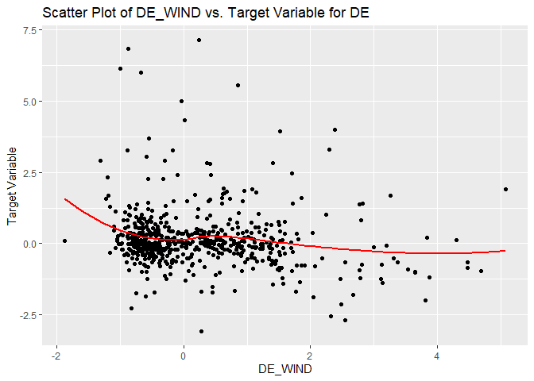
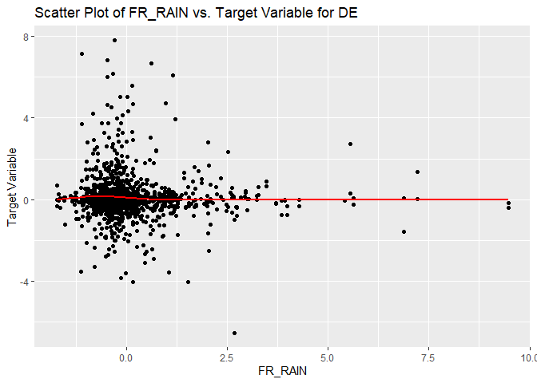

EDA
================

- [TODO:](#todo)
- [Import libraries](#import-libraries)
- [Load data:](#load-data)
- [EDA](#eda)
  - [ID alignement in X and y](#id-alignement-in-x-and-y)
  - [Missing vals by variable](#missing-vals-by-variable)
  - [Variables dtypes](#variables-dtypes)
  - [`COUNTRY` var and country label
    prefix](#country-var-and-country-label-prefix)
  - [Analysis of the lines with and without `DAY_ID`
    duplicates.](#analysis-of-the-lines-with-and-without-day_id-duplicates)
  - [Are NAs simultaneously present in several cols for the same row
    ?](#are-nas-simultaneously-present-in-several-cols-for-the-same-row-)
  - [Correlation between vars](#correlation-between-vars)
  - [Relations between explanatory vars and
    target](#relations-between-explanatory-vars-and-target)
  - [Value distribution for the explanatory and target
    vars](#value-distribution-for-the-explanatory-and-target-vars)
  - [TARGET FR vs TARGET DE](#target-fr-vs-target-de)
  - [TARGET distribution for missing and non-missing
    vals](#target-distribution-for-missing-and-non-missing-vals)
  - [Feature interactions](#feature-interactions)
  - [dTARGET as target](#dtarget-as-target)
- [Reproduce benchmark](#reproduce-benchmark)
  - [Data preparation](#data-preparation)
  - [Model](#model)
  - [FEature importance](#feature-importance)
  - [Comparison of Py and R OLS](#comparison-of-py-and-r-ols)
  - [Model prediction and export
    results](#model-prediction-and-export-results)

# TODO:

EDA:

1.  ~~investigate correlations between vars~~
2.  ~~`TARGET`-vars correlation~~
3.  ~~duplicates among lines, meaning of country label and country
    prefix in var names~~
4.  ~~are NAs simultaneously present in several cols for the same row
    ?~~

# Import libraries

``` r
library(readr)
library(dplyr)
```

    ## 
    ## Attachement du package : 'dplyr'

    ## Les objets suivants sont masqués depuis 'package:stats':
    ## 
    ##     filter, lag

    ## Les objets suivants sont masqués depuis 'package:base':
    ## 
    ##     intersect, setdiff, setequal, union

``` r
library(tidyr)
library(purrr)
library(tibble)
library(Hmisc)
```

    ## 
    ## Attachement du package : 'Hmisc'

    ## Les objets suivants sont masqués depuis 'package:dplyr':
    ## 
    ##     src, summarize

    ## Les objets suivants sont masqués depuis 'package:base':
    ## 
    ##     format.pval, units

``` r
library(ggplot2)
library(corrplot)
```

    ## corrplot 0.92 loaded

``` r
library(PerformanceAnalytics)
```

    ## Le chargement a nécessité le package : xts

    ## Le chargement a nécessité le package : zoo

    ## 
    ## Attachement du package : 'zoo'

    ## Les objets suivants sont masqués depuis 'package:base':
    ## 
    ##     as.Date, as.Date.numeric

    ## 
    ## ######################### Warning from 'xts' package ##########################
    ## #                                                                             #
    ## # The dplyr lag() function breaks how base R's lag() function is supposed to  #
    ## # work, which breaks lag(my_xts). Calls to lag(my_xts) that you type or       #
    ## # source() into this session won't work correctly.                            #
    ## #                                                                             #
    ## # Use stats::lag() to make sure you're not using dplyr::lag(), or you can add #
    ## # conflictRules('dplyr', exclude = 'lag') to your .Rprofile to stop           #
    ## # dplyr from breaking base R's lag() function.                                #
    ## #                                                                             #
    ## # Code in packages is not affected. It's protected by R's namespace mechanism #
    ## # Set `options(xts.warn_dplyr_breaks_lag = FALSE)` to suppress this warning.  #
    ## #                                                                             #
    ## ###############################################################################

    ## 
    ## Attachement du package : 'xts'

    ## Les objets suivants sont masqués depuis 'package:dplyr':
    ## 
    ##     first, last

    ## 
    ## Attachement du package : 'PerformanceAnalytics'

    ## L'objet suivant est masqué depuis 'package:graphics':
    ## 
    ##     legend

# Load data:

``` r
X_train_raw <- read.csv("../data/X_train.csv")
X_test_raw <- read.csv("../data/X_test.csv")
y_train <- read.csv("../data/y_train.csv")
```

Shape of the data sets:

``` r
print("X train:", )
```

    ## [1] "X train:"

``` r
dim(X_train_raw)
```

    ## [1] 1494   35

``` r
print("X test:", )
```

    ## [1] "X test:"

``` r
dim(X_test_raw)
```

    ## [1] 654  35

``` r
print("y train:", )
```

    ## [1] "y train:"

``` r
dim(y_train)
```

    ## [1] 1494    2

# EDA

## ID alignement in X and y

Are samples’ IDs in X and y aligned? Number of misaligned rows:

``` r
sum(X_train_raw$ID != y_train$ID)
```

    ## [1] 0

Yes, they are.

## Missing vals by variable

Missing values by column. Training set:

``` r
tibble_ <- X_train_raw

na_cols_train <- tibble(
  column_names = names(tibble_),
  missing_percentage = round(colMeans(is.na(tibble_)) * 100, 1)
  ) %>% 
  arrange(desc(missing_percentage)) %>% 
  filter(missing_percentage > 0)

na_cols_train
```

<div data-pagedtable="false">

<script data-pagedtable-source type="application/json">
{"columns":[{"label":["column_names"],"name":[1],"type":["chr"],"align":["left"]},{"label":["missing_percentage"],"name":[2],"type":["dbl"],"align":["right"]}],"data":[{"1":"DE_NET_EXPORT","2":"8.3"},{"1":"DE_NET_IMPORT","2":"8.3"},{"1":"DE_RAIN","2":"6.3"},{"1":"FR_RAIN","2":"6.3"},{"1":"DE_WIND","2":"6.3"},{"1":"FR_WIND","2":"6.3"},{"1":"DE_TEMP","2":"6.3"},{"1":"FR_TEMP","2":"6.3"},{"1":"FR_NET_EXPORT","2":"4.7"},{"1":"FR_NET_IMPORT","2":"4.7"},{"1":"DE_FR_EXCHANGE","2":"1.7"},{"1":"FR_DE_EXCHANGE","2":"1.7"}],"options":{"columns":{"min":{},"max":[10]},"rows":{"min":[10],"max":[10]},"pages":{}}}
  </script>

</div>

Test set:

``` r
tibble_ <- X_test_raw

na_cols_test <- tibble(
  column_names = names(tibble_),
  missing_percentage = round(colMeans(is.na(tibble_)) * 100, 1)
  ) %>% 
  arrange(desc(missing_percentage)) %>% 
  filter(missing_percentage > 0)

na_cols_test
```

<div data-pagedtable="false">

<script data-pagedtable-source type="application/json">
{"columns":[{"label":["column_names"],"name":[1],"type":["chr"],"align":["left"]},{"label":["missing_percentage"],"name":[2],"type":["dbl"],"align":["right"]}],"data":[{"1":"DE_NET_EXPORT","2":"7.2"},{"1":"DE_NET_IMPORT","2":"7.2"},{"1":"DE_RAIN","2":"6.1"},{"1":"FR_RAIN","2":"6.1"},{"1":"DE_WIND","2":"6.1"},{"1":"FR_WIND","2":"6.1"},{"1":"DE_TEMP","2":"6.1"},{"1":"FR_TEMP","2":"6.1"},{"1":"FR_NET_EXPORT","2":"3.7"},{"1":"FR_NET_IMPORT","2":"3.7"},{"1":"DE_FR_EXCHANGE","2":"1.4"},{"1":"FR_DE_EXCHANGE","2":"1.4"}],"options":{"columns":{"min":{},"max":[10]},"rows":{"min":[10],"max":[10]},"pages":{}}}
  </script>

</div>

Are cols with NAs the same in training and test sets?

``` r
print("In train set only:")
```

    ## [1] "In train set only:"

``` r
print(setdiff(na_cols_train$column_names, na_cols_test$column_names))
```

    ## character(0)

``` r
print("In test set only:")
```

    ## [1] "In test set only:"

``` r
print(setdiff(na_cols_test$column_names, na_cols_train$column_names))
```

    ## character(0)

## Variables dtypes

Columns’ dtypes. The dtypes of all columns have been properly detected
on the data import.

``` r
str(X_train_raw)
```

    ## 'data.frame':    1494 obs. of  35 variables:
    ##  $ ID              : int  1054 2049 1924 297 1101 1520 1546 1069 1323 1618 ...
    ##  $ DAY_ID          : int  206 501 687 720 818 467 144 1136 83 307 ...
    ##  $ COUNTRY         : chr  "FR" "FR" "FR" "DE" ...
    ##  $ DE_CONSUMPTION  : num  0.2101 -0.0224 1.395 -0.9833 0.1438 ...
    ##  $ FR_CONSUMPTION  : num  -0.427 -1.003 1.979 -0.849 -0.617 ...
    ##  $ DE_FR_EXCHANGE  : num  -0.6065 -0.0221 1.0213 -0.8396 -0.925 ...
    ##  $ FR_DE_EXCHANGE  : num  0.6065 0.0221 -1.0213 0.8396 0.925 ...
    ##  $ DE_NET_EXPORT   : num  NA -0.574 -0.622 -0.271 NA ...
    ##  $ FR_NET_EXPORT   : num  0.693 -1.131 -1.683 0.563 0.99 ...
    ##  $ DE_NET_IMPORT   : num  NA 0.574 0.622 0.271 NA ...
    ##  $ FR_NET_IMPORT   : num  -0.693 1.131 1.683 -0.563 -0.99 ...
    ##  $ DE_GAS          : num  0.441 0.175 2.352 0.488 0.239 ...
    ##  $ FR_GAS          : num  -0.214 0.427 2.122 0.195 -0.241 ...
    ##  $ DE_COAL         : num  0.741 -0.17 1.572 -1.474 1.004 ...
    ##  $ FR_COAL         : num  0.289 -0.762 0.777 -0.786 -0.275 ...
    ##  $ DE_HYDRO        : num  2.209 0.188 -0.109 -0.368 -0.23 ...
    ##  $ FR_HYDRO        : num  0.208 -0.807 0.779 1.32 -0.796 ...
    ##  $ DE_NUCLEAR      : num  0.70961 -1.88274 -1.89711 -0.20555 -0.00558 ...
    ##  $ FR_NUCLEAR      : num  -0.19 -2.186 0.735 -1.59 0.177 ...
    ##  $ DE_SOLAR        : num  0.102 1.987 -1.116 1.752 0.694 ...
    ##  $ FR_SOLAR        : num  1.249 3.237 -0.371 0.563 0.724 ...
    ##  $ DE_WINDPOW      : num  -0.5734 -0.0355 -0.2988 -0.0101 -0.7749 ...
    ##  $ FR_WINDPOW      : num  -0.269 -0.107 -0.141 0.367 -0.564 ...
    ##  $ DE_LIGNITE      : num  0.87 -0.194 0.428 -2.331 0.691 ...
    ##  $ DE_RESIDUAL_LOAD: num  0.627 -0.395 1.337 -1.192 0.572 ...
    ##  $ FR_RESIDUAL_LOAD: num  -0.445 -1.183 1.947 -0.977 -0.526 ...
    ##  $ DE_RAIN         : num  -0.173 -1.24 -0.481 -1.115 -0.541 ...
    ##  $ FR_RAIN         : num  -0.556 -0.77 -0.313 -0.508 -0.425 ...
    ##  $ DE_WIND         : num  -0.791 1.522 0.431 -0.499 -1.088 ...
    ##  $ FR_WIND         : num  -0.283 0.828 0.488 -0.236 -1.012 ...
    ##  $ DE_TEMP         : num  -1.069 0.437 0.685 0.351 0.614 ...
    ##  $ FR_TEMP         : num  -0.0634 1.8312 0.1148 -0.4175 0.7295 ...
    ##  $ GAS_RET         : num  0.339 -0.659 0.536 0.912 0.245 ...
    ##  $ COAL_RET        : num  0.1246 0.0471 0.7433 -0.2962 1.5266 ...
    ##  $ CARBON_RET      : num  -0.00244 -0.49037 0.20495 1.07395 2.61438 ...

## `COUNTRY` var and country label prefix

Value counts in the `COUNTRY` column:

``` r
X_train_raw %>%
  count(COUNTRY) %>%
  mutate(percentage = round(n / sum(n) * 100, 1))
```

<div data-pagedtable="false">

<script data-pagedtable-source type="application/json">
{"columns":[{"label":["COUNTRY"],"name":[1],"type":["chr"],"align":["left"]},{"label":["n"],"name":[2],"type":["int"],"align":["right"]},{"label":["percentage"],"name":[3],"type":["dbl"],"align":["right"]}],"data":[{"1":"DE","2":"643","3":"43"},{"1":"FR","2":"851","3":"57"}],"options":{"columns":{"min":{},"max":[10]},"rows":{"min":[10],"max":[10]},"pages":{}}}
  </script>

</div>

The data describes two countries, FR and DE, roughly equally presented.

Duplicates among `DAY_ID` in the training set:

``` r
X_train_raw %>%
  count(DAY_ID) %>%
  mutate(n = n - 1) %>% 
  rename(num_of_duplicates = n) %>% 
  count(num_of_duplicates) %>% 
  rename(count = n) %>% 
  mutate(percentage = round(count / sum(count) * 100, 1))
```

<div data-pagedtable="false">

<script data-pagedtable-source type="application/json">
{"columns":[{"label":["num_of_duplicates"],"name":[1],"type":["dbl"],"align":["right"]},{"label":["count"],"name":[2],"type":["int"],"align":["right"]},{"label":["percentage"],"name":[3],"type":["dbl"],"align":["right"]}],"data":[{"1":"0","2":"208","3":"24.4"},{"1":"1","2":"643","3":"75.6"}],"options":{"columns":{"min":{},"max":[10]},"rows":{"min":[10],"max":[10]},"pages":{}}}
  </script>

</div>

Most of the lines (3/4) have duplicates.

643\*2 + 208 gives the number of rows in the training set.

Duplicates among `DAY_ID` in the test set:

``` r
X_test_raw %>%
  count(DAY_ID) %>%
  mutate(n = n - 1) %>% 
  rename(num_of_duplicates = n) %>% 
  count(num_of_duplicates) %>% 
  rename(count = n) %>% 
  mutate(percentage = round(count / sum(count) * 100, 1))
```

<div data-pagedtable="false">

<script data-pagedtable-source type="application/json">
{"columns":[{"label":["num_of_duplicates"],"name":[1],"type":["dbl"],"align":["right"]},{"label":["count"],"name":[2],"type":["int"],"align":["right"]},{"label":["percentage"],"name":[3],"type":["dbl"],"align":["right"]}],"data":[{"1":"0","2":"76","3":"20.8"},{"1":"1","2":"289","3":"79.2"}],"options":{"columns":{"min":{},"max":[10]},"rows":{"min":[10],"max":[10]},"pages":{}}}
  </script>

</div>

The number of duplicates is more or less the same as in the training
set.

For the rows that have the same `DAY_ID`, in which columns are they
different? Training set:

``` r
tibble_ <- X_train_raw
tibble_$TARGET <- y_train$TARGET

# given a DAY_ID, select rows corresponding to it and get the names of the
# columns where the two rows having this DAY_ID differ
non_duplicated_cols <- function(day_id_) {
  col_names <- tibble_ %>% 
    filter(DAY_ID == day_id_) %>% 
    select_if(function(column) !identical(column[1], column[2])) %>% 
    names() %>% 
    paste(., collapse = ", ")
  return(col_names)
}

# get the list of day IDs that are duplicated in the table
ids <- tibble_ %>%
  count(DAY_ID) %>% 
  filter(n > 1) %>% 
  pull(DAY_ID)

# for each pair of duplicated rows, get a list of column names that have 
# different values in the pair of duplicated rows, drop duplicates
results <- lapply(ids, non_duplicated_cols) %>% unique()

results
```

    ## [[1]]
    ## [1] "ID, COUNTRY, TARGET"

Same question for the test set (no `TARGET`):

``` r
tibble_ <- X_test_raw

# given a DAY_ID, select rows corresponding to it and get the names of the
# columns where the two rows having this DAY_ID differ
non_duplicated_cols <- function(day_id_) {
  col_names <- tibble_ %>% 
    filter(DAY_ID == day_id_) %>% 
    select_if(function(column) !identical(column[1], column[2])) %>% 
    names() %>% 
    paste(., collapse = ", ")
  return(col_names)
}

# get the list of day IDs that are duplicated in the table
ids <- tibble_ %>%
  count(DAY_ID) %>% 
  filter(n > 1) %>% 
  pull(DAY_ID)

# for each pair of duplicated rows, get a list of column names that have 
# different values in the pair of duplicated rows, drop duplicates
results <- lapply(ids, non_duplicated_cols) %>% unique()

results
```

    ## [[1]]
    ## [1] "ID, COUNTRY"

Thus the rows having the same value of `DAY_ID` differ only by `ID`
(obviously), `COUNTRY` (FR or DE) and `TARGET` (prediction for FR or
DE). For the rest they are identical.

## Analysis of the lines with and without `DAY_ID` duplicates.

First select rows that don’t have duplicates:

``` r
# get the list of day IDs that are not duplicated in the training set
ids_train <- X_train_raw %>%
  count(DAY_ID) %>% 
  filter(n == 1) %>% 
  pull(DAY_ID)

# get the list of day IDs that are not duplicated in the test set
ids_test <- X_test_raw %>%
  count(DAY_ID) %>% 
  filter(n == 1) %>% 
  pull(DAY_ID)
```

To which countries do these lines in the training and test sets
correspond?

``` r
print(X_train_raw %>% filter(DAY_ID %in% ids_train) %>% count(COUNTRY))
```

    ##   COUNTRY   n
    ## 1      FR 208

``` r
print(X_test_raw %>% filter(DAY_ID %in% ids_test) %>% count(COUNTRY))
```

    ##   COUNTRY  n
    ## 1      FR 76

All rows that don’t have a duplicate in `DAY_ID` correspond to country
FR.

What about missing vals in these non duplicated lines?

``` r
tibble_ <- X_train_raw %>% filter(DAY_ID %in% ids_train)

na_cols_train <- tibble(
  column_names = names(tibble_),
  missing_percentage = round(colMeans(is.na(tibble_)) * 100, 1)
  ) %>% 
  arrange(desc(missing_percentage)) %>% 
  filter(missing_percentage > 0)

print(na_cols_train)
```

    ## # A tibble: 6 × 2
    ##   column_names   missing_percentage
    ##   <chr>                       <dbl>
    ## 1 DE_NET_EXPORT                59.6
    ## 2 DE_NET_IMPORT                59.6
    ## 3 FR_NET_EXPORT                33.7
    ## 4 FR_NET_IMPORT                33.7
    ## 5 DE_FR_EXCHANGE               12  
    ## 6 FR_DE_EXCHANGE               12

``` r
tibble_ <- X_test_raw %>% filter(DAY_ID %in% ids_test)

na_cols_test <- tibble(
  column_names = names(tibble_),
  missing_percentage = round(colMeans(is.na(tibble_)) * 100, 1)
  ) %>% 
  arrange(desc(missing_percentage)) %>% 
  filter(missing_percentage > 0)

print(na_cols_test)
```

    ## # A tibble: 6 × 2
    ##   column_names   missing_percentage
    ##   <chr>                       <dbl>
    ## 1 DE_NET_EXPORT                61.8
    ## 2 DE_NET_IMPORT                61.8
    ## 3 FR_NET_EXPORT                31.6
    ## 4 FR_NET_IMPORT                31.6
    ## 5 DE_FR_EXCHANGE               11.8
    ## 6 FR_DE_EXCHANGE               11.8

To conclude, the lines that don’t have duplicates in `DAY_ID` have NAs
in the cols describing countries’ net import and export and DE\<-\>FR
exchange (`DE_FR_EXCHANGE`, `FR_DE_EXCHANGE`, `DE_NET_EXPORT`,
`FR_NET_EXPORT`, `DE_NET_IMPORT`, `FR_NET_IMPORT`).

And in duplicated lines?

``` r
tibble_ <- X_train_raw %>% filter(!(DAY_ID %in% ids_train))

na_cols_train <- tibble(
  column_names = names(tibble_),
  missing_percentage = round(colMeans(is.na(tibble_)) * 100, 1)
  ) %>% 
  arrange(desc(missing_percentage)) %>% 
  filter(missing_percentage > 0)

print(na_cols_train)
```

    ## # A tibble: 6 × 2
    ##   column_names missing_percentage
    ##   <chr>                     <dbl>
    ## 1 DE_RAIN                     7.3
    ## 2 FR_RAIN                     7.3
    ## 3 DE_WIND                     7.3
    ## 4 FR_WIND                     7.3
    ## 5 DE_TEMP                     7.3
    ## 6 FR_TEMP                     7.3

``` r
tibble_ <- X_test_raw %>% filter(!(DAY_ID %in% ids_test))

na_cols_test <- tibble(
  column_names = names(tibble_),
  missing_percentage = round(colMeans(is.na(tibble_)) * 100, 1)
  ) %>% 
  arrange(desc(missing_percentage)) %>% 
  filter(missing_percentage > 0)

print(na_cols_test)
```

    ## # A tibble: 6 × 2
    ##   column_names missing_percentage
    ##   <chr>                     <dbl>
    ## 1 DE_RAIN                     6.9
    ## 2 FR_RAIN                     6.9
    ## 3 DE_WIND                     6.9
    ## 4 FR_WIND                     6.9
    ## 5 DE_TEMP                     6.9
    ## 6 FR_TEMP                     6.9

The lines having duplicates in `DAY_ID` have NAs only in the cols
describing countries’ weather conditions (`DE_RAIN`, `FR_RAIN`,
`DE_WIND`, `FR_WIND`, `DE_TEMP`, `FR_TEMP`).

The two lists of columns above span all (12) the columns with missing
values.

## Are NAs simultaneously present in several cols for the same row ?

Find the groups of columns that have simultaneously NAs in one row for
the training set:

``` r
missing_columns_list <- X_train_raw %>%
  pmap(function(...) names(list(...))[sapply(list(...), is.na)]) %>% 
  Filter(function(x) length(x) > 0, .) %>% 
  unique(.)

missing_columns_list
```

    ## [[1]]
    ## [1] "DE_NET_EXPORT" "DE_NET_IMPORT"
    ## 
    ## [[2]]
    ## [1] "DE_FR_EXCHANGE" "FR_DE_EXCHANGE" "DE_NET_EXPORT"  "FR_NET_EXPORT" 
    ## [5] "DE_NET_IMPORT"  "FR_NET_IMPORT" 
    ## 
    ## [[3]]
    ## [1] "DE_NET_EXPORT" "FR_NET_EXPORT" "DE_NET_IMPORT" "FR_NET_IMPORT"
    ## 
    ## [[4]]
    ## [1] "DE_RAIN" "FR_RAIN" "DE_WIND" "FR_WIND" "DE_TEMP" "FR_TEMP"

Same for the test set:

``` r
X_test_raw %>%
  pmap(function(...) names(list(...))[sapply(list(...), is.na)]) %>% 
  Filter(function(x) length(x) > 0, .) %>% 
  unique(.)
```

    ## [[1]]
    ## [1] "DE_NET_EXPORT" "DE_NET_IMPORT"
    ## 
    ## [[2]]
    ## [1] "DE_FR_EXCHANGE" "FR_DE_EXCHANGE" "DE_NET_EXPORT"  "FR_NET_EXPORT" 
    ## [5] "DE_NET_IMPORT"  "FR_NET_IMPORT" 
    ## 
    ## [[3]]
    ## [1] "DE_NET_EXPORT" "FR_NET_EXPORT" "DE_NET_IMPORT" "FR_NET_IMPORT"
    ## 
    ## [[4]]
    ## [1] "DE_RAIN" "FR_RAIN" "DE_WIND" "FR_WIND" "DE_TEMP" "FR_TEMP"

Apparently we get the same groups of columns.

As a side note, the analysis above shows that the test set has the same
properties as the training set and thus it is a representative sample of
the data.

To conclude the analysis above:

- The rows that **don’t have** duplicates in the `DAY_ID` col have NAs
  in all 6 cols describing countries’ weather conditions (`DE_RAIN`,
  `FR_RAIN`, `DE_WIND`, `FR_WIND`, `DE_TEMP`, `FR_TEMP`).
- The rows that **do have** duplicates in the `DAY_ID` col can have NAs
  simultaneously in the following groups of cols:
  - `DE_NET_EXPORT`, `DE_NET_IMPORT`
  - `DE_NET_EXPORT`, `FR_NET_EXPORT`, `DE_NET_IMPORT`, `FR_NET_IMPORT`
  - `DE_FR_EXCHANGE`, `FR_DE_EXCHANGE`, `DE_NET_EXPORT`,
    `FR_NET_EXPORT`, `DE_NET_IMPORT`, `FR_NET_IMPORT`

## Correlation between vars

Excluding vars `ID` and `DAY_ID` useless for the prediction and setting
apart `COUNTRY`, we are left with numeric vars only.

Pair corr matrix. I use Spearman corr to capture non-linear corrs.

``` r
res <- cor(select(X_train_raw, -ID, -DAY_ID, -COUNTRY), method = "spearman", use = "complete.obs")

res2 <- rcorr(as.matrix(select(X_train_raw, -ID, -DAY_ID, -COUNTRY)), type = "spearman")
```

Plot:

``` r
corrplot(
  res,
  type = "upper",
  order = "hclust", 
  tl.col = "black",
  tl.srt = 45,
  tl.cex = 0.4)
```

<!-- -->

Let’s explore in more details the correlation matrix. For the
convenience we will flatten it together with the matrix of p-values.

``` r
# Code source: http://www.sthda.com/english/wiki/correlation-matrix-a-quick-start-guide-to-analyze-format-and-visualize-a-correlation-matrix-using-r-software#a-simple-function-to-format-the-correlation-matri
# ++++++++++++++++++++++++++++
# flattenCorrMatrix
# ++++++++++++++++++++++++++++
# cormat : matrix of the correlation coefficients
# pmat : matrix of the correlation p-values
flattenCorrMatrix <- function(cormat, pmat) {
  ut <- upper.tri(cormat)
  data.frame(
    row = rownames(cormat)[row(cormat)[ut]],
    column = rownames(cormat)[col(cormat)[ut]],
    cor  =(cormat)[ut],
    p = pmat[ut]
    )
}

res2_flat <- flattenCorrMatrix(res2$r, res2$P) %>% 
  mutate(cor = round(cor, 2), p = round(100 * p, 0)) %>% 
  arrange(desc(abs(cor)))

res2_flat
```

<div data-pagedtable="false">

<script data-pagedtable-source type="application/json">
{"columns":[{"label":["row"],"name":[1],"type":["chr"],"align":["left"]},{"label":["column"],"name":[2],"type":["chr"],"align":["left"]},{"label":["cor"],"name":[3],"type":["dbl"],"align":["right"]},{"label":["p"],"name":[4],"type":["dbl"],"align":["right"]}],"data":[{"1":"DE_FR_EXCHANGE","2":"FR_DE_EXCHANGE","3":"-1.00","4":"0"},{"1":"DE_NET_EXPORT","2":"DE_NET_IMPORT","3":"-1.00","4":"0"},{"1":"FR_NET_EXPORT","2":"FR_NET_IMPORT","3":"-1.00","4":"0"},{"1":"FR_CONSUMPTION","2":"FR_RESIDUAL_LOAD","3":"0.94","4":"0"},{"1":"DE_CONSUMPTION","2":"FR_CONSUMPTION","3":"0.85","4":"0"},{"1":"DE_SOLAR","2":"FR_SOLAR","3":"0.81","4":"0"},{"1":"DE_WIND","2":"FR_WIND","3":"0.81","4":"0"},{"1":"DE_CONSUMPTION","2":"FR_RESIDUAL_LOAD","3":"0.79","4":"0"},{"1":"FR_NUCLEAR","2":"FR_RESIDUAL_LOAD","3":"0.77","4":"0"},{"1":"DE_NET_EXPORT","2":"DE_WINDPOW","3":"0.76","4":"0"},{"1":"DE_NET_IMPORT","2":"DE_WINDPOW","3":"-0.76","4":"0"},{"1":"FR_CONSUMPTION","2":"FR_NUCLEAR","3":"0.75","4":"0"},{"1":"DE_COAL","2":"DE_LIGNITE","3":"0.75","4":"0"},{"1":"DE_FR_EXCHANGE","2":"DE_NET_EXPORT","3":"0.71","4":"0"},{"1":"FR_DE_EXCHANGE","2":"DE_NET_EXPORT","3":"-0.71","4":"0"},{"1":"DE_FR_EXCHANGE","2":"DE_NET_IMPORT","3":"-0.71","4":"0"},{"1":"FR_DE_EXCHANGE","2":"DE_NET_IMPORT","3":"0.71","4":"0"},{"1":"FR_GAS","2":"FR_RESIDUAL_LOAD","3":"0.70","4":"0"},{"1":"DE_FR_EXCHANGE","2":"FR_NET_EXPORT","3":"-0.69","4":"0"},{"1":"FR_DE_EXCHANGE","2":"FR_NET_EXPORT","3":"0.69","4":"0"},{"1":"DE_FR_EXCHANGE","2":"FR_NET_IMPORT","3":"0.69","4":"0"},{"1":"FR_DE_EXCHANGE","2":"FR_NET_IMPORT","3":"-0.69","4":"0"},{"1":"FR_CONSUMPTION","2":"DE_SOLAR","3":"-0.69","4":"0"},{"1":"DE_GAS","2":"DE_RESIDUAL_LOAD","3":"0.69","4":"0"},{"1":"FR_CONSUMPTION","2":"FR_GAS","3":"0.68","4":"0"},{"1":"FR_CONSUMPTION","2":"FR_SOLAR","3":"-0.68","4":"0"},{"1":"DE_COAL","2":"DE_RESIDUAL_LOAD","3":"0.68","4":"0"},{"1":"DE_LIGNITE","2":"DE_RESIDUAL_LOAD","3":"0.68","4":"0"},{"1":"DE_CONSUMPTION","2":"FR_NUCLEAR","3":"0.66","4":"0"},{"1":"DE_CONSUMPTION","2":"DE_SOLAR","3":"-0.66","4":"0"},{"1":"FR_SOLAR","2":"FR_RESIDUAL_LOAD","3":"-0.65","4":"0"},{"1":"FR_NUCLEAR","2":"FR_SOLAR","3":"-0.64","4":"0"},{"1":"DE_WINDPOW","2":"DE_RESIDUAL_LOAD","3":"-0.64","4":"0"},{"1":"DE_SOLAR","2":"FR_RESIDUAL_LOAD","3":"-0.64","4":"0"},{"1":"DE_TEMP","2":"FR_TEMP","3":"0.64","4":"0"},{"1":"DE_CONSUMPTION","2":"FR_SOLAR","3":"-0.62","4":"0"},{"1":"DE_NUCLEAR","2":"FR_NUCLEAR","3":"0.60","4":"0"},{"1":"DE_CONSUMPTION","2":"FR_GAS","3":"0.59","4":"0"},{"1":"FR_NUCLEAR","2":"DE_SOLAR","3":"-0.59","4":"0"},{"1":"DE_CONSUMPTION","2":"DE_NET_EXPORT","3":"0.57","4":"0"},{"1":"FR_CONSUMPTION","2":"DE_NET_EXPORT","3":"0.57","4":"0"},{"1":"DE_CONSUMPTION","2":"DE_NET_IMPORT","3":"-0.57","4":"0"},{"1":"FR_CONSUMPTION","2":"DE_NET_IMPORT","3":"-0.57","4":"0"},{"1":"DE_GAS","2":"FR_GAS","3":"0.57","4":"0"},{"1":"DE_WINDPOW","2":"FR_WINDPOW","3":"0.57","4":"0"},{"1":"FR_HYDRO","2":"FR_RESIDUAL_LOAD","3":"0.56","4":"0"},{"1":"DE_COAL","2":"FR_COAL","3":"0.55","4":"0"},{"1":"FR_GAS","2":"DE_SOLAR","3":"-0.54","4":"0"},{"1":"FR_HYDRO","2":"FR_NUCLEAR","3":"0.52","4":"0"},{"1":"FR_NET_EXPORT","2":"FR_GAS","3":"-0.51","4":"0"},{"1":"FR_NET_IMPORT","2":"FR_GAS","3":"0.51","4":"0"},{"1":"DE_COAL","2":"FR_RESIDUAL_LOAD","3":"0.51","4":"0"},{"1":"FR_GAS","2":"DE_COAL","3":"0.50","4":"0"},{"1":"FR_CONSUMPTION","2":"FR_HYDRO","3":"0.50","4":"0"},{"1":"DE_NET_EXPORT","2":"FR_RESIDUAL_LOAD","3":"0.49","4":"0"},{"1":"DE_NET_IMPORT","2":"FR_RESIDUAL_LOAD","3":"-0.49","4":"0"},{"1":"DE_NUCLEAR","2":"DE_WIND","3":"-0.49","4":"0"},{"1":"DE_NET_EXPORT","2":"DE_HYDRO","3":"-0.48","4":"0"},{"1":"DE_NET_IMPORT","2":"DE_HYDRO","3":"0.48","4":"0"},{"1":"DE_NET_EXPORT","2":"DE_SOLAR","3":"-0.48","4":"0"},{"1":"DE_NET_IMPORT","2":"DE_SOLAR","3":"0.48","4":"0"},{"1":"DE_NUCLEAR","2":"FR_SOLAR","3":"-0.48","4":"0"},{"1":"DE_RESIDUAL_LOAD","2":"DE_WIND","3":"-0.48","4":"0"},{"1":"FR_CONSUMPTION","2":"DE_FR_EXCHANGE","3":"0.47","4":"0"},{"1":"FR_CONSUMPTION","2":"FR_DE_EXCHANGE","3":"-0.47","4":"0"},{"1":"FR_GAS","2":"FR_SOLAR","3":"-0.47","4":"0"},{"1":"FR_WINDPOW","2":"FR_WIND","3":"0.47","4":"0"},{"1":"DE_FR_EXCHANGE","2":"FR_GAS","3":"0.46","4":"0"},{"1":"FR_DE_EXCHANGE","2":"FR_GAS","3":"-0.46","4":"0"},{"1":"DE_CONSUMPTION","2":"DE_COAL","3":"0.46","4":"0"},{"1":"DE_NET_EXPORT","2":"FR_SOLAR","3":"-0.46","4":"0"},{"1":"DE_NET_IMPORT","2":"FR_SOLAR","3":"0.46","4":"0"},{"1":"DE_CONSUMPTION","2":"DE_WINDPOW","3":"0.46","4":"0"},{"1":"DE_NUCLEAR","2":"FR_RESIDUAL_LOAD","3":"0.46","4":"0"},{"1":"GAS_RET","2":"CARBON_RET","3":"0.46","4":"0"},{"1":"FR_CONSUMPTION","2":"DE_COAL","3":"0.45","4":"0"},{"1":"FR_CONSUMPTION","2":"DE_HYDRO","3":"-0.45","4":"0"},{"1":"DE_SOLAR","2":"DE_WINDPOW","3":"-0.45","4":"0"},{"1":"DE_FR_EXCHANGE","2":"FR_RESIDUAL_LOAD","3":"0.45","4":"0"},{"1":"FR_DE_EXCHANGE","2":"FR_RESIDUAL_LOAD","3":"-0.45","4":"0"},{"1":"FR_COAL","2":"FR_RESIDUAL_LOAD","3":"0.45","4":"0"},{"1":"DE_LIGNITE","2":"FR_RESIDUAL_LOAD","3":"0.45","4":"0"},{"1":"DE_CONSUMPTION","2":"DE_FR_EXCHANGE","3":"0.44","4":"0"},{"1":"DE_CONSUMPTION","2":"FR_DE_EXCHANGE","3":"-0.44","4":"0"},{"1":"DE_HYDRO","2":"DE_WINDPOW","3":"-0.44","4":"0"},{"1":"DE_CONSUMPTION","2":"FR_COAL","3":"0.43","4":"0"},{"1":"FR_CONSUMPTION","2":"FR_COAL","3":"0.43","4":"0"},{"1":"FR_HYDRO","2":"DE_NUCLEAR","3":"0.43","4":"0"},{"1":"DE_CONSUMPTION","2":"DE_HYDRO","3":"-0.42","4":"0"},{"1":"DE_GAS","2":"DE_WIND","3":"-0.42","4":"0"},{"1":"FR_HYDRO","2":"DE_WIND","3":"-0.42","4":"0"},{"1":"DE_NUCLEAR","2":"FR_WIND","3":"-0.42","4":"0"},{"1":"DE_FR_EXCHANGE","2":"DE_COAL","3":"0.41","4":"0"},{"1":"FR_DE_EXCHANGE","2":"DE_COAL","3":"-0.41","4":"0"},{"1":"DE_NUCLEAR","2":"DE_SOLAR","3":"-0.41","4":"0"},{"1":"DE_HYDRO","2":"FR_SOLAR","3":"0.41","4":"0"},{"1":"FR_HYDRO","2":"FR_SOLAR","3":"-0.41","4":"0"},{"1":"DE_GAS","2":"DE_WINDPOW","3":"-0.41","4":"0"},{"1":"DE_SOLAR","2":"FR_WINDPOW","3":"-0.41","4":"0"},{"1":"FR_SOLAR","2":"FR_WINDPOW","3":"-0.41","4":"0"},{"1":"FR_GAS","2":"DE_LIGNITE","3":"0.41","4":"0"},{"1":"DE_SOLAR","2":"DE_RAIN","3":"-0.41","4":"0"},{"1":"DE_WINDPOW","2":"DE_WIND","3":"0.41","4":"0"},{"1":"FR_CONSUMPTION","2":"DE_NUCLEAR","3":"0.40","4":"0"},{"1":"DE_FR_EXCHANGE","2":"DE_WINDPOW","3":"0.40","4":"0"},{"1":"FR_DE_EXCHANGE","2":"DE_WINDPOW","3":"-0.40","4":"0"},{"1":"FR_NET_EXPORT","2":"DE_COAL","3":"-0.39","4":"0"},{"1":"FR_NET_IMPORT","2":"DE_COAL","3":"0.39","4":"0"},{"1":"DE_HYDRO","2":"DE_SOLAR","3":"0.39","4":"0"},{"1":"FR_GAS","2":"DE_RESIDUAL_LOAD","3":"0.39","4":"0"},{"1":"DE_NUCLEAR","2":"DE_RESIDUAL_LOAD","3":"0.39","4":"0"},{"1":"DE_RESIDUAL_LOAD","2":"FR_RESIDUAL_LOAD","3":"0.39","4":"0"},{"1":"DE_NET_EXPORT","2":"FR_NUCLEAR","3":"0.38","4":"0"},{"1":"DE_NET_IMPORT","2":"FR_NUCLEAR","3":"-0.38","4":"0"},{"1":"FR_SOLAR","2":"DE_WINDPOW","3":"-0.38","4":"0"},{"1":"DE_HYDRO","2":"FR_RESIDUAL_LOAD","3":"-0.38","4":"0"},{"1":"DE_FR_EXCHANGE","2":"DE_WIND","3":"0.38","4":"0"},{"1":"FR_DE_EXCHANGE","2":"DE_WIND","3":"-0.38","4":"0"},{"1":"FR_HYDRO","2":"FR_WIND","3":"-0.38","4":"0"},{"1":"DE_FR_EXCHANGE","2":"FR_COAL","3":"0.37","4":"0"},{"1":"FR_DE_EXCHANGE","2":"FR_COAL","3":"-0.37","4":"0"},{"1":"FR_GAS","2":"FR_COAL","3":"0.37","4":"0"},{"1":"DE_CONSUMPTION","2":"FR_HYDRO","3":"0.37","4":"0"},{"1":"FR_NET_EXPORT","2":"FR_NUCLEAR","3":"0.37","4":"0"},{"1":"FR_NET_IMPORT","2":"FR_NUCLEAR","3":"-0.37","4":"0"},{"1":"FR_CONSUMPTION","2":"DE_WINDPOW","3":"0.37","4":"0"},{"1":"DE_HYDRO","2":"FR_WINDPOW","3":"-0.37","4":"0"},{"1":"DE_CONSUMPTION","2":"DE_LIGNITE","3":"0.37","4":"0"},{"1":"FR_CONSUMPTION","2":"DE_LIGNITE","3":"0.37","4":"0"},{"1":"FR_COAL","2":"DE_LIGNITE","3":"0.37","4":"0"},{"1":"DE_CONSUMPTION","2":"FR_WINDPOW","3":"0.36","4":"0"},{"1":"DE_NET_EXPORT","2":"FR_WINDPOW","3":"0.36","4":"0"},{"1":"DE_NET_IMPORT","2":"FR_WINDPOW","3":"-0.36","4":"0"},{"1":"DE_GAS","2":"FR_RESIDUAL_LOAD","3":"0.36","4":"0"},{"1":"DE_NET_EXPORT","2":"FR_GAS","3":"0.35","4":"0"},{"1":"DE_NET_IMPORT","2":"FR_GAS","3":"-0.35","4":"0"},{"1":"DE_GAS","2":"DE_LIGNITE","3":"0.35","4":"0"},{"1":"COAL_RET","2":"CARBON_RET","3":"0.35","4":"0"},{"1":"DE_HYDRO","2":"FR_NUCLEAR","3":"-0.34","4":"0"},{"1":"FR_CONSUMPTION","2":"FR_WINDPOW","3":"0.34","4":"0"},{"1":"DE_NET_EXPORT","2":"DE_RESIDUAL_LOAD","3":"-0.34","4":"0"},{"1":"DE_NET_IMPORT","2":"DE_RESIDUAL_LOAD","3":"0.34","4":"0"},{"1":"DE_GAS","2":"DE_COAL","3":"0.33","4":"0"},{"1":"DE_CONSUMPTION","2":"DE_NUCLEAR","3":"0.33","4":"0"},{"1":"FR_NET_EXPORT","2":"DE_NUCLEAR","3":"0.33","4":"0"},{"1":"FR_NET_IMPORT","2":"DE_NUCLEAR","3":"-0.33","4":"0"},{"1":"FR_HYDRO","2":"DE_RESIDUAL_LOAD","3":"0.33","4":"0"},{"1":"FR_NET_EXPORT","2":"FR_COAL","3":"-0.32","4":"0"},{"1":"FR_NET_IMPORT","2":"FR_COAL","3":"0.32","4":"0"},{"1":"DE_FR_EXCHANGE","2":"DE_HYDRO","3":"-0.32","4":"0"},{"1":"FR_DE_EXCHANGE","2":"DE_HYDRO","3":"0.32","4":"0"},{"1":"DE_GAS","2":"FR_HYDRO","3":"0.32","4":"0"},{"1":"FR_GAS","2":"FR_NUCLEAR","3":"0.32","4":"0"},{"1":"DE_COAL","2":"DE_SOLAR","3":"-0.32","4":"0"},{"1":"FR_HYDRO","2":"DE_SOLAR","3":"-0.32","4":"0"},{"1":"FR_SOLAR","2":"FR_RAIN","3":"-0.32","4":"0"},{"1":"DE_SOLAR","2":"DE_LIGNITE","3":"-0.31","4":"0"},{"1":"FR_GAS","2":"FR_HYDRO","3":"0.30","4":"0"},{"1":"FR_WINDPOW","2":"DE_RESIDUAL_LOAD","3":"-0.30","4":"0"},{"1":"FR_WINDPOW","2":"FR_RAIN","3":"0.30","4":"0"},{"1":"DE_RAIN","2":"FR_RAIN","3":"0.30","4":"0"},{"1":"FR_NUCLEAR","2":"FR_WIND","3":"-0.30","4":"0"},{"1":"FR_GAS","2":"DE_HYDRO","3":"-0.29","4":"0"},{"1":"DE_FR_EXCHANGE","2":"DE_SOLAR","3":"-0.29","4":"0"},{"1":"FR_DE_EXCHANGE","2":"DE_SOLAR","3":"0.29","4":"0"},{"1":"DE_NUCLEAR","2":"DE_LIGNITE","3":"0.29","4":"0"},{"1":"FR_COAL","2":"DE_RESIDUAL_LOAD","3":"0.29","4":"0"},{"1":"DE_WINDPOW","2":"DE_RAIN","3":"0.29","4":"0"},{"1":"FR_NET_EXPORT","2":"DE_WIND","3":"-0.29","4":"0"},{"1":"FR_NET_IMPORT","2":"DE_WIND","3":"0.29","4":"0"},{"1":"FR_NUCLEAR","2":"DE_WIND","3":"-0.29","4":"0"},{"1":"DE_GAS","2":"FR_WIND","3":"-0.29","4":"0"},{"1":"FR_COAL","2":"DE_SOLAR","3":"-0.28","4":"0"},{"1":"FR_NUCLEAR","2":"DE_LIGNITE","3":"0.28","4":"0"},{"1":"FR_SOLAR","2":"DE_LIGNITE","3":"-0.28","4":"0"},{"1":"FR_SOLAR","2":"DE_RAIN","3":"-0.28","4":"0"},{"1":"DE_LIGNITE","2":"DE_WIND","3":"-0.28","4":"0"},{"1":"FR_CONSUMPTION","2":"DE_GAS","3":"0.27","4":"0"},{"1":"DE_COAL","2":"FR_NUCLEAR","3":"0.27","4":"0"},{"1":"FR_COAL","2":"FR_NUCLEAR","3":"0.27","4":"0"},{"1":"FR_NET_EXPORT","2":"DE_LIGNITE","3":"-0.27","4":"0"},{"1":"FR_NET_IMPORT","2":"DE_LIGNITE","3":"0.27","4":"0"},{"1":"DE_WINDPOW","2":"DE_LIGNITE","3":"-0.27","4":"0"},{"1":"FR_CONSUMPTION","2":"DE_RESIDUAL_LOAD","3":"0.27","4":"0"},{"1":"FR_NUCLEAR","2":"DE_RESIDUAL_LOAD","3":"0.27","4":"0"},{"1":"FR_WINDPOW","2":"DE_RAIN","3":"0.27","4":"0"},{"1":"DE_RESIDUAL_LOAD","2":"FR_WIND","3":"-0.27","4":"0"},{"1":"GAS_RET","2":"COAL_RET","3":"0.27","4":"0"},{"1":"DE_NET_EXPORT","2":"FR_NET_EXPORT","3":"-0.26","4":"0"},{"1":"FR_NET_EXPORT","2":"DE_NET_IMPORT","3":"0.26","4":"0"},{"1":"DE_NET_EXPORT","2":"FR_NET_IMPORT","3":"0.26","4":"0"},{"1":"DE_NET_IMPORT","2":"FR_NET_IMPORT","3":"-0.26","4":"0"},{"1":"FR_NET_EXPORT","2":"DE_GAS","3":"-0.26","4":"0"},{"1":"FR_NET_IMPORT","2":"DE_GAS","3":"0.26","4":"0"},{"1":"DE_COAL","2":"DE_WINDPOW","3":"-0.26","4":"0"},{"1":"FR_NUCLEAR","2":"DE_WINDPOW","3":"0.26","4":"0"},{"1":"FR_SOLAR","2":"DE_WIND","3":"0.26","4":"0"},{"1":"DE_COAL","2":"FR_SOLAR","3":"-0.25","4":"0"},{"1":"FR_WINDPOW","2":"DE_WIND","3":"0.25","4":"0"},{"1":"FR_COAL","2":"DE_HYDRO","3":"-0.24","4":"0"},{"1":"DE_GAS","2":"DE_SOLAR","3":"-0.24","4":"0"},{"1":"DE_NET_EXPORT","2":"DE_WIND","3":"0.24","4":"0"},{"1":"DE_NET_IMPORT","2":"DE_WIND","3":"-0.24","4":"0"},{"1":"FR_RESIDUAL_LOAD","2":"FR_WIND","3":"-0.24","4":"0"},{"1":"DE_GAS","2":"FR_SOLAR","3":"-0.23","4":"0"},{"1":"DE_FR_EXCHANGE","2":"DE_LIGNITE","3":"0.23","4":"0"},{"1":"FR_DE_EXCHANGE","2":"DE_LIGNITE","3":"-0.23","4":"0"},{"1":"DE_CONSUMPTION","2":"DE_RESIDUAL_LOAD","3":"0.23","4":"0"},{"1":"DE_SOLAR","2":"DE_RESIDUAL_LOAD","3":"-0.23","4":"0"},{"1":"DE_FR_EXCHANGE","2":"FR_WIND","3":"0.23","4":"0"},{"1":"FR_DE_EXCHANGE","2":"FR_WIND","3":"-0.23","4":"0"},{"1":"DE_NET_EXPORT","2":"FR_COAL","3":"0.22","4":"0"},{"1":"DE_NET_IMPORT","2":"FR_COAL","3":"-0.22","4":"0"},{"1":"DE_GAS","2":"DE_NUCLEAR","3":"0.22","4":"0"},{"1":"FR_COAL","2":"FR_SOLAR","3":"-0.22","4":"0"},{"1":"FR_SOLAR","2":"DE_RESIDUAL_LOAD","3":"-0.22","4":"0"},{"1":"DE_WINDPOW","2":"FR_RESIDUAL_LOAD","3":"0.22","4":"0"},{"1":"DE_NET_EXPORT","2":"DE_GAS","3":"-0.21","4":"0"},{"1":"DE_NET_IMPORT","2":"DE_GAS","3":"0.21","4":"0"},{"1":"DE_NET_EXPORT","2":"DE_NUCLEAR","3":"0.21","4":"0"},{"1":"DE_NET_IMPORT","2":"DE_NUCLEAR","3":"-0.21","4":"0"},{"1":"FR_NET_EXPORT","2":"FR_WIND","3":"-0.21","4":"0"},{"1":"FR_NET_IMPORT","2":"FR_WIND","3":"0.21","4":"0"},{"1":"DE_WINDPOW","2":"FR_WIND","3":"0.21","4":"0"},{"1":"DE_LIGNITE","2":"FR_WIND","3":"-0.21","4":"0"},{"1":"FR_WINDPOW","2":"DE_LIGNITE","3":"-0.20","4":"0"},{"1":"DE_CONSUMPTION","2":"DE_RAIN","3":"0.20","4":"0"},{"1":"FR_GAS","2":"DE_NUCLEAR","3":"0.19","4":"0"},{"1":"DE_COAL","2":"DE_NUCLEAR","3":"0.19","4":"0"},{"1":"DE_FR_EXCHANGE","2":"FR_SOLAR","3":"-0.19","4":"0"},{"1":"FR_DE_EXCHANGE","2":"FR_SOLAR","3":"0.19","4":"0"},{"1":"FR_NET_EXPORT","2":"FR_RESIDUAL_LOAD","3":"-0.19","4":"0"},{"1":"FR_NET_IMPORT","2":"FR_RESIDUAL_LOAD","3":"0.19","4":"0"},{"1":"FR_RESIDUAL_LOAD","2":"DE_WIND","3":"-0.19","4":"0"},{"1":"DE_NET_EXPORT","2":"DE_COAL","3":"0.18","4":"0"},{"1":"DE_NET_IMPORT","2":"DE_COAL","3":"-0.18","4":"0"},{"1":"DE_GAS","2":"FR_WINDPOW","3":"-0.18","4":"0"},{"1":"FR_HYDRO","2":"DE_LIGNITE","3":"0.18","4":"0"},{"1":"DE_RESIDUAL_LOAD","2":"FR_TEMP","3":"-0.18","4":"0"},{"1":"FR_CONSUMPTION","2":"FR_NET_EXPORT","3":"-0.17","4":"0"},{"1":"FR_CONSUMPTION","2":"FR_NET_IMPORT","3":"0.17","4":"0"},{"1":"DE_CONSUMPTION","2":"DE_GAS","3":"0.17","4":"0"},{"1":"FR_NET_EXPORT","2":"FR_HYDRO","3":"0.17","4":"0"},{"1":"FR_NET_IMPORT","2":"FR_HYDRO","3":"-0.17","4":"0"},{"1":"FR_COAL","2":"DE_NUCLEAR","3":"0.17","4":"0"},{"1":"FR_NUCLEAR","2":"FR_WINDPOW","3":"0.17","4":"0"},{"1":"DE_SOLAR","2":"FR_RAIN","3":"-0.17","4":"0"},{"1":"FR_SOLAR","2":"FR_WIND","3":"0.17","4":"0"},{"1":"FR_RAIN","2":"FR_WIND","3":"0.17","4":"0"},{"1":"DE_GAS","2":"FR_COAL","3":"0.16","4":"0"},{"1":"FR_COAL","2":"FR_HYDRO","3":"0.16","4":"0"},{"1":"DE_WINDPOW","2":"FR_RAIN","3":"0.16","4":"0"},{"1":"DE_HYDRO","2":"DE_WIND","3":"-0.16","4":"0"},{"1":"DE_NUCLEAR","2":"FR_TEMP","3":"-0.16","4":"0"},{"1":"FR_NET_EXPORT","2":"DE_HYDRO","3":"0.15","4":"0"},{"1":"FR_NET_IMPORT","2":"DE_HYDRO","3":"-0.15","4":"0"},{"1":"DE_COAL","2":"FR_WINDPOW","3":"-0.15","4":"0"},{"1":"FR_RESIDUAL_LOAD","2":"FR_TEMP","3":"-0.15","4":"0"},{"1":"DE_NET_EXPORT","2":"DE_LIGNITE","3":"0.14","4":"0"},{"1":"DE_NET_IMPORT","2":"DE_LIGNITE","3":"-0.14","4":"0"},{"1":"FR_CONSUMPTION","2":"DE_RAIN","3":"0.14","4":"0"},{"1":"DE_HYDRO","2":"DE_RAIN","3":"-0.14","4":"0"},{"1":"FR_NUCLEAR","2":"DE_RAIN","3":"0.14","4":"0"},{"1":"DE_NET_EXPORT","2":"FR_RAIN","3":"0.14","4":"0"},{"1":"DE_NET_IMPORT","2":"FR_RAIN","3":"-0.14","4":"0"},{"1":"DE_HYDRO","2":"FR_RAIN","3":"-0.14","4":"0"},{"1":"FR_CONSUMPTION","2":"FR_TEMP","3":"-0.14","4":"0"},{"1":"DE_SOLAR","2":"FR_TEMP","3":"0.14","4":"0"},{"1":"DE_COAL","2":"DE_HYDRO","3":"-0.13","4":"0"},{"1":"DE_HYDRO","2":"DE_RESIDUAL_LOAD","3":"0.13","4":"0"},{"1":"DE_NET_EXPORT","2":"DE_RAIN","3":"0.13","4":"0"},{"1":"DE_NET_IMPORT","2":"DE_RAIN","3":"-0.13","4":"0"},{"1":"FR_SOLAR","2":"DE_TEMP","3":"-0.13","4":"0"},{"1":"FR_RAIN","2":"DE_TEMP","3":"0.13","4":"0"},{"1":"DE_GAS","2":"FR_TEMP","3":"-0.13","4":"0"},{"1":"FR_HYDRO","2":"FR_TEMP","3":"-0.13","4":"0"},{"1":"DE_RAIN","2":"FR_TEMP","3":"-0.13","4":"0"},{"1":"DE_RESIDUAL_LOAD","2":"CARBON_RET","3":"0.13","4":"0"},{"1":"DE_CONSUMPTION","2":"FR_NET_EXPORT","3":"-0.12","4":"0"},{"1":"DE_CONSUMPTION","2":"FR_NET_IMPORT","3":"0.12","4":"0"},{"1":"DE_HYDRO","2":"DE_LIGNITE","3":"-0.12","4":"0"},{"1":"DE_RAIN","2":"DE_WIND","3":"0.12","4":"0"},{"1":"DE_HYDRO","2":"FR_WIND","3":"-0.12","4":"0"},{"1":"DE_RAIN","2":"FR_WIND","3":"0.12","4":"0"},{"1":"DE_NUCLEAR","2":"DE_TEMP","3":"-0.12","4":"0"},{"1":"FR_NUCLEAR","2":"FR_TEMP","3":"-0.12","4":"0"},{"1":"DE_WINDPOW","2":"CARBON_RET","3":"-0.12","4":"0"},{"1":"DE_GAS","2":"DE_HYDRO","3":"0.11","4":"0"},{"1":"DE_COAL","2":"FR_HYDRO","3":"0.11","4":"0"},{"1":"DE_HYDRO","2":"FR_HYDRO","3":"-0.11","4":"0"},{"1":"DE_GAS","2":"FR_NUCLEAR","3":"0.11","4":"0"},{"1":"FR_GAS","2":"DE_WINDPOW","3":"0.11","4":"0"},{"1":"FR_GAS","2":"FR_WINDPOW","3":"0.11","4":"0"},{"1":"DE_FR_EXCHANGE","2":"DE_RESIDUAL_LOAD","3":"-0.11","4":"0"},{"1":"FR_DE_EXCHANGE","2":"DE_RESIDUAL_LOAD","3":"0.11","4":"0"},{"1":"FR_NET_EXPORT","2":"DE_RAIN","3":"0.11","4":"0"},{"1":"FR_NET_IMPORT","2":"DE_RAIN","3":"-0.11","4":"0"},{"1":"DE_CONSUMPTION","2":"DE_WIND","3":"0.11","4":"0"},{"1":"DE_WINDPOW","2":"DE_TEMP","3":"0.11","4":"0"},{"1":"DE_LIGNITE","2":"FR_TEMP","3":"-0.11","4":"0"},{"1":"DE_WINDPOW","2":"GAS_RET","3":"-0.11","4":"0"},{"1":"FR_NET_EXPORT","2":"FR_WINDPOW","3":"0.10","4":"0"},{"1":"FR_NET_IMPORT","2":"FR_WINDPOW","3":"-0.10","4":"0"},{"1":"DE_GAS","2":"DE_RAIN","3":"-0.10","4":"0"},{"1":"FR_RESIDUAL_LOAD","2":"DE_RAIN","3":"0.10","4":"0"},{"1":"DE_CONSUMPTION","2":"DE_TEMP","3":"0.10","4":"0"},{"1":"DE_HYDRO","2":"DE_TEMP","3":"-0.10","4":"0"},{"1":"DE_CONSUMPTION","2":"FR_TEMP","3":"-0.10","4":"0"},{"1":"DE_SOLAR","2":"GAS_RET","3":"0.10","4":"0"},{"1":"DE_GAS","2":"CARBON_RET","3":"0.10","4":"0"},{"1":"DE_HYDRO","2":"DE_NUCLEAR","3":"-0.09","4":"0"},{"1":"DE_CONSUMPTION","2":"FR_RAIN","3":"0.09","4":"0"},{"1":"DE_NET_EXPORT","2":"DE_TEMP","3":"0.09","4":"0"},{"1":"DE_NET_IMPORT","2":"DE_TEMP","3":"-0.09","4":"0"},{"1":"DE_RESIDUAL_LOAD","2":"DE_TEMP","3":"-0.09","4":"0"},{"1":"FR_WINDPOW","2":"GAS_RET","3":"-0.09","4":"0"},{"1":"DE_NET_EXPORT","2":"CARBON_RET","3":"-0.09","4":"0"},{"1":"DE_NET_IMPORT","2":"CARBON_RET","3":"0.09","4":"0"},{"1":"DE_FR_EXCHANGE","2":"FR_NUCLEAR","3":"0.08","4":"0"},{"1":"FR_DE_EXCHANGE","2":"FR_NUCLEAR","3":"-0.08","4":"0"},{"1":"FR_NET_EXPORT","2":"DE_SOLAR","3":"0.08","4":"0"},{"1":"FR_NET_IMPORT","2":"DE_SOLAR","3":"-0.08","4":"0"},{"1":"FR_WINDPOW","2":"FR_RESIDUAL_LOAD","3":"0.08","4":"0"},{"1":"DE_LIGNITE","2":"DE_RAIN","3":"-0.08","4":"0"},{"1":"DE_NUCLEAR","2":"FR_RAIN","3":"0.08","4":"0"},{"1":"DE_SOLAR","2":"DE_WIND","3":"0.08","4":"0"},{"1":"DE_COAL","2":"FR_TEMP","3":"-0.08","4":"0"},{"1":"DE_HYDRO","2":"FR_TEMP","3":"-0.08","4":"0"},{"1":"FR_CONSUMPTION","2":"GAS_RET","3":"-0.08","4":"0"},{"1":"FR_SOLAR","2":"GAS_RET","3":"0.08","4":"0"},{"1":"DE_NUCLEAR","2":"DE_RAIN","3":"0.07","4":"1"},{"1":"DE_RESIDUAL_LOAD","2":"DE_RAIN","3":"-0.07","4":"1"},{"1":"FR_CONSUMPTION","2":"FR_RAIN","3":"0.07","4":"1"},{"1":"FR_CONSUMPTION","2":"DE_WIND","3":"-0.07","4":"1"},{"1":"FR_GAS","2":"DE_WIND","3":"-0.07","4":"1"},{"1":"FR_COAL","2":"DE_WIND","3":"0.07","4":"1"},{"1":"DE_CONSUMPTION","2":"FR_WIND","3":"0.07","4":"1"},{"1":"DE_NET_EXPORT","2":"FR_WIND","3":"0.07","4":"1"},{"1":"DE_NET_IMPORT","2":"FR_WIND","3":"-0.07","4":"1"},{"1":"FR_GAS","2":"FR_WIND","3":"-0.07","4":"1"},{"1":"FR_WIND","2":"DE_TEMP","3":"-0.07","4":"1"},{"1":"FR_COAL","2":"FR_TEMP","3":"-0.07","4":"1"},{"1":"DE_NET_EXPORT","2":"GAS_RET","3":"-0.07","4":"1"},{"1":"DE_NET_IMPORT","2":"GAS_RET","3":"0.07","4":"1"},{"1":"FR_GAS","2":"GAS_RET","3":"-0.07","4":"1"},{"1":"DE_RESIDUAL_LOAD","2":"GAS_RET","3":"0.07","4":"1"},{"1":"DE_COAL","2":"CARBON_RET","3":"0.07","4":"1"},{"1":"DE_HYDRO","2":"CARBON_RET","3":"0.07","4":"1"},{"1":"FR_WINDPOW","2":"CARBON_RET","3":"-0.07","4":"1"},{"1":"DE_LIGNITE","2":"CARBON_RET","3":"0.07","4":"1"},{"1":"DE_FR_EXCHANGE","2":"FR_WINDPOW","3":"0.06","4":"2"},{"1":"FR_DE_EXCHANGE","2":"FR_WINDPOW","3":"-0.06","4":"2"},{"1":"DE_COAL","2":"DE_RAIN","3":"-0.06","4":"2"},{"1":"DE_GAS","2":"FR_RAIN","3":"-0.06","4":"3"},{"1":"DE_RESIDUAL_LOAD","2":"FR_RAIN","3":"-0.06","4":"2"},{"1":"DE_COAL","2":"DE_WIND","3":"-0.06","4":"3"},{"1":"FR_GAS","2":"DE_TEMP","3":"0.06","4":"2"},{"1":"FR_GAS","2":"FR_TEMP","3":"-0.06","4":"4"},{"1":"FR_SOLAR","2":"FR_TEMP","3":"0.06","4":"3"},{"1":"DE_WIND","2":"GAS_RET","3":"0.06","4":"2"},{"1":"FR_WIND","2":"GAS_RET","3":"0.06","4":"3"},{"1":"FR_WIND","2":"CARBON_RET","3":"0.06","4":"2"},{"1":"DE_NET_EXPORT","2":"FR_HYDRO","3":"0.05","4":"5"},{"1":"DE_NET_IMPORT","2":"FR_HYDRO","3":"-0.05","4":"5"},{"1":"DE_FR_EXCHANGE","2":"DE_NUCLEAR","3":"-0.05","4":"7"},{"1":"FR_DE_EXCHANGE","2":"DE_NUCLEAR","3":"0.05","4":"7"},{"1":"FR_NET_EXPORT","2":"DE_WINDPOW","3":"-0.05","4":"6"},{"1":"FR_NET_IMPORT","2":"DE_WINDPOW","3":"0.05","4":"6"},{"1":"FR_NET_EXPORT","2":"DE_RESIDUAL_LOAD","3":"-0.05","4":"5"},{"1":"FR_NET_IMPORT","2":"DE_RESIDUAL_LOAD","3":"0.05","4":"5"},{"1":"FR_CONSUMPTION","2":"FR_WIND","3":"-0.05","4":"4"},{"1":"FR_COAL","2":"FR_WIND","3":"0.05","4":"4"},{"1":"DE_SOLAR","2":"FR_WIND","3":"0.05","4":"6"},{"1":"DE_GAS","2":"DE_TEMP","3":"-0.05","4":"4"},{"1":"FR_COAL","2":"DE_TEMP","3":"-0.05","4":"7"},{"1":"FR_NUCLEAR","2":"DE_TEMP","3":"0.05","4":"8"},{"1":"FR_RAIN","2":"FR_TEMP","3":"0.05","4":"6"},{"1":"DE_GAS","2":"GAS_RET","3":"0.05","4":"4"},{"1":"FR_RESIDUAL_LOAD","2":"GAS_RET","3":"-0.05","4":"6"},{"1":"DE_TEMP","2":"GAS_RET","3":"-0.05","4":"7"},{"1":"DE_CONSUMPTION","2":"COAL_RET","3":"0.05","4":"6"},{"1":"FR_CONSUMPTION","2":"CARBON_RET","3":"-0.05","4":"4"},{"1":"DE_RAIN","2":"CARBON_RET","3":"0.05","4":"6"},{"1":"FR_NET_EXPORT","2":"FR_RAIN","3":"0.04","4":"11"},{"1":"FR_NET_IMPORT","2":"FR_RAIN","3":"-0.04","4":"11"},{"1":"FR_GAS","2":"FR_RAIN","3":"-0.04","4":"12"},{"1":"FR_RAIN","2":"DE_WIND","3":"0.04","4":"14"},{"1":"DE_COAL","2":"FR_WIND","3":"0.04","4":"19"},{"1":"DE_LIGNITE","2":"DE_TEMP","3":"-0.04","4":"16"},{"1":"DE_RAIN","2":"DE_TEMP","3":"0.04","4":"16"},{"1":"FR_WINDPOW","2":"FR_TEMP","3":"0.04","4":"10"},{"1":"DE_HYDRO","2":"GAS_RET","3":"0.04","4":"10"},{"1":"DE_NUCLEAR","2":"GAS_RET","3":"-0.04","4":"11"},{"1":"FR_NUCLEAR","2":"GAS_RET","3":"-0.04","4":"17"},{"1":"DE_LIGNITE","2":"COAL_RET","3":"0.04","4":"12"},{"1":"DE_RESIDUAL_LOAD","2":"COAL_RET","3":"0.04","4":"17"},{"1":"DE_RAIN","2":"COAL_RET","3":"0.04","4":"18"},{"1":"FR_WIND","2":"COAL_RET","3":"0.04","4":"18"},{"1":"FR_RAIN","2":"CARBON_RET","3":"0.04","4":"10"},{"1":"FR_TEMP","2":"CARBON_RET","3":"-0.04","4":"12"},{"1":"FR_NET_EXPORT","2":"FR_SOLAR","3":"-0.03","4":"21"},{"1":"FR_NET_IMPORT","2":"FR_SOLAR","3":"0.03","4":"21"},{"1":"FR_HYDRO","2":"DE_WINDPOW","3":"-0.03","4":"31"},{"1":"FR_NUCLEAR","2":"FR_RAIN","3":"0.03","4":"31"},{"1":"DE_FR_EXCHANGE","2":"DE_TEMP","3":"0.03","4":"30"},{"1":"FR_DE_EXCHANGE","2":"DE_TEMP","3":"-0.03","4":"30"},{"1":"DE_WIND","2":"DE_TEMP","3":"-0.03","4":"34"},{"1":"FR_NET_EXPORT","2":"FR_TEMP","3":"0.03","4":"26"},{"1":"FR_NET_IMPORT","2":"FR_TEMP","3":"-0.03","4":"26"},{"1":"DE_CONSUMPTION","2":"GAS_RET","3":"-0.03","4":"22"},{"1":"FR_NET_EXPORT","2":"GAS_RET","3":"0.03","4":"27"},{"1":"FR_NET_IMPORT","2":"GAS_RET","3":"-0.03","4":"27"},{"1":"DE_COAL","2":"GAS_RET","3":"0.03","4":"20"},{"1":"DE_RAIN","2":"GAS_RET","3":"-0.03","4":"20"},{"1":"DE_FR_EXCHANGE","2":"COAL_RET","3":"-0.03","4":"33"},{"1":"FR_DE_EXCHANGE","2":"COAL_RET","3":"0.03","4":"33"},{"1":"FR_NUCLEAR","2":"COAL_RET","3":"0.03","4":"32"},{"1":"DE_WIND","2":"COAL_RET","3":"0.03","4":"26"},{"1":"FR_NET_EXPORT","2":"CARBON_RET","3":"-0.03","4":"30"},{"1":"FR_NET_IMPORT","2":"CARBON_RET","3":"0.03","4":"30"},{"1":"FR_NUCLEAR","2":"CARBON_RET","3":"-0.03","4":"20"},{"1":"FR_RESIDUAL_LOAD","2":"CARBON_RET","3":"-0.03","4":"19"},{"1":"DE_WIND","2":"CARBON_RET","3":"0.03","4":"32"},{"1":"DE_FR_EXCHANGE","2":"FR_HYDRO","3":"-0.02","4":"55"},{"1":"FR_DE_EXCHANGE","2":"FR_HYDRO","3":"0.02","4":"55"},{"1":"DE_NUCLEAR","2":"DE_WINDPOW","3":"-0.02","4":"48"},{"1":"FR_COAL","2":"FR_WINDPOW","3":"-0.02","4":"37"},{"1":"DE_FR_EXCHANGE","2":"DE_RAIN","3":"-0.02","4":"38"},{"1":"FR_DE_EXCHANGE","2":"DE_RAIN","3":"0.02","4":"38"},{"1":"FR_COAL","2":"DE_RAIN","3":"-0.02","4":"37"},{"1":"FR_HYDRO","2":"DE_RAIN","3":"0.02","4":"42"},{"1":"DE_COAL","2":"FR_RAIN","3":"-0.02","4":"46"},{"1":"FR_COAL","2":"FR_RAIN","3":"0.02","4":"47"},{"1":"FR_HYDRO","2":"FR_RAIN","3":"0.02","4":"40"},{"1":"DE_LIGNITE","2":"FR_RAIN","3":"-0.02","4":"57"},{"1":"FR_RESIDUAL_LOAD","2":"FR_RAIN","3":"0.02","4":"51"},{"1":"DE_SOLAR","2":"DE_TEMP","3":"-0.02","4":"37"},{"1":"FR_WINDPOW","2":"DE_TEMP","3":"0.02","4":"40"},{"1":"FR_RESIDUAL_LOAD","2":"DE_TEMP","3":"0.02","4":"38"},{"1":"DE_NET_EXPORT","2":"FR_TEMP","3":"0.02","4":"43"},{"1":"DE_NET_IMPORT","2":"FR_TEMP","3":"-0.02","4":"43"},{"1":"DE_WINDPOW","2":"FR_TEMP","3":"0.02","4":"51"},{"1":"DE_FR_EXCHANGE","2":"GAS_RET","3":"-0.02","4":"40"},{"1":"FR_DE_EXCHANGE","2":"GAS_RET","3":"0.02","4":"40"},{"1":"FR_COAL","2":"GAS_RET","3":"0.02","4":"45"},{"1":"DE_LIGNITE","2":"GAS_RET","3":"-0.02","4":"34"},{"1":"FR_CONSUMPTION","2":"COAL_RET","3":"0.02","4":"53"},{"1":"DE_NET_EXPORT","2":"COAL_RET","3":"-0.02","4":"40"},{"1":"FR_NET_EXPORT","2":"COAL_RET","3":"0.02","4":"47"},{"1":"DE_NET_IMPORT","2":"COAL_RET","3":"0.02","4":"40"},{"1":"FR_NET_IMPORT","2":"COAL_RET","3":"-0.02","4":"47"},{"1":"DE_GAS","2":"COAL_RET","3":"0.02","4":"49"},{"1":"DE_COAL","2":"COAL_RET","3":"0.02","4":"55"},{"1":"DE_HYDRO","2":"COAL_RET","3":"-0.02","4":"37"},{"1":"DE_SOLAR","2":"COAL_RET","3":"-0.02","4":"43"},{"1":"FR_SOLAR","2":"COAL_RET","3":"-0.02","4":"48"},{"1":"FR_RESIDUAL_LOAD","2":"COAL_RET","3":"0.02","4":"46"},{"1":"FR_GAS","2":"CARBON_RET","3":"-0.02","4":"47"},{"1":"FR_HYDRO","2":"CARBON_RET","3":"-0.02","4":"51"},{"1":"DE_NUCLEAR","2":"CARBON_RET","3":"0.02","4":"46"},{"1":"DE_SOLAR","2":"CARBON_RET","3":"0.02","4":"47"},{"1":"DE_FR_EXCHANGE","2":"DE_GAS","3":"0.01","4":"74"},{"1":"FR_DE_EXCHANGE","2":"DE_GAS","3":"-0.01","4":"74"},{"1":"DE_NUCLEAR","2":"FR_WINDPOW","3":"0.01","4":"62"},{"1":"DE_FR_EXCHANGE","2":"FR_RAIN","3":"0.01","4":"60"},{"1":"FR_DE_EXCHANGE","2":"FR_RAIN","3":"-0.01","4":"60"},{"1":"FR_NET_EXPORT","2":"DE_TEMP","3":"0.01","4":"73"},{"1":"FR_NET_IMPORT","2":"DE_TEMP","3":"-0.01","4":"73"},{"1":"DE_COAL","2":"DE_TEMP","3":"0.01","4":"72"},{"1":"FR_HYDRO","2":"DE_TEMP","3":"-0.01","4":"79"},{"1":"DE_FR_EXCHANGE","2":"FR_TEMP","3":"-0.01","4":"65"},{"1":"FR_DE_EXCHANGE","2":"FR_TEMP","3":"0.01","4":"65"},{"1":"FR_HYDRO","2":"GAS_RET","3":"0.01","4":"81"},{"1":"FR_GAS","2":"COAL_RET","3":"0.01","4":"57"},{"1":"FR_COAL","2":"COAL_RET","3":"-0.01","4":"80"},{"1":"DE_NUCLEAR","2":"COAL_RET","3":"0.01","4":"79"},{"1":"DE_WINDPOW","2":"COAL_RET","3":"-0.01","4":"57"},{"1":"FR_RAIN","2":"COAL_RET","3":"0.01","4":"83"},{"1":"FR_TEMP","2":"COAL_RET","3":"-0.01","4":"67"},{"1":"DE_CONSUMPTION","2":"CARBON_RET","3":"-0.01","4":"71"},{"1":"FR_SOLAR","2":"CARBON_RET","3":"0.01","4":"60"},{"1":"FR_COAL","2":"DE_WINDPOW","3":"0.00","4":"87"},{"1":"FR_HYDRO","2":"FR_WINDPOW","3":"0.00","4":"100"},{"1":"FR_GAS","2":"DE_RAIN","3":"0.00","4":"89"},{"1":"FR_CONSUMPTION","2":"DE_TEMP","3":"0.00","4":"88"},{"1":"DE_WIND","2":"FR_TEMP","3":"0.00","4":"88"},{"1":"FR_WIND","2":"FR_TEMP","3":"0.00","4":"88"},{"1":"FR_RAIN","2":"GAS_RET","3":"0.00","4":"97"},{"1":"FR_TEMP","2":"GAS_RET","3":"0.00","4":"96"},{"1":"FR_HYDRO","2":"COAL_RET","3":"0.00","4":"87"},{"1":"FR_WINDPOW","2":"COAL_RET","3":"0.00","4":"91"},{"1":"DE_TEMP","2":"COAL_RET","3":"0.00","4":"99"},{"1":"DE_FR_EXCHANGE","2":"CARBON_RET","3":"0.00","4":"89"},{"1":"FR_DE_EXCHANGE","2":"CARBON_RET","3":"0.00","4":"89"},{"1":"FR_COAL","2":"CARBON_RET","3":"0.00","4":"89"},{"1":"DE_TEMP","2":"CARBON_RET","3":"0.00","4":"88"}],"options":{"columns":{"min":{},"max":[10]},"rows":{"min":[10],"max":[10]},"pages":{}}}
  </script>

</div>

First we notice that all correlations with an absolute value greater
than 0.07 are significant with p-value \< 1%.

Other observations:

1.  The following pairs of variables are all perfectly anti correlated:
    `DE_FR_EXCHANGE` vs `FR_DE_EXCHANGE`, `DE_NET_EXPORT` vs
    `DE_NET_IMPORT`, `FR_NET_EXPORT` vs `FR_NET_IMPORT`. Actually one
    variable in the pair is the inverse of another. The plot below shows
    all pair correlations between these variables. From it , and from
    the correlation matrix, we also notice that DE\<-\>FR exchange is
    strongly correlated with DE/FR net import/export. At the same time
    `DE_NET_IMPORT` and `FR_NET_IMPORT` are decorrelated.

``` r
chart.Correlation(
  select(X_train_raw, DE_FR_EXCHANGE, FR_DE_EXCHANGE, DE_NET_EXPORT, DE_NET_IMPORT, FR_NET_EXPORT, FR_NET_IMPORT), 
  histogram=TRUE, 
  pch=19)
```

    ## Warning in par(usr): argument 1 does not name a graphical parameter

    ## Warning in par(usr): argument 1 does not name a graphical parameter

    ## Warning in par(usr): argument 1 does not name a graphical parameter

    ## Warning in par(usr): argument 1 does not name a graphical parameter

    ## Warning in par(usr): argument 1 does not name a graphical parameter

    ## Warning in par(usr): argument 1 does not name a graphical parameter

    ## Warning in par(usr): argument 1 does not name a graphical parameter

    ## Warning in par(usr): argument 1 does not name a graphical parameter

    ## Warning in par(usr): argument 1 does not name a graphical parameter

    ## Warning in par(usr): argument 1 does not name a graphical parameter

    ## Warning in par(usr): argument 1 does not name a graphical parameter

    ## Warning in par(usr): argument 1 does not name a graphical parameter

    ## Warning in par(usr): argument 1 does not name a graphical parameter

    ## Warning in par(usr): argument 1 does not name a graphical parameter

    ## Warning in par(usr): argument 1 does not name a graphical parameter

<!-- -->

``` r
chart.Correlation(
  select(X_train_raw, FR_DE_EXCHANGE, DE_NET_IMPORT, FR_NET_EXPORT), 
  histogram=TRUE, 
  pch=19)
```

    ## Warning in par(usr): argument 1 does not name a graphical parameter

    ## Warning in par(usr): argument 1 does not name a graphical parameter

    ## Warning in par(usr): argument 1 does not name a graphical parameter

<!-- -->

Relation between FR/DE export, FR\<-\>DE exchange and FR/DE consumption
(total and without renewable).

- Notice the difference in the relation between `FR_CONSUMPTION` and
  `FR_RESIDUAL_LOAD` versus `DE_CONSUMPTION` and `DE_RESIDUAL_LOAD`.
  Could it be attributed to the different proportion of the renewable
  sources in two countries?
- Weak but noticeable relation between e.g. `FR_DE_EXCHANGE` and
  `FR_CONSUMPTION`.

``` r
chart.Correlation(
  select(X_train_raw, FR_DE_EXCHANGE, DE_NET_EXPORT, FR_NET_EXPORT, FR_CONSUMPTION, DE_CONSUMPTION, FR_RESIDUAL_LOAD, DE_RESIDUAL_LOAD), 
  histogram=TRUE, 
  pch=19)
```

    ## Warning in par(usr): argument 1 does not name a graphical parameter

    ## Warning in par(usr): argument 1 does not name a graphical parameter

    ## Warning in par(usr): argument 1 does not name a graphical parameter

    ## Warning in par(usr): argument 1 does not name a graphical parameter

    ## Warning in par(usr): argument 1 does not name a graphical parameter

    ## Warning in par(usr): argument 1 does not name a graphical parameter

    ## Warning in par(usr): argument 1 does not name a graphical parameter

    ## Warning in par(usr): argument 1 does not name a graphical parameter

    ## Warning in par(usr): argument 1 does not name a graphical parameter

    ## Warning in par(usr): argument 1 does not name a graphical parameter

    ## Warning in par(usr): argument 1 does not name a graphical parameter

    ## Warning in par(usr): argument 1 does not name a graphical parameter

    ## Warning in par(usr): argument 1 does not name a graphical parameter

    ## Warning in par(usr): argument 1 does not name a graphical parameter

    ## Warning in par(usr): argument 1 does not name a graphical parameter

    ## Warning in par(usr): argument 1 does not name a graphical parameter

    ## Warning in par(usr): argument 1 does not name a graphical parameter

    ## Warning in par(usr): argument 1 does not name a graphical parameter

    ## Warning in par(usr): argument 1 does not name a graphical parameter

    ## Warning in par(usr): argument 1 does not name a graphical parameter

    ## Warning in par(usr): argument 1 does not name a graphical parameter

<!-- -->

Relation between weather conditions in two countries. Rather strong
correlation between temperature and wind in FR and DE, the amount of
rain in two countries is essentially unrelated.

``` r
chart.Correlation(
  select(X_train_raw, DE_RAIN, FR_RAIN, DE_WIND, FR_WIND, DE_TEMP, FR_TEMP), 
  histogram=TRUE, 
  pch=19)
```

    ## Warning in par(usr): argument 1 does not name a graphical parameter

    ## Warning in par(usr): argument 1 does not name a graphical parameter

    ## Warning in par(usr): argument 1 does not name a graphical parameter

    ## Warning in par(usr): argument 1 does not name a graphical parameter

    ## Warning in par(usr): argument 1 does not name a graphical parameter

    ## Warning in par(usr): argument 1 does not name a graphical parameter

    ## Warning in par(usr): argument 1 does not name a graphical parameter

    ## Warning in par(usr): argument 1 does not name a graphical parameter

    ## Warning in par(usr): argument 1 does not name a graphical parameter

    ## Warning in par(usr): argument 1 does not name a graphical parameter

    ## Warning in par(usr): argument 1 does not name a graphical parameter

    ## Warning in par(usr): argument 1 does not name a graphical parameter

    ## Warning in par(usr): argument 1 does not name a graphical parameter

    ## Warning in par(usr): argument 1 does not name a graphical parameter

    ## Warning in par(usr): argument 1 does not name a graphical parameter

<!-- -->

Relation between weather conditions and production of renewable energy
in two countries.

- An odd relation between `x_WIND` and `x_WINDPOW` for both countries,
  as it consisted of two approx linear relations with different slopes.
- For both countries, there may be a steep anti correlation between
  amount of rain and solar energy production. However, the distribution
  of x_RAIN values has a long high-end wing that may hinder this
  relation.

``` r
chart.Correlation(
  select(X_train_raw, FR_RAIN, FR_WIND, FR_TEMP, FR_SOLAR, FR_WINDPOW, FR_HYDRO), 
  histogram=TRUE, 
  pch=19)
```

    ## Warning in par(usr): argument 1 does not name a graphical parameter

    ## Warning in par(usr): argument 1 does not name a graphical parameter

    ## Warning in par(usr): argument 1 does not name a graphical parameter

    ## Warning in par(usr): argument 1 does not name a graphical parameter

    ## Warning in par(usr): argument 1 does not name a graphical parameter

    ## Warning in par(usr): argument 1 does not name a graphical parameter

    ## Warning in par(usr): argument 1 does not name a graphical parameter

    ## Warning in par(usr): argument 1 does not name a graphical parameter

    ## Warning in par(usr): argument 1 does not name a graphical parameter

    ## Warning in par(usr): argument 1 does not name a graphical parameter

    ## Warning in par(usr): argument 1 does not name a graphical parameter

    ## Warning in par(usr): argument 1 does not name a graphical parameter

    ## Warning in par(usr): argument 1 does not name a graphical parameter

    ## Warning in par(usr): argument 1 does not name a graphical parameter

    ## Warning in par(usr): argument 1 does not name a graphical parameter

<!-- -->

``` r
chart.Correlation(
  select(X_train_raw, DE_RAIN, DE_WIND, DE_TEMP, DE_SOLAR, DE_WINDPOW, DE_HYDRO), 
  histogram=TRUE, 
  pch=19)
```

    ## Warning in par(usr): argument 1 does not name a graphical parameter

    ## Warning in par(usr): argument 1 does not name a graphical parameter

    ## Warning in par(usr): argument 1 does not name a graphical parameter

    ## Warning in par(usr): argument 1 does not name a graphical parameter

    ## Warning in par(usr): argument 1 does not name a graphical parameter

    ## Warning in par(usr): argument 1 does not name a graphical parameter

    ## Warning in par(usr): argument 1 does not name a graphical parameter

    ## Warning in par(usr): argument 1 does not name a graphical parameter

    ## Warning in par(usr): argument 1 does not name a graphical parameter

    ## Warning in par(usr): argument 1 does not name a graphical parameter

    ## Warning in par(usr): argument 1 does not name a graphical parameter

    ## Warning in par(usr): argument 1 does not name a graphical parameter

    ## Warning in par(usr): argument 1 does not name a graphical parameter

    ## Warning in par(usr): argument 1 does not name a graphical parameter

    ## Warning in par(usr): argument 1 does not name a graphical parameter

<!-- -->

Relations between countries’ consumption rates, exchange between them
and whether conditions.

No clear relationship between any of the pair of variables.

``` r
chart.Correlation(
  select(X_train_raw, FR_CONSUMPTION, FR_RESIDUAL_LOAD, FR_DE_EXCHANGE, FR_NET_EXPORT, FR_RAIN, FR_WIND, FR_TEMP), 
  histogram=TRUE, 
  pch=19)
```

    ## Warning in par(usr): argument 1 does not name a graphical parameter

    ## Warning in par(usr): argument 1 does not name a graphical parameter

    ## Warning in par(usr): argument 1 does not name a graphical parameter

    ## Warning in par(usr): argument 1 does not name a graphical parameter

    ## Warning in par(usr): argument 1 does not name a graphical parameter

    ## Warning in par(usr): argument 1 does not name a graphical parameter

    ## Warning in par(usr): argument 1 does not name a graphical parameter

    ## Warning in par(usr): argument 1 does not name a graphical parameter

    ## Warning in par(usr): argument 1 does not name a graphical parameter

    ## Warning in par(usr): argument 1 does not name a graphical parameter

    ## Warning in par(usr): argument 1 does not name a graphical parameter

    ## Warning in par(usr): argument 1 does not name a graphical parameter

    ## Warning in par(usr): argument 1 does not name a graphical parameter

    ## Warning in par(usr): argument 1 does not name a graphical parameter

    ## Warning in par(usr): argument 1 does not name a graphical parameter

    ## Warning in par(usr): argument 1 does not name a graphical parameter

    ## Warning in par(usr): argument 1 does not name a graphical parameter

    ## Warning in par(usr): argument 1 does not name a graphical parameter

    ## Warning in par(usr): argument 1 does not name a graphical parameter

    ## Warning in par(usr): argument 1 does not name a graphical parameter

    ## Warning in par(usr): argument 1 does not name a graphical parameter

<!-- -->

Correlation between consumption and production.

``` r
chart.Correlation(
  select(X_train_raw, FR_CONSUMPTION, FR_RESIDUAL_LOAD, FR_GAS, FR_COAL, FR_NUCLEAR), 
  histogram=TRUE, 
  pch=19)
```

    ## Warning in par(usr): argument 1 does not name a graphical parameter

    ## Warning in par(usr): argument 1 does not name a graphical parameter

    ## Warning in par(usr): argument 1 does not name a graphical parameter

    ## Warning in par(usr): argument 1 does not name a graphical parameter

    ## Warning in par(usr): argument 1 does not name a graphical parameter

    ## Warning in par(usr): argument 1 does not name a graphical parameter

    ## Warning in par(usr): argument 1 does not name a graphical parameter

    ## Warning in par(usr): argument 1 does not name a graphical parameter

    ## Warning in par(usr): argument 1 does not name a graphical parameter

    ## Warning in par(usr): argument 1 does not name a graphical parameter

<!-- -->

## Relations between explanatory vars and target

We exclude from the analysis `ID`, `DAY_ID` and perfectly correlated
vars `DE_FR_EXCHANGE`, `FR_NET_IMPORT`, `DE_NET_IMPORT`.

For both countries there is no clear relationship between any of the
explanatory variable and target.

For France:

``` r
# Merge the two tibbles based on a common identifier
merged_tibble <- left_join(X_train_raw, y_train, by = "ID") %>% 
  filter(COUNTRY == "FR") %>% 
  select(-ID, -DAY_ID, -COUNTRY, -DE_FR_EXCHANGE, -FR_NET_IMPORT, -DE_NET_IMPORT)

# Create a vector of explanatory variable names
explanatory_vars <- colnames(select(merged_tibble, -TARGET))

# Generate scatter plots for each explanatory variable
for (var in colnames(select(merged_tibble, -TARGET))) {
  res <- ggplot(merged_tibble, aes_string(x = var, y = "TARGET")) +
    geom_point() +
    geom_smooth(method = "loess", se = FALSE, color = "red", span = 0.9) +
    labs(x = var, y = "Target Variable") +
    ggtitle(paste("Scatter Plot of", var, "vs. Target Variable for FR"))
  print(res)
}
```

    ## Warning: `aes_string()` was deprecated in ggplot2 3.0.0.
    ## ℹ Please use tidy evaluation idioms with `aes()`.
    ## ℹ See also `vignette("ggplot2-in-packages")` for more information.
    ## This warning is displayed once every 8 hours.
    ## Call `lifecycle::last_lifecycle_warnings()` to see where this warning was
    ## generated.

    ## `geom_smooth()` using formula = 'y ~ x'

<!-- -->

    ## `geom_smooth()` using formula = 'y ~ x'

<!-- -->

    ## `geom_smooth()` using formula = 'y ~ x'

    ## Warning: Removed 25 rows containing non-finite values (`stat_smooth()`).

    ## Warning: Removed 25 rows containing missing values (`geom_point()`).

<!-- -->

    ## `geom_smooth()` using formula = 'y ~ x'

    ## Warning: Removed 124 rows containing non-finite values (`stat_smooth()`).

    ## Warning: Removed 124 rows containing missing values (`geom_point()`).

<!-- -->

    ## `geom_smooth()` using formula = 'y ~ x'

    ## Warning: Removed 70 rows containing non-finite values (`stat_smooth()`).

    ## Warning: Removed 70 rows containing missing values (`geom_point()`).

<!-- -->

    ## `geom_smooth()` using formula = 'y ~ x'

<!-- -->

    ## `geom_smooth()` using formula = 'y ~ x'

<!-- -->

    ## `geom_smooth()` using formula = 'y ~ x'

<!-- -->

    ## `geom_smooth()` using formula = 'y ~ x'

<!-- -->

    ## `geom_smooth()` using formula = 'y ~ x'

<!-- -->

    ## `geom_smooth()` using formula = 'y ~ x'

<!-- -->

    ## `geom_smooth()` using formula = 'y ~ x'

<!-- -->

    ## `geom_smooth()` using formula = 'y ~ x'

<!-- -->

    ## `geom_smooth()` using formula = 'y ~ x'

<!-- -->

    ## `geom_smooth()` using formula = 'y ~ x'

<!-- -->

    ## `geom_smooth()` using formula = 'y ~ x'

<!-- -->

    ## `geom_smooth()` using formula = 'y ~ x'

<!-- -->

    ## `geom_smooth()` using formula = 'y ~ x'

<!-- -->

    ## `geom_smooth()` using formula = 'y ~ x'

<!-- -->

    ## `geom_smooth()` using formula = 'y ~ x'

<!-- -->

    ## `geom_smooth()` using formula = 'y ~ x'

    ## Warning: Removed 47 rows containing non-finite values (`stat_smooth()`).

    ## Warning: Removed 47 rows containing missing values (`geom_point()`).

<!-- -->

    ## `geom_smooth()` using formula = 'y ~ x'

    ## Warning: Removed 47 rows containing non-finite values (`stat_smooth()`).
    ## Removed 47 rows containing missing values (`geom_point()`).

<!-- -->

    ## `geom_smooth()` using formula = 'y ~ x'

    ## Warning: Removed 47 rows containing non-finite values (`stat_smooth()`).
    ## Removed 47 rows containing missing values (`geom_point()`).

<!-- -->

    ## `geom_smooth()` using formula = 'y ~ x'

    ## Warning: Removed 47 rows containing non-finite values (`stat_smooth()`).
    ## Removed 47 rows containing missing values (`geom_point()`).

<!-- -->

    ## `geom_smooth()` using formula = 'y ~ x'

    ## Warning: Removed 47 rows containing non-finite values (`stat_smooth()`).
    ## Removed 47 rows containing missing values (`geom_point()`).

<!-- -->

    ## `geom_smooth()` using formula = 'y ~ x'

    ## Warning: Removed 47 rows containing non-finite values (`stat_smooth()`).
    ## Removed 47 rows containing missing values (`geom_point()`).

<!-- -->

    ## `geom_smooth()` using formula = 'y ~ x'

<!-- -->

    ## `geom_smooth()` using formula = 'y ~ x'

<!-- -->

    ## `geom_smooth()` using formula = 'y ~ x'

<!-- -->

For Germany:

``` r
# Merge the two tibbles based on a common identifier
merged_tibble <- left_join(X_train_raw, y_train, by = "ID") %>% 
  filter(COUNTRY == "DE") %>% 
  select(-ID, -DAY_ID, -COUNTRY, -DE_FR_EXCHANGE, -FR_NET_IMPORT, -DE_NET_IMPORT)

# Create a vector of explanatory variable names
explanatory_vars <- colnames(select(merged_tibble, -TARGET))

# Generate scatter plots for each explanatory variable
for (var in colnames(select(merged_tibble, -TARGET))) {
  res <- ggplot(merged_tibble, aes_string(x = var, y = "TARGET")) +
    geom_point() +
    geom_smooth(method = "loess", se = FALSE, color = "red", span = 0.9) +
    labs(x = var, y = "Target Variable") +
    ggtitle(paste("Scatter Plot of", var, "vs. Target Variable for DE"))
  print(res)
}
```

    ## `geom_smooth()` using formula = 'y ~ x'

<!-- -->

    ## `geom_smooth()` using formula = 'y ~ x'

<!-- -->

    ## `geom_smooth()` using formula = 'y ~ x'

<!-- -->

    ## `geom_smooth()` using formula = 'y ~ x'

<!-- -->

    ## `geom_smooth()` using formula = 'y ~ x'

<!-- -->

    ## `geom_smooth()` using formula = 'y ~ x'

<!-- -->

    ## `geom_smooth()` using formula = 'y ~ x'

<!-- -->

    ## `geom_smooth()` using formula = 'y ~ x'

<!-- -->

    ## `geom_smooth()` using formula = 'y ~ x'

<!-- -->

    ## `geom_smooth()` using formula = 'y ~ x'

<!-- -->

    ## `geom_smooth()` using formula = 'y ~ x'

<!-- -->

    ## `geom_smooth()` using formula = 'y ~ x'

<!-- -->

    ## `geom_smooth()` using formula = 'y ~ x'

<!-- -->

    ## `geom_smooth()` using formula = 'y ~ x'

<!-- -->

    ## `geom_smooth()` using formula = 'y ~ x'

<!-- -->

    ## `geom_smooth()` using formula = 'y ~ x'

<!-- -->

    ## `geom_smooth()` using formula = 'y ~ x'

<!-- -->

    ## `geom_smooth()` using formula = 'y ~ x'

<!-- -->

    ## `geom_smooth()` using formula = 'y ~ x'

<!-- -->

    ## `geom_smooth()` using formula = 'y ~ x'

<!-- -->

    ## `geom_smooth()` using formula = 'y ~ x'

    ## Warning: Removed 47 rows containing non-finite values (`stat_smooth()`).

    ## Warning: Removed 47 rows containing missing values (`geom_point()`).

<!-- -->

    ## `geom_smooth()` using formula = 'y ~ x'

    ## Warning: Removed 47 rows containing non-finite values (`stat_smooth()`).
    ## Removed 47 rows containing missing values (`geom_point()`).

<!-- -->

    ## `geom_smooth()` using formula = 'y ~ x'

    ## Warning: Removed 47 rows containing non-finite values (`stat_smooth()`).
    ## Removed 47 rows containing missing values (`geom_point()`).

<!-- -->

    ## `geom_smooth()` using formula = 'y ~ x'

    ## Warning: Removed 47 rows containing non-finite values (`stat_smooth()`).
    ## Removed 47 rows containing missing values (`geom_point()`).

<!-- -->

    ## `geom_smooth()` using formula = 'y ~ x'

    ## Warning: Removed 47 rows containing non-finite values (`stat_smooth()`).
    ## Removed 47 rows containing missing values (`geom_point()`).

<!-- -->

    ## `geom_smooth()` using formula = 'y ~ x'

    ## Warning: Removed 47 rows containing non-finite values (`stat_smooth()`).
    ## Removed 47 rows containing missing values (`geom_point()`).

<!-- -->

    ## `geom_smooth()` using formula = 'y ~ x'

<!-- -->

    ## `geom_smooth()` using formula = 'y ~ x'

<!-- -->

    ## `geom_smooth()` using formula = 'y ~ x'

<!-- -->

Both countries together:

``` r
# Merge the two tibbles based on a common identifier
merged_tibble <- left_join(X_train_raw, y_train, by = "ID") %>% 
  select(-ID, -DAY_ID, -COUNTRY, -DE_FR_EXCHANGE, -FR_NET_IMPORT, -DE_NET_IMPORT)

# Create a vector of explanatory variable names
explanatory_vars <- colnames(select(merged_tibble, -TARGET))

# Generate scatter plots for each explanatory variable
for (var in colnames(select(merged_tibble, -TARGET))) {
  res <- ggplot(merged_tibble, aes_string(x = var, y = "TARGET")) +
    geom_point() +
    geom_smooth(method = "loess", se = FALSE, color = "red", span = 0.9) +
    labs(x = var, y = "Target Variable") +
    ggtitle(paste("Scatter Plot of", var, "vs. Target Variable for DE"))
  print(res)
}
```

    ## `geom_smooth()` using formula = 'y ~ x'

<!-- -->

    ## `geom_smooth()` using formula = 'y ~ x'

<!-- -->

    ## `geom_smooth()` using formula = 'y ~ x'

    ## Warning: Removed 25 rows containing non-finite values (`stat_smooth()`).

    ## Warning: Removed 25 rows containing missing values (`geom_point()`).

<!-- -->

    ## `geom_smooth()` using formula = 'y ~ x'

    ## Warning: Removed 124 rows containing non-finite values (`stat_smooth()`).

    ## Warning: Removed 124 rows containing missing values (`geom_point()`).

<!-- -->

    ## `geom_smooth()` using formula = 'y ~ x'

    ## Warning: Removed 70 rows containing non-finite values (`stat_smooth()`).

    ## Warning: Removed 70 rows containing missing values (`geom_point()`).

<!-- -->

    ## `geom_smooth()` using formula = 'y ~ x'

<!-- -->

    ## `geom_smooth()` using formula = 'y ~ x'

<!-- -->

    ## `geom_smooth()` using formula = 'y ~ x'

<!-- -->

    ## `geom_smooth()` using formula = 'y ~ x'

<!-- -->

    ## `geom_smooth()` using formula = 'y ~ x'

<!-- -->

    ## `geom_smooth()` using formula = 'y ~ x'

<!-- -->

    ## `geom_smooth()` using formula = 'y ~ x'

<!-- -->

    ## `geom_smooth()` using formula = 'y ~ x'

<!-- -->

    ## `geom_smooth()` using formula = 'y ~ x'

<!-- -->

    ## `geom_smooth()` using formula = 'y ~ x'

<!-- -->

    ## `geom_smooth()` using formula = 'y ~ x'

<!-- -->

    ## `geom_smooth()` using formula = 'y ~ x'

<!-- -->

    ## `geom_smooth()` using formula = 'y ~ x'

<!-- -->

    ## `geom_smooth()` using formula = 'y ~ x'

<!-- -->

    ## `geom_smooth()` using formula = 'y ~ x'

<!-- -->

    ## `geom_smooth()` using formula = 'y ~ x'

    ## Warning: Removed 94 rows containing non-finite values (`stat_smooth()`).

    ## Warning: Removed 94 rows containing missing values (`geom_point()`).

<!-- -->

    ## `geom_smooth()` using formula = 'y ~ x'

    ## Warning: Removed 94 rows containing non-finite values (`stat_smooth()`).
    ## Removed 94 rows containing missing values (`geom_point()`).

<!-- -->

    ## `geom_smooth()` using formula = 'y ~ x'

    ## Warning: Removed 94 rows containing non-finite values (`stat_smooth()`).
    ## Removed 94 rows containing missing values (`geom_point()`).

<!-- -->

    ## `geom_smooth()` using formula = 'y ~ x'

    ## Warning: Removed 94 rows containing non-finite values (`stat_smooth()`).
    ## Removed 94 rows containing missing values (`geom_point()`).

<!-- -->

    ## `geom_smooth()` using formula = 'y ~ x'

    ## Warning: Removed 94 rows containing non-finite values (`stat_smooth()`).
    ## Removed 94 rows containing missing values (`geom_point()`).

<!-- -->

    ## `geom_smooth()` using formula = 'y ~ x'

    ## Warning: Removed 94 rows containing non-finite values (`stat_smooth()`).
    ## Removed 94 rows containing missing values (`geom_point()`).

<!-- -->

    ## `geom_smooth()` using formula = 'y ~ x'

<!-- -->

    ## `geom_smooth()` using formula = 'y ~ x'

<!-- -->

    ## `geom_smooth()` using formula = 'y ~ x'

<!-- -->

## Value distribution for the explanatory and target vars

For France.

Notice the distribution of `x_CONSUMPTION`, `x_COAL`, `x_GAZ` and
`x_NUCLEAR` and the difference in these distribs for the two countries.

``` r
# Merge the two tibbles based on a common identifier
merged_tibble <- X_train_raw %>% 
  filter(COUNTRY == "FR") %>% 
  select(-ID, -DAY_ID, -COUNTRY, -DE_FR_EXCHANGE, -FR_NET_IMPORT, -DE_NET_IMPORT)

# Generate hist for each explanatory variable
for (var in colnames(merged_tibble)) {
  res <- ggplot(merged_tibble, aes_string(x = var)) +
    geom_histogram() +
    ggtitle(paste(var, " for FR"))
  print(res)
}
```

    ## `stat_bin()` using `bins = 30`. Pick better value with `binwidth`.

<!-- -->

    ## `stat_bin()` using `bins = 30`. Pick better value with `binwidth`.

<!-- -->

    ## `stat_bin()` using `bins = 30`. Pick better value with `binwidth`.

    ## Warning: Removed 25 rows containing non-finite values (`stat_bin()`).

<!-- -->

    ## `stat_bin()` using `bins = 30`. Pick better value with `binwidth`.

    ## Warning: Removed 124 rows containing non-finite values (`stat_bin()`).

<!-- -->

    ## `stat_bin()` using `bins = 30`. Pick better value with `binwidth`.

    ## Warning: Removed 70 rows containing non-finite values (`stat_bin()`).

<!-- -->

    ## `stat_bin()` using `bins = 30`. Pick better value with `binwidth`.

<!-- -->

    ## `stat_bin()` using `bins = 30`. Pick better value with `binwidth`.

<!-- -->

    ## `stat_bin()` using `bins = 30`. Pick better value with `binwidth`.

<!-- -->

    ## `stat_bin()` using `bins = 30`. Pick better value with `binwidth`.

<!-- -->

    ## `stat_bin()` using `bins = 30`. Pick better value with `binwidth`.

<!-- -->

    ## `stat_bin()` using `bins = 30`. Pick better value with `binwidth`.

<!-- -->

    ## `stat_bin()` using `bins = 30`. Pick better value with `binwidth`.

<!-- -->

    ## `stat_bin()` using `bins = 30`. Pick better value with `binwidth`.

<!-- -->

    ## `stat_bin()` using `bins = 30`. Pick better value with `binwidth`.

<!-- -->

    ## `stat_bin()` using `bins = 30`. Pick better value with `binwidth`.

<!-- -->

    ## `stat_bin()` using `bins = 30`. Pick better value with `binwidth`.

<!-- -->

    ## `stat_bin()` using `bins = 30`. Pick better value with `binwidth`.

<!-- -->

    ## `stat_bin()` using `bins = 30`. Pick better value with `binwidth`.

<!-- -->

    ## `stat_bin()` using `bins = 30`. Pick better value with `binwidth`.

<!-- -->

    ## `stat_bin()` using `bins = 30`. Pick better value with `binwidth`.

<!-- -->

    ## `stat_bin()` using `bins = 30`. Pick better value with `binwidth`.

    ## Warning: Removed 47 rows containing non-finite values (`stat_bin()`).

<!-- -->

    ## `stat_bin()` using `bins = 30`. Pick better value with `binwidth`.

    ## Warning: Removed 47 rows containing non-finite values (`stat_bin()`).

<!-- -->

    ## `stat_bin()` using `bins = 30`. Pick better value with `binwidth`.

    ## Warning: Removed 47 rows containing non-finite values (`stat_bin()`).

<!-- -->

    ## `stat_bin()` using `bins = 30`. Pick better value with `binwidth`.

    ## Warning: Removed 47 rows containing non-finite values (`stat_bin()`).

<!-- -->

    ## `stat_bin()` using `bins = 30`. Pick better value with `binwidth`.

    ## Warning: Removed 47 rows containing non-finite values (`stat_bin()`).

<!-- -->

    ## `stat_bin()` using `bins = 30`. Pick better value with `binwidth`.

    ## Warning: Removed 47 rows containing non-finite values (`stat_bin()`).

<!-- -->

    ## `stat_bin()` using `bins = 30`. Pick better value with `binwidth`.

<!-- -->

    ## `stat_bin()` using `bins = 30`. Pick better value with `binwidth`.

<!-- -->

    ## `stat_bin()` using `bins = 30`. Pick better value with `binwidth`.

<!-- -->

For Germany only the TARGET distribution is different, all other cols
are identical to France:

``` r
# Merge the two tibbles based on a common identifier
merged_tibble <- left_join(X_train_raw, y_train, by = "ID") %>% 
  filter(COUNTRY == "DE") %>% 
  select(-ID, -DAY_ID, -COUNTRY, -DE_FR_EXCHANGE, -FR_NET_IMPORT, -DE_NET_IMPORT)

res <- ggplot() +
  geom_histogram(aes(x = y_train[X_train_raw$COUNTRY == "FR", "TARGET"], y = stat(count / sum(count))), fill = "blue", alpha = 0.5) +
  geom_histogram(aes(x = y_train[X_train_raw$COUNTRY == "DE", "TARGET"], y = stat(count / sum(count))), fill = "red", alpha = 0.5) +
  labs(title = "TARGET for FR and DE", x = "TARGET") + 
  scale_fill_manual(values = c("blue", "red"), labels = c("TARGET FR", "TARGET DE"))
print(res)
```

    ## Warning: `stat(count / sum(count))` was deprecated in ggplot2 3.4.0.
    ## ℹ Please use `after_stat(count / sum(count))` instead.
    ## This warning is displayed once every 8 hours.
    ## Call `lifecycle::last_lifecycle_warnings()` to see where this warning was
    ## generated.

    ## `stat_bin()` using `bins = 30`. Pick better value with `binwidth`.
    ## `stat_bin()` using `bins = 30`. Pick better value with `binwidth`.

<!-- -->

## TARGET FR vs TARGET DE

No clear relation between target values for the same day for the two
countries.

``` r
rearranged_data <- left_join(X_train_raw, y_train, by = "ID") %>% 
  select(DAY_ID, COUNTRY, TARGET) %>%
  pivot_wider(names_from = COUNTRY, values_from = TARGET, values_fill = NA) %>%
  drop_na()

# Display the rearranged table
rearranged_data
```

<div data-pagedtable="false">

<script data-pagedtable-source type="application/json">
{"columns":[{"label":["DAY_ID"],"name":[1],"type":["int"],"align":["right"]},{"label":["FR"],"name":[2],"type":["dbl"],"align":["right"]},{"label":["DE"],"name":[3],"type":["dbl"],"align":["right"]}],"data":[{"1":"501","2":"-0.112516365","3":"0.0842206060"},{"1":"687","2":"-0.180839960","3":"2.3981149157"},{"1":"720","2":"0.124105776","3":"-0.2603561006"},{"1":"467","2":"0.932105435","3":"0.2017984936"},{"1":"144","2":"0.192679748","3":"-0.1780147011"},{"1":"83","2":"0.076152669","3":"-0.7135641264"},{"1":"307","2":"0.000000000","3":"0.1111311017"},{"1":"277","2":"-0.390190528","3":"-0.1483856498"},{"1":"116","2":"-0.138061478","3":"-0.1333811131"},{"1":"406","2":"0.123036296","3":"0.1963115293"},{"1":"1175","2":"-1.905466631","3":"-0.0254765643"},{"1":"309","2":"0.053383717","3":"0.4602781895"},{"1":"519","2":"0.452684067","3":"0.0696487586"},{"1":"673","2":"-0.060480452","3":"-0.0332661304"},{"1":"626","2":"0.090353009","3":"-0.4114397924"},{"1":"184","2":"0.127091278","3":"-0.5014073131"},{"1":"1060","2":"-0.030374860","3":"0.0127149134"},{"1":"461","2":"-0.403435988","3":"-0.1961981638"},{"1":"23","2":"0.105110631","3":"0.0631489322"},{"1":"27","2":"0.286468266","3":"0.2459953503"},{"1":"204","2":"0.084718426","3":"0.1452869540"},{"1":"1184","2":"1.327686189","3":"1.0304810772"},{"1":"479","2":"-0.686379027","3":"-0.3181589851"},{"1":"667","2":"0.374852693","3":"0.1050953633"},{"1":"659","2":"-0.305761666","3":"-0.1965200376"},{"1":"725","2":"0.327387161","3":"-0.1853663002"},{"1":"25","2":"0.180484709","3":"0.2051818824"},{"1":"180","2":"0.228169065","3":"0.3117722103"},{"1":"36","2":"3.046264356","3":"-0.4318253904"},{"1":"696","2":"0.102847274","3":"-0.4998498577"},{"1":"556","2":"-0.128957273","3":"-0.9544738849"},{"1":"974","2":"-0.018176687","3":"1.4003958127"},{"1":"918","2":"-0.092673420","3":"-0.4000475047"},{"1":"809","2":"0.077687415","3":"-0.1725968759"},{"1":"1024","2":"-0.073471122","3":"-0.4447891930"},{"1":"120","2":"-0.140337840","3":"0.2512798119"},{"1":"761","2":"0.092546158","3":"0.5371756785"},{"1":"560","2":"0.270906281","3":"0.3656768085"},{"1":"907","2":"0.210736419","3":"0.2168235832"},{"1":"783","2":"0.026116805","3":"0.6262273343"},{"1":"281","2":"-0.022216709","3":"0.1944139447"},{"1":"741","2":"-0.115034529","3":"-0.5183287701"},{"1":"620","2":"0.290947980","3":"0.4098576742"},{"1":"664","2":"-3.583935504","3":"-1.6995709262"},{"1":"130","2":"0.345183345","3":"0.1199433653"},{"1":"746","2":"0.109980371","3":"-0.1931839761"},{"1":"640","2":"-0.532470747","3":"0.0955788888"},{"1":"1120","2":"3.139054138","3":"-0.6233754343"},{"1":"1055","2":"0.128547323","3":"0.1083086052"},{"1":"86","2":"-0.210317251","3":"-0.0709196980"},{"1":"965","2":"-0.005460115","3":"-1.7205914465"},{"1":"243","2":"0.264189387","3":"-0.3982567745"},{"1":"562","2":"0.372822394","3":"-0.1808379708"},{"1":"587","2":"0.162124861","3":"0.2946947838"},{"1":"416","2":"0.223088466","3":"0.2072689251"},{"1":"246","2":"-2.338778624","3":"0.4449434488"},{"1":"771","2":"4.685478863","3":"1.5015344996"},{"1":"514","2":"-0.523370050","3":"0.1297703274"},{"1":"975","2":"-0.221715430","3":"-0.3858323204"},{"1":"522","2":"0.004202487","3":"0.2843374807"},{"1":"668","2":"-0.349692065","3":"-0.0964084079"},{"1":"162","2":"1.242365224","3":"0.4026183657"},{"1":"641","2":"0.207272502","3":"0.4962212960"},{"1":"714","2":"-0.013735821","3":"0.7697085206"},{"1":"494","2":"0.102596839","3":"0.0139878503"},{"1":"250","2":"0.106734262","3":"0.3782094872"},{"1":"697","2":"0.064530274","3":"-0.6397130552"},{"1":"253","2":"0.219205055","3":"-0.7348990219"},{"1":"431","2":"-0.233386237","3":"-0.5652876245"},{"1":"847","2":"0.032768808","3":"0.2477354053"},{"1":"11","2":"-0.038716052","3":"0.2941667745"},{"1":"954","2":"0.071629779","3":"-0.3522528650"},{"1":"1107","2":"0.144955400","3":"0.4477162391"},{"1":"166","2":"-1.047582397","3":"-0.1022306968"},{"1":"533","2":"-0.253806810","3":"-0.0089481522"},{"1":"1063","2":"-0.249385914","3":"-0.7004275425"},{"1":"1012","2":"0.390649352","3":"0.1896798809"},{"1":"320","2":"-0.617489634","3":"-0.0170390518"},{"1":"276","2":"-0.008350693","3":"-0.9391970952"},{"1":"104","2":"0.000000000","3":"-0.2200174165"},{"1":"146","2":"-0.054894079","3":"0.5653828215"},{"1":"704","2":"0.117020558","3":"1.9406541068"},{"1":"644","2":"0.066696244","3":"-0.0175331338"},{"1":"351","2":"1.047058039","3":"6.8360198769"},{"1":"437","2":"-0.533808156","3":"0.2952277108"},{"1":"1030","2":"0.000000000","3":"0.5997798747"},{"1":"429","2":"0.133185642","3":"1.5490718406"},{"1":"1132","2":"0.376436024","3":"0.5830826030"},{"1":"154","2":"0.037302101","3":"-0.1457080925"},{"1":"263","2":"-0.010045195","3":"0.1210639313"},{"1":"788","2":"-0.177267289","3":"-0.1676407218"},{"1":"552","2":"-0.583499888","3":"0.3281771700"},{"1":"1147","2":"0.360159735","3":"-0.6994358372"},{"1":"279","2":"-0.040625878","3":"-0.7228733604"},{"1":"353","2":"-0.024338515","3":"-0.6552480647"},{"1":"828","2":"2.805050889","3":"1.1145027838"},{"1":"1059","2":"2.606451374","3":"0.1435787124"},{"1":"340","2":"-0.021899973","3":"-0.6560471530"},{"1":"824","2":"0.072029564","3":"0.2344680480"},{"1":"903","2":"-0.146248816","3":"1.9155131143"},{"1":"933","2":"-1.492472380","3":"0.0298220491"},{"1":"492","2":"0.054552582","3":"1.0177951627"},{"1":"609","2":"0.235475495","3":"-1.5363194033"},{"1":"1089","2":"-1.518410711","3":"-0.4775012019"},{"1":"972","2":"0.090394198","3":"1.3273583285"},{"1":"648","2":"-0.061031970","3":"-0.6710696088"},{"1":"988","2":"-0.611402751","3":"-0.3184219674"},{"1":"40","2":"-0.399379078","3":"-0.3954473636"},{"1":"612","2":"1.364115317","3":"0.6074489953"},{"1":"201","2":"1.862087995","3":"0.3657609259"},{"1":"124","2":"-0.045224444","3":"3.9893981002"},{"1":"1036","2":"0.328229719","3":"0.5127225644"},{"1":"711","2":"-1.538633574","3":"-0.3161782440"},{"1":"1000","2":"0.489788027","3":"0.7456609964"},{"1":"393","2":"0.357202456","3":"0.3280919895"},{"1":"500","2":"0.429258107","3":"-0.7715312519"},{"1":"172","2":"-0.409315192","3":"0.5728538407"},{"1":"762","2":"0.207342806","3":"0.1246711728"},{"1":"1130","2":"0.044804105","3":"-0.7559719279"},{"1":"449","2":"0.192840012","3":"0.7371891475"},{"1":"1018","2":"0.173177498","3":"0.0715602298"},{"1":"178","2":"6.094297094","3":"0.0493477944"},{"1":"742","2":"-3.829395781","3":"1.2565672424"},{"1":"134","2":"-0.352653744","3":"2.3320404011"},{"1":"835","2":"0.046403503","3":"-0.5417697600"},{"1":"956","2":"2.271506244","3":"-0.3281879605"},{"1":"219","2":"-0.007514308","3":"-0.5130569605"},{"1":"149","2":"-0.960140015","3":"0.0255592010"},{"1":"1182","2":"0.325508432","3":"2.4625746623"},{"1":"1065","2":"-0.079258227","3":"-1.6870792627"},{"1":"919","2":"0.595543406","3":"0.7430209546"},{"1":"754","2":"-0.364680660","3":"2.4098959946"},{"1":"131","2":"-1.142964248","3":"0.1379009590"},{"1":"205","2":"0.933608564","3":"-0.9644602292"},{"1":"446","2":"0.015968059","3":"0.0317617060"},{"1":"1202","2":"1.877651311","3":"-0.0917736371"},{"1":"121","2":"-0.184552836","3":"-0.9533655026"},{"1":"304","2":"-0.004582342","3":"1.6087779394"},{"1":"591","2":"-0.043840158","3":"-0.2515901500"},{"1":"198","2":"-6.519268275","3":"-0.9770749158"},{"1":"996","2":"2.729441039","3":"0.3068891994"},{"1":"1097","2":"-0.163297945","3":"1.1628712808"},{"1":"384","2":"-0.095345996","3":"-0.0823516026"},{"1":"989","2":"-0.132676905","3":"-0.1690073728"},{"1":"543","2":"0.186630120","3":"0.3802549103"},{"1":"826","2":"1.387378418","3":"6.1511333663"},{"1":"794","2":"-0.027153627","3":"-0.2263296392"},{"1":"693","2":"-0.092482444","3":"2.8371973408"},{"1":"345","2":"-0.052454530","3":"-0.0406872644"},{"1":"906","2":"-0.063956404","3":"-0.4040387645"},{"1":"935","2":"-1.983548694","3":"1.4122786313"},{"1":"302","2":"-0.300933704","3":"-1.1061882992"},{"1":"655","2":"0.339441121","3":"-0.6007765983"},{"1":"267","2":"-0.284213420","3":"-0.2465755762"},{"1":"1201","2":"-0.191844379","3":"1.9083099417"},{"1":"93","2":"-0.138391258","3":"0.1904186578"},{"1":"890","2":"-0.814217849","3":"-0.5158459619"},{"1":"580","2":"-0.021081455","3":"-0.0045462941"},{"1":"476","2":"1.531969012","3":"2.2718245105"},{"1":"923","2":"-0.067928164","3":"-2.2738700538"},{"1":"763","2":"-0.325961308","3":"0.2805626383"},{"1":"1079","2":"-0.042981445","3":"-0.5261763729"},{"1":"430","2":"-0.089313545","3":"0.0745608641"},{"1":"1005","2":"0.261250781","3":"0.3032214888"},{"1":"535","2":"-0.264130367","3":"0.1262707279"},{"1":"515","2":"-1.009606757","3":"0.7903619472"},{"1":"1119","2":"-0.025963269","3":"0.4844648630"},{"1":"681","2":"-0.121040810","3":"0.2510310465"},{"1":"117","2":"3.957780273","3":"0.3410064109"},{"1":"735","2":"0.935543467","3":"0.0443324733"},{"1":"638","2":"-0.199549816","3":"-0.3435146252"},{"1":"660","2":"-0.102750708","3":"-0.3076860594"},{"1":"538","2":"-0.115046808","3":"-2.1024731931"},{"1":"539","2":"1.398749262","3":"-0.5497556362"},{"1":"643","2":"-0.070841192","3":"-0.9041413040"},{"1":"251","2":"0.146361532","3":"0.3415421519"},{"1":"1003","2":"0.194651128","3":"-0.9926129291"},{"1":"1040","2":"0.153274197","3":"0.3461066107"},{"1":"102","2":"-0.083982533","3":"1.4176793773"},{"1":"1137","2":"-3.302049611","3":"0.7441389719"},{"1":"71","2":"1.583694765","3":"0.1028055842"},{"1":"55","2":"-0.173162963","3":"1.7021181209"},{"1":"540","2":"0.047095006","3":"-0.0865721252"},{"1":"841","2":"0.133250280","3":"3.9489492325"},{"1":"998","2":"0.419482772","3":"-0.1818939081"},{"1":"1058","2":"-0.385909324","3":"0.0840958525"},{"1":"109","2":"0.147973363","3":"-0.5084614468"},{"1":"836","2":"-0.535874989","3":"0.4821126709"},{"1":"730","2":"0.104661358","3":"2.2627729712"},{"1":"398","2":"-0.006202036","3":"-0.3451945531"},{"1":"96","2":"0.104399869","3":"0.1430957795"},{"1":"605","2":"-1.139640921","3":"6.0099044297"},{"1":"635","2":"-0.293317452","3":"-0.0421043324"},{"1":"41","2":"-0.205206899","3":"-0.6455413089"},{"1":"944","2":"-2.667797654","3":"-3.0759292908"},{"1":"420","2":"-0.689365209","3":"-1.6554820897"},{"1":"195","2":"0.060976165","3":"-0.0905521974"},{"1":"525","2":"-0.207360643","3":"0.0226172387"},{"1":"983","2":"0.118301797","3":"-1.2344263392"},{"1":"473","2":"-0.001773830","3":"-0.3044702167"},{"1":"671","2":"0.485351379","3":"0.1134880972"},{"1":"347","2":"-0.834714059","3":"-0.2202548426"},{"1":"1118","2":"0.045679281","3":"-0.2527638864"},{"1":"78","2":"0.051408659","3":"-0.0152611170"},{"1":"1045","2":"-0.329425789","3":"-0.5433218535"},{"1":"685","2":"-0.217328398","3":"4.3379534211"},{"1":"356","2":"0.118945720","3":"-0.7991544400"},{"1":"72","2":"-0.210121766","3":"-0.1096546984"},{"1":"985","2":"0.827636099","3":"-0.9935227281"},{"1":"236","2":"1.616693702","3":"0.1233210138"},{"1":"617","2":"0.106872187","3":"-0.0923790052"},{"1":"239","2":"0.332811044","3":"-0.0726833597"},{"1":"293","2":"-0.418452620","3":"-0.3538903119"},{"1":"333","2":"-0.382307253","3":"0.0435868673"},{"1":"349","2":"-0.058111085","3":"-0.0229909607"},{"1":"1183","2":"0.753098054","3":"-0.1152367907"},{"1":"209","2":"0.373233009","3":"0.2561399257"},{"1":"107","2":"-0.032924887","3":"0.6775461572"},{"1":"750","2":"-0.173979304","3":"-0.0734642461"},{"1":"37","2":"2.560178103","3":"0.1445753160"},{"1":"882","2":"0.032038457","3":"0.0000000000"},{"1":"864","2":"0.000000000","3":"-0.5994157533"},{"1":"203","2":"0.333855987","3":"-0.0128928917"},{"1":"1148","2":"-0.027275798","3":"-0.0150891183"},{"1":"363","2":"0.384713940","3":"0.9230296636"},{"1":"118","2":"-0.049730149","3":"2.7914844582"},{"1":"601","2":"0.030987309","3":"0.0003691249"},{"1":"844","2":"-0.400473786","3":"0.0000000000"},{"1":"782","2":"-0.079611058","3":"0.1535024172"},{"1":"622","2":"1.463850237","3":"0.5973596476"},{"1":"1027","2":"-2.788407858","3":"0.8576794572"},{"1":"214","2":"0.205091832","3":"0.1884802386"},{"1":"319","2":"-0.071935254","3":"-0.0634537942"},{"1":"553","2":"-0.263854356","3":"-0.6165991933"},{"1":"1021","2":"-0.248610907","3":"-0.5984357148"},{"1":"26","2":"0.448455061","3":"0.3078658709"},{"1":"1098","2":"-0.344003268","3":"-0.6264568328"},{"1":"872","2":"0.381073431","3":"-0.2335052353"},{"1":"1179","2":"1.574410008","3":"1.2924505275"},{"1":"831","2":"0.312118269","3":"0.8984003299"},{"1":"586","2":"0.418239472","3":"0.4886546785"},{"1":"765","2":"0.472110486","3":"-0.1862422883"},{"1":"592","2":"-1.239358913","3":"2.9249114043"},{"1":"516","2":"0.000000000","3":"-1.7503092869"},{"1":"920","2":"-0.426853462","3":"-0.0114692682"},{"1":"12","2":"-2.540508413","3":"0.3935574874"},{"1":"790","2":"-0.255051556","3":"0.9798942582"},{"1":"1146","2":"0.172037336","3":"-0.6285163536"},{"1":"1101","2":"0.349791247","3":"0.0825401690"},{"1":"881","2":"-0.186710150","3":"-0.1652316001"},{"1":"709","2":"0.036632364","3":"0.2673484027"},{"1":"672","2":"-0.047611461","3":"-1.0950655400"},{"1":"568","2":"0.210924157","3":"1.4750312714"},{"1":"66","2":"-0.429961146","3":"0.2837955193"},{"1":"554","2":"-0.355187538","3":"1.5925886335"},{"1":"3","2":"0.068904639","3":"7.1386040254"},{"1":"564","2":"0.068266759","3":"0.0331388464"},{"1":"682","2":"0.238368030","3":"-0.7830395044"},{"1":"463","2":"-0.860117087","3":"-0.6574228762"},{"1":"791","2":"-1.155310283","3":"0.4144066817"},{"1":"808","2":"-0.340318837","3":"0.1871197209"},{"1":"779","2":"-0.427196663","3":"1.7324054183"},{"1":"544","2":"-0.078009739","3":"-1.2279446811"},{"1":"1188","2":"-0.134709403","3":"-0.0354530339"},{"1":"297","2":"-0.066266038","3":"-0.8298694957"},{"1":"574","2":"3.739162119","3":"0.4260302644"},{"1":"942","2":"0.575578865","3":"-0.1177216511"},{"1":"582","2":"-0.123439256","3":"-1.2552629255"},{"1":"105","2":"-0.189577862","3":"0.8126532292"},{"1":"795","2":"5.015579833","3":"1.5795427736"},{"1":"549","2":"-0.166542058","3":"-0.1250944129"},{"1":"61","2":"0.155863859","3":"-0.1151725225"},{"1":"921","2":"0.385505837","3":"0.1130567878"},{"1":"1116","2":"-1.674696942","3":"-1.2896617833"},{"1":"775","2":"4.566602512","3":"0.5872257209"},{"1":"823","2":"-0.054180570","3":"0.7672129467"},{"1":"982","2":"0.344851076","3":"-0.0895705641"},{"1":"653","2":"1.231589942","3":"0.1598929917"},{"1":"1207","2":"-0.729755443","3":"-1.3245552289"},{"1":"112","2":"0.687807815","3":"-0.5425929608"},{"1":"106","2":"2.718001302","3":"0.1506703308"},{"1":"490","2":"0.024534511","3":"0.0959948550"},{"1":"939","2":"3.726678114","3":"0.5473761848"},{"1":"510","2":"0.108277354","3":"0.3655045964"},{"1":"318","2":"1.082568168","3":"0.9327102239"},{"1":"1165","2":"0.831897292","3":"1.2066662066"},{"1":"466","2":"-0.340967612","3":"-1.4500136648"},{"1":"547","2":"-0.060010648","3":"0.2216092150"},{"1":"941","2":"4.632928464","3":"0.5464696965"},{"1":"381","2":"0.094365102","3":"0.1152826799"},{"1":"57","2":"-0.003619387","3":"-0.3387738899"},{"1":"815","2":"-0.941653975","3":"1.5038047448"},{"1":"189","2":"0.094847491","3":"1.7783708552"},{"1":"194","2":"0.183410839","3":"0.0000000000"},{"1":"68","2":"-0.382729235","3":"0.2030099362"},{"1":"797","2":"-0.076641030","3":"-0.3588286799"},{"1":"1156","2":"0.978181860","3":"-0.3240050145"},{"1":"46","2":"-1.125885764","3":"-1.1384520643"},{"1":"536","2":"-1.180750042","3":"-0.0051332756"},{"1":"442","2":"0.101729591","3":"0.5430052688"},{"1":"147","2":"0.030617365","3":"-1.3806414118"},{"1":"964","2":"0.007404603","3":"0.9972664082"},{"1":"163","2":"0.256828488","3":"0.1388452661"},{"1":"1037","2":"-0.366890024","3":"-0.3899724952"},{"1":"936","2":"0.602543454","3":"0.2717803721"},{"1":"170","2":"-0.286374738","3":"3.2670579681"},{"1":"785","2":"-0.298577070","3":"-0.3220104225"},{"1":"1042","2":"-0.118393019","3":"-0.4366807567"},{"1":"722","2":"0.068315675","3":"-0.5646760123"},{"1":"600","2":"0.105073203","3":"-0.3989618553"},{"1":"364","2":"-0.067340590","3":"-0.2048663117"},{"1":"1140","2":"0.585545646","3":"0.0329283970"},{"1":"81","2":"-0.052124575","3":"-0.2848370663"},{"1":"268","2":"0.327809917","3":"-0.1592259948"},{"1":"336","2":"-1.953328666","3":"-0.1848200626"},{"1":"862","2":"0.180850317","3":"-0.3430914263"},{"1":"223","2":"0.077112076","3":"0.4209709213"},{"1":"798","2":"0.070673132","3":"0.3678279626"},{"1":"615","2":"0.061331699","3":"-0.2737819612"},{"1":"1077","2":"1.005468933","3":"3.2754211285"},{"1":"337","2":"-1.022690068","3":"3.0394764290"},{"1":"287","2":"0.540126339","3":"-1.0091160749"},{"1":"558","2":"-2.514671204","3":"1.6742720728"},{"1":"977","2":"-0.209482164","3":"0.3929377467"},{"1":"70","2":"0.431117922","3":"-0.0245265465"},{"1":"598","2":"-0.168353548","3":"-0.6620232813"},{"1":"240","2":"-0.122646818","3":"0.3525282608"},{"1":"897","2":"0.032431882","3":"0.3349097888"},{"1":"1190","2":"0.331902019","3":"-0.1635301336"},{"1":"329","2":"-0.086932076","3":"-0.9146830800"},{"1":"702","2":"0.012996229","3":"-0.4138092935"},{"1":"1095","2":"0.053411805","3":"0.0540493372"},{"1":"135","2":"0.047839901","3":"0.5590675170"},{"1":"629","2":"-0.473220572","3":"-0.0698414545"},{"1":"16","2":"0.383148431","3":"-0.1563440877"},{"1":"158","2":"1.044834792","3":"0.1352507737"},{"1":"932","2":"0.007617509","3":"5.5701151873"},{"1":"736","2":"-0.022677079","3":"-0.0826018323"},{"1":"799","2":"-0.219144880","3":"0.3781051965"},{"1":"434","2":"0.373267407","3":"0.1553908483"},{"1":"412","2":"-0.879598145","3":"1.4833764788"},{"1":"221","2":"6.681753850","3":"0.6863681873"},{"1":"98","2":"-1.904983409","3":"-0.0514306582"},{"1":"1208","2":"0.136028020","3":"0.0603799270"},{"1":"701","2":"0.957627794","3":"-0.8419344896"},{"1":"901","2":"-0.143929519","3":"0.2433047511"},{"1":"470","2":"-0.122951368","3":"-0.0832697995"},{"1":"294","2":"0.049469620","3":"0.6137208642"},{"1":"181","2":"-0.156035764","3":"-1.0733857836"},{"1":"34","2":"-0.147559845","3":"-0.0954835852"},{"1":"584","2":"0.058881478","3":"0.6978810095"},{"1":"269","2":"0.539349945","3":"0.4411887515"},{"1":"77","2":"0.528570076","3":"0.4971588432"},{"1":"565","2":"-1.861136752","3":"-0.6492386901"},{"1":"503","2":"-0.046972845","3":"-0.1927133667"},{"1":"792","2":"0.200905462","3":"0.1581903580"},{"1":"453","2":"-0.011077618","3":"0.0811774695"},{"1":"713","2":"3.437579674","3":"-0.1959016970"},{"1":"523","2":"-0.029100340","3":"0.1713540282"},{"1":"327","2":"-0.449947200","3":"-0.6137661029"},{"1":"371","2":"-4.041590368","3":"-0.4669603809"},{"1":"417","2":"-0.245419914","3":"-0.0272271468"},{"1":"1187","2":"-4.030636232","3":"0.6090537362"},{"1":"5","2":"1.031308262","3":"0.0263742542"},{"1":"780","2":"-0.020177939","3":"-0.3099468881"},{"1":"310","2":"1.052117111","3":"1.0106336251"},{"1":"222","2":"0.156624678","3":"0.2946871022"},{"1":"1144","2":"-0.140644709","3":"1.0741419649"},{"1":"796","2":"-0.027355979","3":"-0.2010773039"},{"1":"192","2":"-0.118718095","3":"0.1038074488"},{"1":"729","2":"0.559594984","3":"0.2382725698"},{"1":"480","2":"0.073967465","3":"-0.1773841486"},{"1":"396","2":"-0.032315159","3":"-0.7427786696"},{"1":"1002","2":"0.588519491","3":"-0.3278725641"},{"1":"595","2":"-0.035501410","3":"-0.9885647230"},{"1":"521","2":"-0.196162561","3":"0.4313154374"},{"1":"355","2":"-0.143462996","3":"-0.4496200326"},{"1":"665","2":"-0.082021521","3":"1.7965961639"},{"1":"155","2":"-0.197998292","3":"-0.0464191131"},{"1":"229","2":"0.155689341","3":"0.0025742803"},{"1":"168","2":"0.007614549","3":"-0.8569179301"},{"1":"101","2":"-0.130926459","3":"-0.2048618810"},{"1":"1199","2":"0.158922061","3":"0.8989816613"},{"1":"1100","2":"-0.079602367","3":"-0.2342175783"},{"1":"231","2":"0.011467831","3":"-0.1450544076"},{"1":"1001","2":"0.058611000","3":"0.4236916969"},{"1":"1070","2":"0.031202712","3":"-0.0872165697"},{"1":"1112","2":"0.542524523","3":"-0.0207412530"},{"1":"757","2":"0.550671512","3":"-2.0024185801"},{"1":"542","2":"0.367828519","3":"-2.7058728814"},{"1":"391","2":"-0.164817777","3":"-0.1988565275"},{"1":"237","2":"0.632282706","3":"0.9975364638"},{"1":"833","2":"-0.119075679","3":"0.8443490744"},{"1":"718","2":"1.800263784","3":"0.3264369940"},{"1":"292","2":"0.824413456","3":"1.0072607037"},{"1":"1168","2":"-0.028086808","3":"0.4503195310"},{"1":"1135","2":"-0.281116551","3":"0.0776024743"},{"1":"652","2":"0.024099605","3":"0.0526685640"},{"1":"1198","2":"-0.256443754","3":"0.3179320010"},{"1":"88","2":"0.077632079","3":"-0.2384776869"},{"1":"724","2":"-0.282211877","3":"0.4347276964"},{"1":"678","2":"-0.312566445","3":"2.4692648111"},{"1":"776","2":"2.119259141","3":"0.8276512096"},{"1":"654","2":"0.012133329","3":"3.6924496811"},{"1":"647","2":"-1.583698527","3":"0.0734841495"},{"1":"285","2":"-0.068772851","3":"-0.2114271212"},{"1":"328","2":"0.235567378","3":"0.3211099184"},{"1":"311","2":"0.452958257","3":"1.2129769581"},{"1":"7","2":"-0.118915397","3":"-0.0212271879"},{"1":"861","2":"0.029507497","3":"0.3377810228"},{"1":"150","2":"0.450276034","3":"-0.1257389627"},{"1":"191","2":"0.108843295","3":"0.6636325835"},{"1":"1169","2":"-0.325950250","3":"-0.4663256244"},{"1":"887","2":"-0.063545735","3":"-0.2057332098"},{"1":"127","2":"0.181212721","3":"-0.3262661583"},{"1":"712","2":"-0.097902883","3":"0.2891463978"},{"1":"403","2":"0.048142208","3":"-0.5274285548"},{"1":"400","2":"0.210579386","3":"-1.2499796841"},{"1":"950","2":"-0.192813916","3":"-0.5156112867"},{"1":"414","2":"-0.176865090","3":"0.3656250811"},{"1":"817","2":"-0.222441578","3":"-0.3720414601"},{"1":"341","2":"0.104009756","3":"-0.1109161413"},{"1":"419","2":"0.181230118","3":"0.1534920732"},{"1":"274","2":"-0.018181016","3":"-0.0866643398"},{"1":"74","2":"0.032171280","3":"-0.8544702784"},{"1":"374","2":"-0.143491648","3":"0.2181535906"},{"1":"262","2":"0.073764608","3":"1.5621927956"},{"1":"53","2":"-0.134410028","3":"-0.0306268948"},{"1":"732","2":"0.053519256","3":"0.1546171048"},{"1":"230","2":"-0.074795824","3":"-1.0104150965"},{"1":"359","2":"-0.031899156","3":"0.7757610302"},{"1":"807","2":"-0.003920231","3":"0.3311982984"},{"1":"700","2":"0.027347061","3":"-0.8137570461"},{"1":"690","2":"1.337380339","3":"3.3049491981"},{"1":"165","2":"0.077390232","3":"-0.0069890459"},{"1":"92","2":"0.038481161","3":"0.0933227081"},{"1":"789","2":"-0.079605914","3":"0.6731191869"},{"1":"557","2":"-0.145679079","3":"0.3641708217"},{"1":"42","2":"-0.413474112","3":"-0.0591077018"},{"1":"1022","2":"0.002722344","3":"2.8239234409"},{"1":"445","2":"0.517190286","3":"-0.0860711337"},{"1":"427","2":"0.403373456","3":"0.3402084497"},{"1":"1133","2":"-0.640917118","3":"-0.2061880858"},{"1":"1145","2":"2.358063196","3":"0.0686191711"},{"1":"175","2":"-0.109631954","3":"0.0439849504"},{"1":"1086","2":"-0.130883501","3":"-0.7347979460"},{"1":"1138","2":"-0.698179595","3":"-1.7277291583"},{"1":"649","2":"-0.163794724","3":"-0.0059680246"},{"1":"444","2":"-0.187620015","3":"-0.5317068970"},{"1":"454","2":"-0.318142208","3":"-0.1359138168"},{"1":"816","2":"-0.128718877","3":"-0.0359010446"},{"1":"679","2":"0.030683304","3":"0.2068754092"},{"1":"832","2":"0.114562684","3":"-0.3860273766"},{"1":"604","2":"0.201223533","3":"0.5939481119"},{"1":"1011","2":"0.050073176","3":"0.5136136779"},{"1":"20","2":"-0.556196562","3":"0.2809889254"},{"1":"217","2":"-0.134392916","3":"-0.4060720368"},{"1":"938","2":"-0.141911060","3":"1.1970926449"},{"1":"22","2":"0.095138949","3":"0.3659397826"},{"1":"767","2":"0.154401142","3":"-0.3797937411"},{"1":"137","2":"0.212894427","3":"0.6059101658"},{"1":"1134","2":"-0.666972522","3":"-0.1989865088"},{"1":"895","2":"0.368679721","3":"-0.1382629017"},{"1":"289","2":"0.017647189","3":"-0.2053561635"},{"1":"361","2":"-0.019074416","3":"-0.2497628293"},{"1":"550","2":"0.012112935","3":"-0.2602250769"},{"1":"225","2":"-0.176754911","3":"0.0304635917"},{"1":"94","2":"0.508325287","3":"0.2013004518"},{"1":"8","2":"-0.157485686","3":"0.0429955499"},{"1":"188","2":"0.133139584","3":"-0.1526401074"},{"1":"179","2":"0.237998427","3":"0.7808804409"},{"1":"773","2":"-0.124953182","3":"-0.0638819581"},{"1":"803","2":"-0.192352808","3":"-0.6977158298"},{"1":"82","2":"-0.052358216","3":"-0.7868241742"},{"1":"579","2":"-0.885800662","3":"-0.3554556598"},{"1":"573","2":"-0.251767560","3":"1.5731675141"},{"1":"530","2":"0.000000000","3":"-0.0990273614"},{"1":"474","2":"0.211684190","3":"-0.7760423002"},{"1":"270","2":"-0.633226611","3":"0.3345728986"},{"1":"1046","2":"0.233170818","3":"-1.2552996761"},{"1":"1032","2":"0.169379176","3":"0.3196290016"},{"1":"884","2":"-0.098614267","3":"0.7387169913"},{"1":"348","2":"-1.673878391","3":"-0.0825712898"},{"1":"266","2":"-0.926451758","3":"1.8608952620"},{"1":"904","2":"-0.009032604","3":"2.9016227033"},{"1":"220","2":"0.332549124","3":"0.3063040137"},{"1":"62","2":"-0.529466921","3":"-0.2178739149"},{"1":"1008","2":"0.353417492","3":"-0.0575850694"},{"1":"258","2":"-0.385996203","3":"-0.3555856973"},{"1":"87","2":"-0.032870725","3":"0.1102061589"},{"1":"424","2":"0.103299499","3":"0.2210068580"},{"1":"187","2":"-0.046464644","3":"-0.3140162484"},{"1":"616","2":"-1.016041043","3":"0.0478901050"},{"1":"282","2":"0.121494654","3":"0.0325558880"},{"1":"49","2":"-0.024853742","3":"-0.1015020038"},{"1":"315","2":"-0.003548368","3":"-0.1877711410"},{"1":"387","2":"0.065055225","3":"-0.8886042152"},{"1":"1007","2":"-0.469155066","3":"-0.2120473163"},{"1":"778","2":"0.003017907","3":"-0.7564308319"},{"1":"1052","2":"-0.183713451","3":"0.9460897554"},{"1":"631","2":"-0.319574965","3":"0.5026977365"},{"1":"624","2":"-0.190343874","3":"0.1523267000"},{"1":"910","2":"-0.870595809","3":"0.0054209771"},{"1":"1054","2":"1.704839569","3":"0.0062950020"},{"1":"1110","2":"-0.062004916","3":"-0.0752289205"},{"1":"296","2":"-0.251643672","3":"-0.6052789210"},{"1":"60","2":"-0.032539240","3":"0.5463014215"},{"1":"1076","2":"0.097860643","3":"-0.0468880696"},{"1":"674","2":"0.303411371","3":"-2.1315946551"},{"1":"399","2":"1.160682460","3":"-0.1357255592"},{"1":"1117","2":"-0.180053443","3":"-1.1922175054"},{"1":"893","2":"0.030245078","3":"1.3741871351"},{"1":"495","2":"-0.053419231","3":"1.8329745420"},{"1":"280","2":"-0.064378107","3":"-1.8099870635"},{"1":"1071","2":"-2.918485667","3":"-0.4107785599"},{"1":"377","2":"1.472586622","3":"-0.1304680825"},{"1":"888","2":"0.009669275","3":"1.4805769074"},{"1":"378","2":"0.100961252","3":"-0.8140812155"},{"1":"677","2":"1.316289705","3":"0.3387502381"},{"1":"286","2":"0.048704078","3":"-0.9500889388"},{"1":"512","2":"-0.062797731","3":"0.3941352560"},{"1":"1075","2":"0.650135468","3":"0.8836031231"},{"1":"497","2":"0.064577312","3":"-0.2364136317"},{"1":"877","2":"-0.540725202","3":"1.3841129808"},{"1":"990","2":"-0.527467590","3":"-0.0143550505"},{"1":"561","2":"0.254542779","3":"0.5851430882"},{"1":"675","2":"-0.187871868","3":"0.0603381376"},{"1":"1213","2":"-3.003988388","3":"0.1475866270"},{"1":"1044","2":"-0.047694516","3":"-0.5680529211"},{"1":"689","2":"0.158064043","3":"1.3282652195"},{"1":"642","2":"0.190615719","3":"-0.3031126957"},{"1":"623","2":"0.110603898","3":"-0.8033148098"},{"1":"183","2":"0.246767695","3":"0.2387409751"},{"1":"610","2":"-0.285126485","3":"-0.1635609489"},{"1":"820","2":"-0.123250296","3":"-0.9320105306"},{"1":"272","2":"0.222906906","3":"-0.1043457588"},{"1":"199","2":"-0.277124944","3":"0.0957462255"},{"1":"608","2":"0.172943676","3":"-0.2707138253"},{"1":"505","2":"0.038064448","3":"-0.0218691394"},{"1":"1129","2":"-2.036308910","3":"-0.8806579973"},{"1":"1019","2":"0.283348292","3":"0.0003806907"},{"1":"422","2":"-0.122633627","3":"-0.1244818000"},{"1":"1181","2":"-0.156338466","3":"-0.1210304663"},{"1":"606","2":"-0.413098127","3":"-0.1473328354"},{"1":"97","2":"-0.011400829","3":"-0.2193930964"},{"1":"851","2":"1.526003794","3":"-0.3391811208"},{"1":"365","2":"0.386030801","3":"0.3241910662"},{"1":"330","2":"2.757462682","3":"1.7125481986"},{"1":"806","2":"-0.024934224","3":"0.7548610190"},{"1":"650","2":"0.112367306","3":"-0.3284870539"},{"1":"1193","2":"0.005483152","3":"0.8325152873"},{"1":"1088","2":"-0.194306957","3":"-0.7992607923"},{"1":"1016","2":"-0.036397185","3":"-0.1703949925"},{"1":"715","2":"-0.356819258","3":"-0.4109709714"},{"1":"852","2":"0.253452690","3":"-0.4606912139"},{"1":"305","2":"0.143345061","3":"0.8230692421"},{"1":"331","2":"-0.069643451","3":"-0.4140974571"},{"1":"298","2":"-1.296333205","3":"0.9263960083"},{"1":"278","2":"-0.062510024","3":"0.2031260121"},{"1":"922","2":"0.097205313","3":"-0.0667336031"},{"1":"566","2":"-0.248999717","3":"-0.3294034649"},{"1":"899","2":"-0.391962139","3":"-0.0090071221"},{"1":"325","2":"0.101489472","3":"-0.0770933258"},{"1":"290","2":"0.020508570","3":"-1.3442689994"},{"1":"122","2":"-0.173553239","3":"-0.2471983584"},{"1":"423","2":"0.174770287","3":"0.3974782423"},{"1":"1111","2":"-0.014816438","3":"-1.4616473249"},{"1":"1212","2":"-0.425473867","3":"-0.1443196937"},{"1":"733","2":"-0.060878726","3":"0.1041830166"},{"1":"169","2":"1.911781414","3":"0.6961761860"},{"1":"380","2":"0.375146337","3":"0.9089499969"},{"1":"517","2":"4.199754624","3":"0.0050574070"},{"1":"481","2":"-0.335930575","3":"-0.7026097104"},{"1":"948","2":"-1.333115090","3":"0.2705097153"},{"1":"1127","2":"0.101947725","3":"-1.8519493206"},{"1":"1017","2":"0.229969480","3":"0.3003039060"},{"1":"662","2":"2.620018723","3":"0.3570009850"},{"1":"1092","2":"-0.120491299","3":"1.0510265180"},{"1":"855","2":"-0.204352010","3":"-0.5191792182"},{"1":"994","2":"0.533219587","3":"0.1671473833"},{"1":"425","2":"0.033096520","3":"0.0184397516"},{"1":"968","2":"0.056075814","3":"0.3796642294"},{"1":"905","2":"0.049618336","3":"-0.1477760746"},{"1":"247","2":"-0.043387375","3":"-0.0478190931"},{"1":"413","2":"-0.058923309","3":"-1.4162905397"},{"1":"859","2":"-0.056432528","3":"0.4542766087"},{"1":"1083","2":"-2.220987354","3":"0.1517974464"},{"1":"346","2":"0.058271171","3":"-0.2406715603"},{"1":"821","2":"-0.631049323","3":"5.0164912760"},{"1":"914","2":"-0.103980456","3":"0.0652709778"},{"1":"143","2":"-0.165758340","3":"1.4378258340"},{"1":"973","2":"-0.396123720","3":"-0.1297470602"},{"1":"31","2":"-0.576795003","3":"1.0916062121"},{"1":"21","2":"0.205473597","3":"-2.5672496956"},{"1":"207","2":"-0.063830241","3":"-0.0597462542"},{"1":"99","2":"-0.025081645","3":"-0.8452717989"},{"1":"567","2":"-1.511113540","3":"0.6509153615"},{"1":"232","2":"-0.317920205","3":"-0.7579629985"},{"1":"526","2":"-0.158117609","3":"0.2279228930"},{"1":"589","2":"-0.020303134","3":"0.5547609954"},{"1":"545","2":"-1.801421814","3":"-1.8787228021"},{"1":"436","2":"-0.003166545","3":"0.6744157688"},{"1":"482","2":"0.279533948","3":"0.0310240992"},{"1":"426","2":"-0.030879542","3":"1.3234100022"},{"1":"460","2":"0.254678310","3":"-0.5034215800"},{"1":"627","2":"0.112180006","3":"-0.2089217518"},{"1":"1178","2":"-0.312285095","3":"0.7509507855"},{"1":"73","2":"-0.123165747","3":"-0.8155589700"},{"1":"909","2":"0.022759152","3":"-0.2218004089"},{"1":"666","2":"0.144098473","3":"0.3676756572"},{"1":"684","2":"-0.005269609","3":"0.0656394600"},{"1":"739","2":"0.193310579","3":"-0.7333253747"},{"1":"537","2":"-0.111678794","3":"-0.4433870226"},{"1":"409","2":"-0.524185259","3":"0.2067703109"},{"1":"908","2":"-0.070774772","3":"-0.1199666096"},{"1":"663","2":"-0.264852720","3":"-0.0732552492"},{"1":"957","2":"-0.043505097","3":"-0.5237674847"},{"1":"1200","2":"0.048150804","3":"-1.2285536629"},{"1":"344","2":"0.126378511","3":"0.1505828963"},{"1":"469","2":"0.009087778","3":"-0.7208472922"},{"1":"284","2":"-3.579195661","3":"0.4897216160"},{"1":"389","2":"0.951292013","3":"0.0057976061"},{"1":"686","2":"1.976814546","3":"1.6709160660"},{"1":"593","2":"-0.198731180","3":"-0.0244404718"},{"1":"456","2":"-0.094849810","3":"0.3338302332"},{"1":"896","2":"-0.167963351","3":"0.5663041980"},{"1":"781","2":"0.790065936","3":"0.5983488615"},{"1":"645","2":"0.088895010","3":"-0.5535800729"},{"1":"152","2":"-0.028920627","3":"0.2718434474"},{"1":"257","2":"-0.165160602","3":"-0.2048356050"},{"1":"980","2":"0.050094195","3":"1.5967329101"},{"1":"961","2":"-0.094982133","3":"-0.7836985963"},{"1":"508","2":"-0.005902039","3":"0.1181265870"},{"1":"357","2":"0.355817788","3":"-0.3253800570"},{"1":"457","2":"-0.050730688","3":"-0.3396882153"},{"1":"878","2":"0.032488327","3":"0.4233729207"},{"1":"14","2":"-0.704943462","3":"-0.1608231304"},{"1":"602","2":"-0.586867621","3":"0.1715879457"},{"1":"656","2":"0.023748275","3":"-0.2724923793"},{"1":"38","2":"-0.094685884","3":"0.0107742667"},{"1":"108","2":"0.062572297","3":"-0.1315423146"},{"1":"2","2":"2.575976368","3":"0.8612699704"},{"1":"856","2":"-2.328779320","3":"-0.2338966226"}],"options":{"columns":{"min":{},"max":[10]},"rows":{"min":[10],"max":[10]},"pages":{}}}
  </script>

</div>

``` r
res <- ggplot(rearranged_data) +
  geom_point(aes(x = FR, y = DE)) +
  labs(x = "TARGET FR", y = "TARGET DE")
print(res)
```

<!-- -->

## TARGET distribution for missing and non-missing vals

We consider all 12 variables that have missing values and plot a
histogram of TARGET values for each of them for the rows with and
without missing values. We plot these histograms separately for FR and
DE.

First, for FR. Apparently the presence of missing values is not related
to the TARGET value.

``` r
df <- X_train_raw %>% 
  filter(COUNTRY == "FR") %>% 
  select(
    FR_DE_EXCHANGE, 
    FR_NET_EXPORT, 
    DE_NET_IMPORT, 
    DE_RAIN, 
    FR_RAIN, 
    DE_WIND, 
    FR_WIND, 
    DE_TEMP, 
    FR_TEMP)

# Generate hist for each explanatory variable
for (var in colnames(df)) {
  mask <- df %>% select(., all_of(var)) %>% is.na()
  res <- ggplot() +
    geom_histogram(aes(x = y_train[!mask, "TARGET"], y = stat(count / sum(count))), fill="blue", alpha = 0.5) +
    geom_histogram(aes(x = y_train[mask, "TARGET"], y = stat(count / sum(count))), fill="red", alpha = 0.5) +
    ggtitle(paste(var, " for FR"))
  print(res)
}
```

    ## `stat_bin()` using `bins = 30`. Pick better value with `binwidth`.
    ## `stat_bin()` using `bins = 30`. Pick better value with `binwidth`.

<!-- -->

    ## `stat_bin()` using `bins = 30`. Pick better value with `binwidth`.
    ## `stat_bin()` using `bins = 30`. Pick better value with `binwidth`.

<!-- -->

    ## `stat_bin()` using `bins = 30`. Pick better value with `binwidth`.
    ## `stat_bin()` using `bins = 30`. Pick better value with `binwidth`.

<!-- -->

    ## `stat_bin()` using `bins = 30`. Pick better value with `binwidth`.
    ## `stat_bin()` using `bins = 30`. Pick better value with `binwidth`.

<!-- -->

    ## `stat_bin()` using `bins = 30`. Pick better value with `binwidth`.
    ## `stat_bin()` using `bins = 30`. Pick better value with `binwidth`.

<!-- -->

    ## `stat_bin()` using `bins = 30`. Pick better value with `binwidth`.
    ## `stat_bin()` using `bins = 30`. Pick better value with `binwidth`.

<!-- -->

    ## `stat_bin()` using `bins = 30`. Pick better value with `binwidth`.
    ## `stat_bin()` using `bins = 30`. Pick better value with `binwidth`.

<!-- -->

    ## `stat_bin()` using `bins = 30`. Pick better value with `binwidth`.
    ## `stat_bin()` using `bins = 30`. Pick better value with `binwidth`.

<!-- -->

    ## `stat_bin()` using `bins = 30`. Pick better value with `binwidth`.
    ## `stat_bin()` using `bins = 30`. Pick better value with `binwidth`.

<!-- -->

For DE. SAme conclusion: no clear relation between the presence of
missing values and TARGET. Note that the absence of missing values for
`FR_DE_EXCHANGE`, `FR_NET_EXPORT`, `DE_NET_IMPORT` is in line with the
previous analysis (DE lines always have a duplicate `DAY_ID` for FR).

``` r
df <- X_train_raw %>% 
  filter(COUNTRY == "DE") %>% 
  select(
    FR_DE_EXCHANGE, 
    FR_NET_EXPORT, 
    DE_NET_IMPORT, 
    DE_RAIN, 
    FR_RAIN, 
    DE_WIND, 
    FR_WIND, 
    DE_TEMP, 
    FR_TEMP)

# Generate hist for each explanatory variable
for (var in colnames(df)) {
  mask <- df %>% select(., all_of(var)) %>% is.na()
  res <- ggplot() +
    geom_histogram(aes(x = y_train[!mask, "TARGET"], y = stat(count / sum(count))), fill="blue", alpha = 0.5) +
    geom_histogram(aes(x = y_train[mask, "TARGET"], y = stat(count / sum(count))), fill="red", alpha = 0.5) +
    ggtitle(paste(var, " for DE"))
  print(res)
}
```

    ## `stat_bin()` using `bins = 30`. Pick better value with `binwidth`.

<!-- -->

    ## `stat_bin()` using `bins = 30`. Pick better value with `binwidth`.

<!-- -->

    ## `stat_bin()` using `bins = 30`. Pick better value with `binwidth`.

<!-- -->

    ## `stat_bin()` using `bins = 30`. Pick better value with `binwidth`.
    ## `stat_bin()` using `bins = 30`. Pick better value with `binwidth`.

<!-- -->

    ## `stat_bin()` using `bins = 30`. Pick better value with `binwidth`.
    ## `stat_bin()` using `bins = 30`. Pick better value with `binwidth`.

<!-- -->

    ## `stat_bin()` using `bins = 30`. Pick better value with `binwidth`.
    ## `stat_bin()` using `bins = 30`. Pick better value with `binwidth`.

<!-- -->

    ## `stat_bin()` using `bins = 30`. Pick better value with `binwidth`.
    ## `stat_bin()` using `bins = 30`. Pick better value with `binwidth`.

<!-- -->

    ## `stat_bin()` using `bins = 30`. Pick better value with `binwidth`.
    ## `stat_bin()` using `bins = 30`. Pick better value with `binwidth`.

<!-- -->

    ## `stat_bin()` using `bins = 30`. Pick better value with `binwidth`.
    ## `stat_bin()` using `bins = 30`. Pick better value with `binwidth`.

<!-- -->

## Feature interactions

Heat maps with color code corresponding to the mean TARGET per bin and
text - number of examples per bin.

``` r
plot_var_interaction <- function(df, col1, col2, country, target = "TARGET", nbins = 5) {
  
  # Create bins and calculate mean TARGET and count for each bin
  summary_data <- df %>%
    filter(COUNTRY == country) %>% 
    select(col1, col2, target) %>% 
    mutate(
      col1_bin = cut(!!sym(col1), breaks = nbins),
      col2_bin = cut(!!sym(col2), breaks = nbins)
    ) %>%
    group_by(col1_bin, col2_bin) %>%
    summarise(mean_target = mean(!!sym(target), na.rm = TRUE), count_target = n())
  
  # Draw the two-dimensional histogram with colored bins
  result <- ggplot(summary_data, aes(x = col1_bin, y = col2_bin)) +
    geom_tile(aes(fill = mean_target)) +
    geom_text(aes(label = count_target), color = "white", size = 4) +
    scale_fill_gradient(low = "blue", high = "red")  +
    labs(x = col1, y = col2)

  print(result)
}
```

There is no visible trend in the interaction between `FR_NUCLEAR` and
`FR_CONSUMPTION`:

``` r
col1 <- "FR_NUCLEAR"
col2 <- "FR_CONSUMPTION"
country = "FR"
plot_var_interaction(left_join(X_train_raw, y_train, by = "ID"), col1, col2, country)
```

    ## Warning: Using an external vector in selections was deprecated in tidyselect 1.1.0.
    ## ℹ Please use `all_of()` or `any_of()` instead.
    ##   # Was:
    ##   data %>% select(col1)
    ## 
    ##   # Now:
    ##   data %>% select(all_of(col1))
    ## 
    ## See <https://tidyselect.r-lib.org/reference/faq-external-vector.html>.
    ## This warning is displayed once every 8 hours.
    ## Call `lifecycle::last_lifecycle_warnings()` to see where this warning was
    ## generated.

    ## Warning: Using an external vector in selections was deprecated in tidyselect 1.1.0.
    ## ℹ Please use `all_of()` or `any_of()` instead.
    ##   # Was:
    ##   data %>% select(col2)
    ## 
    ##   # Now:
    ##   data %>% select(all_of(col2))
    ## 
    ## See <https://tidyselect.r-lib.org/reference/faq-external-vector.html>.
    ## This warning is displayed once every 8 hours.
    ## Call `lifecycle::last_lifecycle_warnings()` to see where this warning was
    ## generated.

    ## Warning: Using an external vector in selections was deprecated in tidyselect 1.1.0.
    ## ℹ Please use `all_of()` or `any_of()` instead.
    ##   # Was:
    ##   data %>% select(target)
    ## 
    ##   # Now:
    ##   data %>% select(all_of(target))
    ## 
    ## See <https://tidyselect.r-lib.org/reference/faq-external-vector.html>.
    ## This warning is displayed once every 8 hours.
    ## Call `lifecycle::last_lifecycle_warnings()` to see where this warning was
    ## generated.

    ## `summarise()` has grouped output by 'col1_bin'. You can override using the
    ## `.groups` argument.

<!-- -->

``` r
col1 <- "DE_NUCLEAR"
col2 <- "DE_CONSUMPTION"
country = "DE"
plot_var_interaction(left_join(X_train_raw, y_train, by = "ID"), col1, col2, country)
```

    ## `summarise()` has grouped output by 'col1_bin'. You can override using the
    ## `.groups` argument.

<!-- -->

Nor there is any trend in the interaction between `FR_NUCLEAR` and
`FR_RESIDUAL_LOAD`:

``` r
col1 <- "FR_NUCLEAR"
col2 <- "FR_RESIDUAL_LOAD"
country = "FR"
plot_var_interaction(left_join(X_train_raw, y_train, by = "ID"), col1, col2, country)
```

    ## `summarise()` has grouped output by 'col1_bin'. You can override using the
    ## `.groups` argument.

<!-- -->

``` r
col1 <- "DE_NUCLEAR"
col2 <- "DE_RESIDUAL_LOAD"
country = "DE"
plot_var_interaction(left_join(X_train_raw, y_train, by = "ID"), col1, col2, country)
```

    ## `summarise()` has grouped output by 'col1_bin'. You can override using the
    ## `.groups` argument.

<!-- -->

``` r
col1 <- "FR_GAS"
col2 <- "FR_RESIDUAL_LOAD"
country = "FR"
plot_var_interaction(left_join(X_train_raw, y_train, by = "ID"), col1, col2, country)
```

    ## `summarise()` has grouped output by 'col1_bin'. You can override using the
    ## `.groups` argument.

<!-- -->

``` r
col1 <- "DE_GAS"
col2 <- "DE_RESIDUAL_LOAD"
country = "DE"
plot_var_interaction(left_join(X_train_raw, y_train, by = "ID"), col1, col2, country)
```

    ## `summarise()` has grouped output by 'col1_bin'. You can override using the
    ## `.groups` argument.

<!-- -->

``` r
col1 <- "FR_COAL"
col2 <- "FR_RESIDUAL_LOAD"
country = "FR"
plot_var_interaction(left_join(X_train_raw, y_train, by = "ID"), col1, col2, country)
```

    ## `summarise()` has grouped output by 'col1_bin'. You can override using the
    ## `.groups` argument.

<!-- -->

``` r
col1 <- "DE_COAL"
col2 <- "DE_RESIDUAL_LOAD"
country = "DE"
plot_var_interaction(left_join(X_train_raw, y_train, by = "ID"), col1, col2, country)
```

    ## `summarise()` has grouped output by 'col1_bin'. You can override using the
    ## `.groups` argument.

<!-- -->

``` r
col1 <- "FR_DE_EXCHANGE"
col2 <- "FR_RESIDUAL_LOAD"
country = "FR"
plot_var_interaction(left_join(X_train_raw, y_train, by = "ID"), col1, col2, country)
```

    ## `summarise()` has grouped output by 'col1_bin'. You can override using the
    ## `.groups` argument.

<!-- -->

``` r
col1 <- "FR_DE_EXCHANGE"
col2 <- "DE_RESIDUAL_LOAD"
country = "DE"
plot_var_interaction(left_join(X_train_raw, y_train, by = "ID"), col1, col2, country)
```

    ## `summarise()` has grouped output by 'col1_bin'. You can override using the
    ## `.groups` argument.

<!-- -->

``` r
col1 <- "FR_NUCLEAR"
col2 <- "FR_GAS"
country = "FR"
plot_var_interaction(left_join(X_train_raw, y_train, by = "ID"), col1, col2, country)
```

    ## `summarise()` has grouped output by 'col1_bin'. You can override using the
    ## `.groups` argument.

<!-- -->

``` r
col1 <- "DE_NUCLEAR"
col2 <- "DE_GAS"
country = "DE"
plot_var_interaction(left_join(X_train_raw, y_train, by = "ID"), col1, col2, country)
```

    ## `summarise()` has grouped output by 'col1_bin'. You can override using the
    ## `.groups` argument.

<!-- -->

``` r
col1 <- "FR_NUCLEAR"
col2 <- "FR_COAL"
country = "FR"
plot_var_interaction(left_join(X_train_raw, y_train, by = "ID"), col1, col2, country)
```

    ## `summarise()` has grouped output by 'col1_bin'. You can override using the
    ## `.groups` argument.

<!-- -->

``` r
col1 <- "DE_NUCLEAR"
col2 <- "DE_COAL"
country = "DE"
plot_var_interaction(left_join(X_train_raw, y_train, by = "ID"), col1, col2, country)
```

    ## `summarise()` has grouped output by 'col1_bin'. You can override using the
    ## `.groups` argument.

<!-- -->

There is not enough stats to evidence the pattern visible in the
interaction between `GAS_RET` and `CARBON_RET`:

``` r
col1 <- "GAS_RET"
col2 <- "CARBON_RET"
country = "FR"
plot_var_interaction(left_join(X_train_raw, y_train, by = "ID"), col1, col2, country)
```

    ## `summarise()` has grouped output by 'col1_bin'. You can override using the
    ## `.groups` argument.

<!-- -->

``` r
country = "DE"
plot_var_interaction(left_join(X_train_raw, y_train, by = "ID"), col1, col2, country)
```

    ## `summarise()` has grouped output by 'col1_bin'. You can override using the
    ## `.groups` argument.

<!-- -->

Same for the interaction between `COAL_RET` and `CARBON_RET`:

``` r
col1 <- "COAL_RET"
col2 <- "CARBON_RET"
country = "FR"
plot_var_interaction(left_join(X_train_raw, y_train, by = "ID"), col1, col2, country)
```

    ## `summarise()` has grouped output by 'col1_bin'. You can override using the
    ## `.groups` argument.

<!-- -->

``` r
country = "DE"
plot_var_interaction(left_join(X_train_raw, y_train, by = "ID"), col1, col2, country)
```

    ## `summarise()` has grouped output by 'col1_bin'. You can override using the
    ## `.groups` argument.

<!-- -->

Idem for the interaction between `COAL_RET` and `GAS_RET`:

``` r
col1 <- "COAL_RET"
col2 <- "GAS_RET"
country = "FR"
plot_var_interaction(left_join(X_train_raw, y_train, by = "ID"), col1, col2, country)
```

    ## `summarise()` has grouped output by 'col1_bin'. You can override using the
    ## `.groups` argument.

<!-- -->

``` r
country = "DE"
plot_var_interaction(left_join(X_train_raw, y_train, by = "ID"), col1, col2, country)
```

    ## `summarise()` has grouped output by 'col1_bin'. You can override using the
    ## `.groups` argument.

<!-- -->

Idem:

``` r
col1 <- "FR_GAS"
col2 <- "GAS_RET"
country = "FR"
plot_var_interaction(left_join(X_train_raw, y_train, by = "ID"), col1, col2, country)
```

    ## `summarise()` has grouped output by 'col1_bin'. You can override using the
    ## `.groups` argument.

<!-- -->

``` r
col1 <- "DE_GAS"
col2 <- "GAS_RET"
country = "DE"
plot_var_interaction(left_join(X_train_raw, y_train, by = "ID"), col1, col2, country)
```

    ## `summarise()` has grouped output by 'col1_bin'. You can override using the
    ## `.groups` argument.

<!-- -->

Idem:

``` r
col1 <- "FR_COAL"
col2 <- "COAL_RET"
country = "FR"
plot_var_interaction(left_join(X_train_raw, y_train, by = "ID"), col1, col2, country)
```

    ## `summarise()` has grouped output by 'col1_bin'. You can override using the
    ## `.groups` argument.

<!-- -->

``` r
col1 <- "DE_COAL"
col2 <- "COAL_RET"
country = "DE"
plot_var_interaction(left_join(X_train_raw, y_train, by = "ID"), col1, col2, country)
```

    ## `summarise()` has grouped output by 'col1_bin'. You can override using the
    ## `.groups` argument.

<!-- -->

``` r
col1 <- "FR_GAS"
col2 <- "FR_NUCLEAR"
country = "FR"
target <- "TARGET"

# Merge the two tibbles based on a common identifier
merged_tibble <- left_join(X_train_raw, y_train, by = "ID") %>% 
  filter(COUNTRY == country) %>% 
  select(!!sym(col1), !!sym(col2), !!sym(target))

res <- ggplot(merged_tibble) +
  geom_point(aes(x = !!sym(col1), y = !!sym(col2), color = !!sym(target)), size = 1, alpha = 0.9) +
  scale_color_viridis_c("Taux de chômage", option = "plasma")
print(res)
```

<!-- -->

``` r
col1 <- "FR_COAL"
col2 <- "FR_NUCLEAR"
country = "FR"
target <- "TARGET"

# Merge the two tibbles based on a common identifier
merged_tibble <- left_join(X_train_raw, y_train, by = "ID") %>% 
  filter(COUNTRY == country) %>% 
  select(!!sym(col1), !!sym(col2), !!sym(target))

res <- ggplot(merged_tibble) +
  geom_point(aes(x = !!sym(col1), y = !!sym(col2), color = !!sym(target)), size = 1, alpha = 0.9) +
  scale_color_viridis_c("Taux de chômage", option = "plasma")
print(res)
```

<!-- -->

``` r
col1 <- "DE_GAS"
col2 <- "DE_NUCLEAR"
country = "DE"
target <- "TARGET"

# Merge the two tibbles based on a common identifier
merged_tibble <- left_join(X_train_raw, y_train, by = "ID") %>% 
  filter(COUNTRY == country) %>% 
  select(!!sym(col1), !!sym(col2), !!sym(target))

res <- ggplot(merged_tibble) +
  geom_point(aes(x = !!sym(col1), y = !!sym(col2), color = !!sym(target)), size = 1, alpha = 0.9) +
  scale_color_viridis_c("Taux de chômage", option = "plasma")
print(res)
```

<!-- -->

``` r
col1 <- "DE_COAL"
col2 <- "DE_NUCLEAR"
country = "DE"
target <- "TARGET"

# Merge the two tibbles based on a common identifier
merged_tibble <- left_join(X_train_raw, y_train, by = "ID") %>% 
  filter(COUNTRY == country) %>% 
  select(!!sym(col1), !!sym(col2), !!sym(target))

res <- ggplot(merged_tibble) +
  geom_point(aes(x = !!sym(col1), y = !!sym(col2), color = !!sym(target)), size = 1, alpha = 0.9) +
  scale_color_viridis_c("Taux de chômage", option = "plasma")
print(res)
```

<!-- -->

``` r
col1 <- "FR_COAL"
col2 <- "COAL_RET"
country = "FR"
target <- "TARGET"

# Merge the two tibbles based on a common identifier
merged_tibble <- left_join(X_train_raw, y_train, by = "ID") %>% 
  filter(COUNTRY == country) %>% 
  select(!!sym(col1), !!sym(col2), !!sym(target))

res <- ggplot(merged_tibble) +
  geom_point(aes(x = !!sym(col1), y = !!sym(col2), color = !!sym(target)), size = 2, alpha = 0.9) +
  scale_color_viridis_c("Taux de chômage", option = "plasma")
print(res)
```

<!-- -->

``` r
col1 <- "FR_COAL"
col2 <- "CARBON_RET"
country = "FR"
target <- "TARGET"

# Merge the two tibbles based on a common identifier
merged_tibble <- left_join(X_train_raw, y_train, by = "ID") %>% 
  filter(COUNTRY == country) %>% 
  select(!!sym(col1), !!sym(col2), !!sym(target))

res <- ggplot(merged_tibble) +
  geom_point(aes(x = !!sym(col1), y = !!sym(col2), color = !!sym(target)), size = 2, alpha = 0.9) +
  scale_color_viridis_c("Taux de chômage", option = "plasma")
print(res)
```

<!-- -->

## dTARGET as target

``` r
day_ids <- X_train_raw%>% 
  filter(COUNTRY == "DE") %>% 
  pull(DAY_ID)

mask_fr_ids <- (X_train_raw$DAY_ID %in% day_ids) & (X_train_raw$COUNTRY == "FR")

mask_de_ids <- (X_train_raw$DAY_ID %in% day_ids) & (X_train_raw$COUNTRY == "DE")

merged_tibble <- X_train_raw[mask_fr_ids,] %>%
  select(-ID, -DAY_ID, -COUNTRY, -DE_FR_EXCHANGE, -FR_NET_IMPORT, -DE_NET_IMPORT)

merged_tibble$delta_TARGET <- y_train[mask_fr_ids, "TARGET"] - y_train[mask_de_ids, "TARGET"]

# Generate scatter plots for each explanatory variable
for (var in colnames(select(merged_tibble, -delta_TARGET))) {
  res <- ggplot(merged_tibble, aes_string(x = var, y = "delta_TARGET")) +
    geom_point() +
    geom_smooth(method = "loess", se = FALSE, color = "red", span = 0.9) +
    labs(x = var, y = "delta Target Variable") +
    ggtitle(paste("Scatter Plot of", var, "vs. delta Target Variable"))
  print(res)
}
```

    ## `geom_smooth()` using formula = 'y ~ x'

<!-- -->

    ## `geom_smooth()` using formula = 'y ~ x'

<!-- -->

    ## `geom_smooth()` using formula = 'y ~ x'

<!-- -->

    ## `geom_smooth()` using formula = 'y ~ x'

<!-- -->

    ## `geom_smooth()` using formula = 'y ~ x'

<!-- -->

    ## `geom_smooth()` using formula = 'y ~ x'

<!-- -->

    ## `geom_smooth()` using formula = 'y ~ x'

<!-- -->

    ## `geom_smooth()` using formula = 'y ~ x'

<!-- -->

    ## `geom_smooth()` using formula = 'y ~ x'

<!-- -->

    ## `geom_smooth()` using formula = 'y ~ x'

<!-- -->

    ## `geom_smooth()` using formula = 'y ~ x'

<!-- -->

    ## `geom_smooth()` using formula = 'y ~ x'

<!-- -->

    ## `geom_smooth()` using formula = 'y ~ x'

<!-- -->

    ## `geom_smooth()` using formula = 'y ~ x'

<!-- -->

    ## `geom_smooth()` using formula = 'y ~ x'

<!-- -->

    ## `geom_smooth()` using formula = 'y ~ x'

<!-- -->

    ## `geom_smooth()` using formula = 'y ~ x'

<!-- -->

    ## `geom_smooth()` using formula = 'y ~ x'

<!-- -->

    ## `geom_smooth()` using formula = 'y ~ x'

<!-- -->

    ## `geom_smooth()` using formula = 'y ~ x'

<!-- -->

    ## `geom_smooth()` using formula = 'y ~ x'

    ## Warning: Removed 47 rows containing non-finite values (`stat_smooth()`).

    ## Warning: Removed 47 rows containing missing values (`geom_point()`).

<!-- -->

    ## `geom_smooth()` using formula = 'y ~ x'

    ## Warning: Removed 47 rows containing non-finite values (`stat_smooth()`).
    ## Removed 47 rows containing missing values (`geom_point()`).

<!-- -->

    ## `geom_smooth()` using formula = 'y ~ x'

    ## Warning: Removed 47 rows containing non-finite values (`stat_smooth()`).
    ## Removed 47 rows containing missing values (`geom_point()`).

<!-- -->

    ## `geom_smooth()` using formula = 'y ~ x'

    ## Warning: Removed 47 rows containing non-finite values (`stat_smooth()`).
    ## Removed 47 rows containing missing values (`geom_point()`).

<!-- -->

    ## `geom_smooth()` using formula = 'y ~ x'

    ## Warning: Removed 47 rows containing non-finite values (`stat_smooth()`).
    ## Removed 47 rows containing missing values (`geom_point()`).

<!-- -->

    ## `geom_smooth()` using formula = 'y ~ x'

    ## Warning: Removed 47 rows containing non-finite values (`stat_smooth()`).
    ## Removed 47 rows containing missing values (`geom_point()`).

<!-- -->

    ## `geom_smooth()` using formula = 'y ~ x'

<!-- -->

    ## `geom_smooth()` using formula = 'y ~ x'

<!-- -->

    ## `geom_smooth()` using formula = 'y ~ x'

<!-- -->

# Reproduce benchmark

## Data preparation

Fill-in NAs:

``` r
X_train <- X_train_raw %>% replace(is.na(.), 0)
X_test <- X_test_raw %>% replace(is.na(.), 0)
```

Drop unused cols. Mind that we use `ID` and `DAY_ID` as explanatory
vars.

``` r
X_train <- X_train %>% select(-COUNTRY)
X_test <- X_test %>% select(-COUNTRY)
```

## Model

Fit OLS:

``` r
lm_ <- lm(y_train$TARGET ~ ., data = X_train)
```

## FEature importance

``` r
coef(lm_) %>% 
  enframe(., name = "Names", value = "Values") %>% 
  arrange(desc(abs(Values)))
```

<div data-pagedtable="false">

<script data-pagedtable-source type="application/json">
{"columns":[{"label":["Names"],"name":[1],"type":["chr"],"align":["left"]},{"label":["Values"],"name":[2],"type":["dbl"],"align":["right"]}],"data":[{"1":"FR_RESIDUAL_LOAD","2":"-5.141459e-01"},{"1":"DE_NET_EXPORT","2":"-3.099037e-01"},{"1":"FR_CONSUMPTION","2":"3.078894e-01"},{"1":"(Intercept)","2":"3.007515e-01"},{"1":"FR_NUCLEAR","2":"2.532457e-01"},{"1":"DE_FR_EXCHANGE","2":"1.861194e-01"},{"1":"FR_WINDPOW","2":"-1.490709e-01"},{"1":"FR_NET_EXPORT","2":"-1.260562e-01"},{"1":"FR_SOLAR","2":"-9.336830e-02"},{"1":"FR_WIND","2":"8.740539e-02"},{"1":"DE_CONSUMPTION","2":"-7.544868e-02"},{"1":"FR_HYDRO","2":"6.592481e-02"},{"1":"FR_GAS","2":"5.600574e-02"},{"1":"DE_GAS","2":"-5.591154e-02"},{"1":"DE_WIND","2":"-5.078760e-02"},{"1":"DE_HYDRO","2":"4.285970e-02"},{"1":"DE_SOLAR","2":"-3.577777e-02"},{"1":"DE_RESIDUAL_LOAD","2":"3.377970e-02"},{"1":"DE_LIGNITE","2":"-2.940405e-02"},{"1":"DE_COAL","2":"-2.600518e-02"},{"1":"GAS_RET","2":"2.421799e-02"},{"1":"FR_RAIN","2":"-2.141569e-02"},{"1":"DE_TEMP","2":"-2.116963e-02"},{"1":"FR_COAL","2":"-1.912381e-02"},{"1":"DE_RAIN","2":"-1.673500e-02"},{"1":"COAL_RET","2":"-1.579018e-02"},{"1":"DE_WINDPOW","2":"1.523364e-02"},{"1":"CARBON_RET","2":"1.424735e-02"},{"1":"DE_NUCLEAR","2":"-1.214404e-02"},{"1":"FR_TEMP","2":"4.014597e-03"},{"1":"ID","2":"-8.679470e-05"},{"1":"DAY_ID","2":"-3.546901e-05"},{"1":"FR_DE_EXCHANGE","2":"NA"},{"1":"DE_NET_IMPORT","2":"NA"},{"1":"FR_NET_IMPORT","2":"NA"}],"options":{"columns":{"min":{},"max":[10]},"rows":{"min":[10],"max":[10]},"pages":{}}}
  </script>

</div>

## Comparison of Py and R OLS

Compare with the OLS model in Py benchmlark notebook:

``` r
py_lm_ <- read.csv("../tmp/py_benchmark_model_coeffs.csv")
r_lm_ <- tibble(param = names(coef(lm_)), val = coef(lm_))

# rename Intercept
r_lm_$param[1] = "intercept"

# outer join between two tibbles
# ...
lm_join_ <- full_join(py_lm_, r_lm_, by = "param", suffix = c(".py", ".r"))

# element wise comparison of the models' coefficients
lm_join_$equal <- near(py_lm_$val, r_lm_$val)

lm_join_
```

<div data-pagedtable="false">

<script data-pagedtable-source type="application/json">
{"columns":[{"label":["param"],"name":[1],"type":["chr"],"align":["left"]},{"label":["val.py"],"name":[2],"type":["dbl"],"align":["right"]},{"label":["val.r"],"name":[3],"type":["dbl"],"align":["right"]},{"label":["equal"],"name":[4],"type":["lgl"],"align":["right"]}],"data":[{"1":"intercept","2":"3.007515e-01","3":"3.007515e-01","4":"TRUE","_row":"(Intercept)"},{"1":"ID","2":"-8.679470e-05","3":"-8.679470e-05","4":"TRUE","_row":"ID"},{"1":"DAY_ID","2":"-3.546901e-05","3":"-3.546901e-05","4":"TRUE","_row":"DAY_ID"},{"1":"DE_CONSUMPTION","2":"-7.544868e-02","3":"-7.544868e-02","4":"TRUE","_row":"DE_CONSUMPTION"},{"1":"FR_CONSUMPTION","2":"3.078894e-01","3":"3.078894e-01","4":"TRUE","_row":"FR_CONSUMPTION"},{"1":"DE_FR_EXCHANGE","2":"9.305968e-02","3":"1.861194e-01","4":"FALSE","_row":"DE_FR_EXCHANGE"},{"1":"FR_DE_EXCHANGE","2":"-9.305968e-02","3":"NA","4":"NA","_row":"FR_DE_EXCHANGE"},{"1":"DE_NET_EXPORT","2":"-1.549519e-01","3":"-3.099037e-01","4":"FALSE","_row":"DE_NET_EXPORT"},{"1":"FR_NET_EXPORT","2":"-6.302810e-02","3":"-1.260562e-01","4":"FALSE","_row":"FR_NET_EXPORT"},{"1":"DE_NET_IMPORT","2":"1.549519e-01","3":"NA","4":"NA","_row":"DE_NET_IMPORT"},{"1":"FR_NET_IMPORT","2":"6.302810e-02","3":"NA","4":"NA","_row":"FR_NET_IMPORT"},{"1":"DE_GAS","2":"-5.591154e-02","3":"-5.591154e-02","4":"TRUE","_row":"DE_GAS"},{"1":"FR_GAS","2":"5.600574e-02","3":"5.600574e-02","4":"TRUE","_row":"FR_GAS"},{"1":"DE_COAL","2":"-2.600518e-02","3":"-2.600518e-02","4":"TRUE","_row":"DE_COAL"},{"1":"FR_COAL","2":"-1.912381e-02","3":"-1.912381e-02","4":"TRUE","_row":"FR_COAL"},{"1":"DE_HYDRO","2":"4.285970e-02","3":"4.285970e-02","4":"TRUE","_row":"DE_HYDRO"},{"1":"FR_HYDRO","2":"6.592481e-02","3":"6.592481e-02","4":"TRUE","_row":"FR_HYDRO"},{"1":"DE_NUCLEAR","2":"-1.214404e-02","3":"-1.214404e-02","4":"TRUE","_row":"DE_NUCLEAR"},{"1":"FR_NUCLEAR","2":"2.532457e-01","3":"2.532457e-01","4":"TRUE","_row":"FR_NUCLEAR"},{"1":"DE_SOLAR","2":"-3.577777e-02","3":"-3.577777e-02","4":"TRUE","_row":"DE_SOLAR"},{"1":"FR_SOLAR","2":"-9.336830e-02","3":"-9.336830e-02","4":"TRUE","_row":"FR_SOLAR"},{"1":"DE_WINDPOW","2":"1.523364e-02","3":"1.523364e-02","4":"TRUE","_row":"DE_WINDPOW"},{"1":"FR_WINDPOW","2":"-1.490709e-01","3":"-1.490709e-01","4":"TRUE","_row":"FR_WINDPOW"},{"1":"DE_LIGNITE","2":"-2.940405e-02","3":"-2.940405e-02","4":"TRUE","_row":"DE_LIGNITE"},{"1":"DE_RESIDUAL_LOAD","2":"3.377970e-02","3":"3.377970e-02","4":"TRUE","_row":"DE_RESIDUAL_LOAD"},{"1":"FR_RESIDUAL_LOAD","2":"-5.141459e-01","3":"-5.141459e-01","4":"TRUE","_row":"FR_RESIDUAL_LOAD"},{"1":"DE_RAIN","2":"-1.673500e-02","3":"-1.673500e-02","4":"TRUE","_row":"DE_RAIN"},{"1":"FR_RAIN","2":"-2.141569e-02","3":"-2.141569e-02","4":"TRUE","_row":"FR_RAIN"},{"1":"DE_WIND","2":"-5.078760e-02","3":"-5.078760e-02","4":"TRUE","_row":"DE_WIND"},{"1":"FR_WIND","2":"8.740539e-02","3":"8.740539e-02","4":"TRUE","_row":"FR_WIND"},{"1":"DE_TEMP","2":"-2.116963e-02","3":"-2.116963e-02","4":"TRUE","_row":"DE_TEMP"},{"1":"FR_TEMP","2":"4.014597e-03","3":"4.014597e-03","4":"TRUE","_row":"FR_TEMP"},{"1":"GAS_RET","2":"2.421799e-02","3":"2.421799e-02","4":"TRUE","_row":"GAS_RET"},{"1":"COAL_RET","2":"-1.579018e-02","3":"-1.579018e-02","4":"TRUE","_row":"COAL_RET"},{"1":"CARBON_RET","2":"1.424735e-02","3":"1.424735e-02","4":"TRUE","_row":"CARBON_RET"}],"options":{"columns":{"min":{},"max":[10]},"rows":{"min":[10],"max":[10]},"pages":{}}}
  </script>

</div>

Except few variables (`DE_FR_EXCHANGE` (different), `FR_DE_EXCHANGE`
(NA), `DE_NET_EXPORT` (different),`FR_NET_EXPORT` (different),
`DE_NET_IMPORT`(NA), `FR_NET_IMPORT` (NA)), the coefficients of the
models are the same. For the coefficients that differ, the reason is
that OLS in R has automatically detected highly correlated variables and
excluded them from the model, thus some of the coefficients are NAs and
others are different.

## Model prediction and export results

Predict:

``` r
y_hat_train <- predict(lm_, X_train)
```

    ## Warning in predict.lm(lm_, X_train): prediction from rank-deficient fit;
    ## attr(*, "non-estim") has doubtful cases

``` r
y_hat_test <- predict(lm_, X_test)
```

    ## Warning in predict.lm(lm_, X_test): prediction from rank-deficient fit; attr(*,
    ## "non-estim") has doubtful cases

Spearman correlation for the predictions on the training set:

``` r
cor(y_train$TARGET, y_hat_train, method = "spearman")
```

    ## [1] 0.2786787

This correlation value is the same as the one of the Py benchmark model.

Export predictions on the test set:

``` r
to_export <- tibble(ID = X_test_raw$ID, TARGET = y_hat_test)

write_csv(to_export, "../data/y_hat_test.csv")
```
