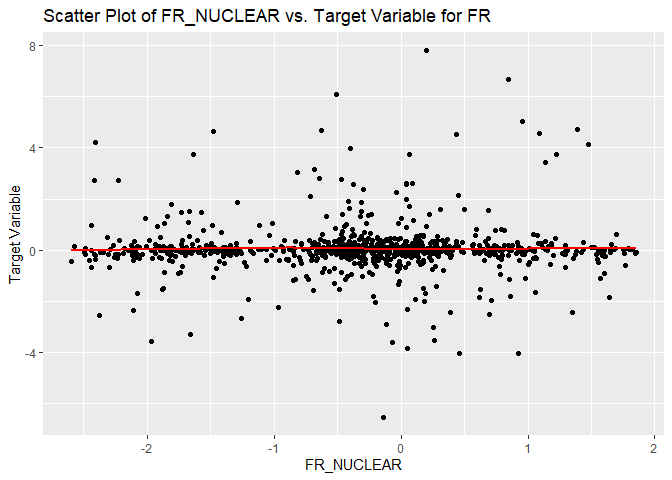
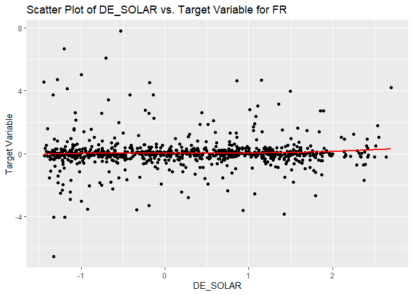
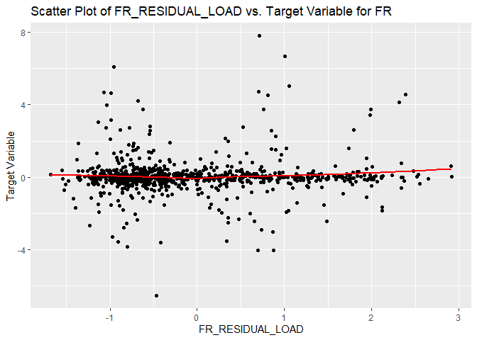
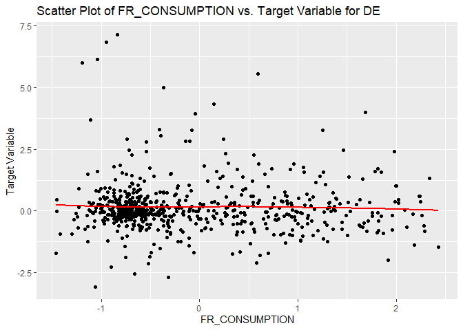
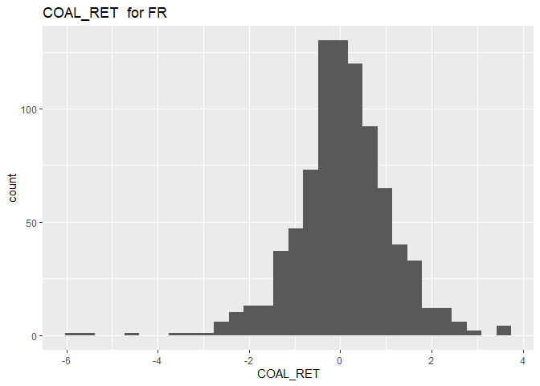

EDA
================

- [Import libraries](#import-libraries)
- [Load data:](#load-data)
- [EDA](#eda)
  - [ID alignement in X and y](#id-alignement-in-x-and-y)
  - [Missing vals by variable](#missing-vals-by-variable)
  - [Variables dtypes](#variables-dtypes)
  - [`COUNTRY` var and country label
    prefix](#country-var-and-country-label-prefix)
  - [Analysis of the lines with and without `DAY_ID`
    duplicates.](#analysis-of-the-lines-with-and-without-day_id-duplicates)
  - [Are NAs simultaneously present in several cols for the same row
    ?](#are-nas-simultaneously-present-in-several-cols-for-the-same-row-)
  - [Correlation between vars](#correlation-between-vars)
  - [Relations between explanatory vars and
    target](#relations-between-explanatory-vars-and-target)
  - [Value distribution for the explanatory and target
    vars](#value-distribution-for-the-explanatory-and-target-vars)
  - [TARGET FR vs TARGET DE](#target-fr-vs-target-de)
  - [TARGET distribution for missing and non-missing
    vals](#target-distribution-for-missing-and-non-missing-vals)
  - [Feature interactions](#feature-interactions)
  - [dTARGET as target](#dtarget-as-target)

# Import libraries

``` r
# turn off warnings globally
options(warn=-1)
library(readr)
library(dplyr)
```

    ## 
    ## Attachement du package : 'dplyr'

    ## Les objets suivants sont masqués depuis 'package:stats':
    ## 
    ##     filter, lag

    ## Les objets suivants sont masqués depuis 'package:base':
    ## 
    ##     intersect, setdiff, setequal, union

``` r
library(tidyr)
library(purrr)
library(tibble)
library(Hmisc)
```

    ## 
    ## Attachement du package : 'Hmisc'

    ## Les objets suivants sont masqués depuis 'package:dplyr':
    ## 
    ##     src, summarize

    ## Les objets suivants sont masqués depuis 'package:base':
    ## 
    ##     format.pval, units

``` r
library(ggplot2)
library(corrplot)
```

    ## corrplot 0.92 loaded

``` r
library(PerformanceAnalytics)
```

    ## Le chargement a nécessité le package : xts

    ## Le chargement a nécessité le package : zoo

    ## 
    ## Attachement du package : 'zoo'

    ## Les objets suivants sont masqués depuis 'package:base':
    ## 
    ##     as.Date, as.Date.numeric

    ## 
    ## ######################### Warning from 'xts' package ##########################
    ## #                                                                             #
    ## # The dplyr lag() function breaks how base R's lag() function is supposed to  #
    ## # work, which breaks lag(my_xts). Calls to lag(my_xts) that you type or       #
    ## # source() into this session won't work correctly.                            #
    ## #                                                                             #
    ## # Use stats::lag() to make sure you're not using dplyr::lag(), or you can add #
    ## # conflictRules('dplyr', exclude = 'lag') to your .Rprofile to stop           #
    ## # dplyr from breaking base R's lag() function.                                #
    ## #                                                                             #
    ## # Code in packages is not affected. It's protected by R's namespace mechanism #
    ## # Set `options(xts.warn_dplyr_breaks_lag = FALSE)` to suppress this warning.  #
    ## #                                                                             #
    ## ###############################################################################

    ## 
    ## Attachement du package : 'xts'

    ## Les objets suivants sont masqués depuis 'package:dplyr':
    ## 
    ##     first, last

    ## 
    ## Attachement du package : 'PerformanceAnalytics'

    ## L'objet suivant est masqué depuis 'package:graphics':
    ## 
    ##     legend

# Load data:

``` r
X_train_raw <- read.csv("../data/X_train.csv")
X_test_raw <- read.csv("../data/X_test.csv")
y_train <- read.csv("../data/y_train.csv")
```

Shape of the data sets:

``` r
print(paste("X train nrow = ", nrow(X_train_raw), ", ncol = ", ncol(X_train_raw), sep = ""), quote = FALSE)
```

    ## [1] X train nrow = 1494, ncol = 35

``` r
print(paste("X test nrow = ", nrow(X_test_raw), ", ncol = ", ncol(X_test_raw), sep = ""), quote = FALSE)
```

    ## [1] X test nrow = 654, ncol = 35

``` r
print(paste("y train nrow = ", nrow(y_train), ", ncol = ", ncol(y_train), sep = ""), quote = FALSE)
```

    ## [1] y train nrow = 1494, ncol = 2

# EDA

## ID alignement in X and y

Are samples’ IDs in X and y aligned?

``` r
print(paste("Number of misaligned rows:", sum(X_train_raw$ID != y_train$ID)), quote = FALSE)
```

    ## [1] Number of misaligned rows: 0

## Missing vals by variable

Missing values by column. Training set:

``` r
tibble_ <- X_train_raw

na_cols_train <- tibble(
  column_names = names(tibble_),
  missing_percentage = round(colMeans(is.na(tibble_)) * 100, 1)
  ) %>% 
  arrange(desc(missing_percentage)) %>% 
  filter(missing_percentage > 0)

print(na_cols_train, quote = FALSE)
```

    ## # A tibble: 12 × 2
    ##    column_names   missing_percentage
    ##    <chr>                       <dbl>
    ##  1 DE_NET_EXPORT                 8.3
    ##  2 DE_NET_IMPORT                 8.3
    ##  3 DE_RAIN                       6.3
    ##  4 FR_RAIN                       6.3
    ##  5 DE_WIND                       6.3
    ##  6 FR_WIND                       6.3
    ##  7 DE_TEMP                       6.3
    ##  8 FR_TEMP                       6.3
    ##  9 FR_NET_EXPORT                 4.7
    ## 10 FR_NET_IMPORT                 4.7
    ## 11 DE_FR_EXCHANGE                1.7
    ## 12 FR_DE_EXCHANGE                1.7

Test set:

``` r
tibble_ <- X_test_raw

na_cols_test <- tibble(
  column_names = names(tibble_),
  missing_percentage = round(colMeans(is.na(tibble_)) * 100, 1)
  ) %>% 
  arrange(desc(missing_percentage)) %>% 
  filter(missing_percentage > 0)

print(na_cols_test, quotes = FALSE)
```

    ## # A tibble: 12 × 2
    ##    column_names   missing_percentage
    ##    <chr>                       <dbl>
    ##  1 DE_NET_EXPORT                 7.2
    ##  2 DE_NET_IMPORT                 7.2
    ##  3 DE_RAIN                       6.1
    ##  4 FR_RAIN                       6.1
    ##  5 DE_WIND                       6.1
    ##  6 FR_WIND                       6.1
    ##  7 DE_TEMP                       6.1
    ##  8 FR_TEMP                       6.1
    ##  9 FR_NET_EXPORT                 3.7
    ## 10 FR_NET_IMPORT                 3.7
    ## 11 DE_FR_EXCHANGE                1.4
    ## 12 FR_DE_EXCHANGE                1.4

Are cols with NAs the same in training and test sets?

``` r
print(paste("In train set only:", setdiff(na_cols_train$column_names, na_cols_test$column_names)), quotes = FALSE)
```

    ## [1] "In train set only: "

``` r
print(paste("In test set only:", setdiff(na_cols_test$column_names, na_cols_train$column_names)), quotes = FALSE)
```

    ## [1] "In test set only: "

## Variables dtypes

Columns’ dtypes. The dtypes of all columns have been properly detected
on the data import.

``` r
str(X_train_raw)
```

    ## 'data.frame':    1494 obs. of  35 variables:
    ##  $ ID              : int  1054 2049 1924 297 1101 1520 1546 1069 1323 1618 ...
    ##  $ DAY_ID          : int  206 501 687 720 818 467 144 1136 83 307 ...
    ##  $ COUNTRY         : chr  "FR" "FR" "FR" "DE" ...
    ##  $ DE_CONSUMPTION  : num  0.2101 -0.0224 1.395 -0.9833 0.1438 ...
    ##  $ FR_CONSUMPTION  : num  -0.427 -1.003 1.979 -0.849 -0.617 ...
    ##  $ DE_FR_EXCHANGE  : num  -0.6065 -0.0221 1.0213 -0.8396 -0.925 ...
    ##  $ FR_DE_EXCHANGE  : num  0.6065 0.0221 -1.0213 0.8396 0.925 ...
    ##  $ DE_NET_EXPORT   : num  NA -0.574 -0.622 -0.271 NA ...
    ##  $ FR_NET_EXPORT   : num  0.693 -1.131 -1.683 0.563 0.99 ...
    ##  $ DE_NET_IMPORT   : num  NA 0.574 0.622 0.271 NA ...
    ##  $ FR_NET_IMPORT   : num  -0.693 1.131 1.683 -0.563 -0.99 ...
    ##  $ DE_GAS          : num  0.441 0.175 2.352 0.488 0.239 ...
    ##  $ FR_GAS          : num  -0.214 0.427 2.122 0.195 -0.241 ...
    ##  $ DE_COAL         : num  0.741 -0.17 1.572 -1.474 1.004 ...
    ##  $ FR_COAL         : num  0.289 -0.762 0.777 -0.786 -0.275 ...
    ##  $ DE_HYDRO        : num  2.209 0.188 -0.109 -0.368 -0.23 ...
    ##  $ FR_HYDRO        : num  0.208 -0.807 0.779 1.32 -0.796 ...
    ##  $ DE_NUCLEAR      : num  0.70961 -1.88274 -1.89711 -0.20555 -0.00558 ...
    ##  $ FR_NUCLEAR      : num  -0.19 -2.186 0.735 -1.59 0.177 ...
    ##  $ DE_SOLAR        : num  0.102 1.987 -1.116 1.752 0.694 ...
    ##  $ FR_SOLAR        : num  1.249 3.237 -0.371 0.563 0.724 ...
    ##  $ DE_WINDPOW      : num  -0.5734 -0.0355 -0.2988 -0.0101 -0.7749 ...
    ##  $ FR_WINDPOW      : num  -0.269 -0.107 -0.141 0.367 -0.564 ...
    ##  $ DE_LIGNITE      : num  0.87 -0.194 0.428 -2.331 0.691 ...
    ##  $ DE_RESIDUAL_LOAD: num  0.627 -0.395 1.337 -1.192 0.572 ...
    ##  $ FR_RESIDUAL_LOAD: num  -0.445 -1.183 1.947 -0.977 -0.526 ...
    ##  $ DE_RAIN         : num  -0.173 -1.24 -0.481 -1.115 -0.541 ...
    ##  $ FR_RAIN         : num  -0.556 -0.77 -0.313 -0.508 -0.425 ...
    ##  $ DE_WIND         : num  -0.791 1.522 0.431 -0.499 -1.088 ...
    ##  $ FR_WIND         : num  -0.283 0.828 0.488 -0.236 -1.012 ...
    ##  $ DE_TEMP         : num  -1.069 0.437 0.685 0.351 0.614 ...
    ##  $ FR_TEMP         : num  -0.0634 1.8312 0.1148 -0.4175 0.7295 ...
    ##  $ GAS_RET         : num  0.339 -0.659 0.536 0.912 0.245 ...
    ##  $ COAL_RET        : num  0.1246 0.0471 0.7433 -0.2962 1.5266 ...
    ##  $ CARBON_RET      : num  -0.00244 -0.49037 0.20495 1.07395 2.61438 ...

## `COUNTRY` var and country label prefix

Value counts in the `COUNTRY` column:

``` r
print(
  X_train_raw %>%
    count(COUNTRY) %>%
    mutate(percentage = round(n / sum(n) * 100, 1))
)
```

    ##   COUNTRY   n percentage
    ## 1      DE 643         43
    ## 2      FR 851         57

The data describes two countries, FR and DE, roughly equally presented.

Duplicates among `DAY_ID` in the training set:

``` r
print(
  X_train_raw %>%
    count(DAY_ID) %>%
    mutate(n = n - 1) %>% 
    rename(num_of_duplicates = n) %>% 
    count(num_of_duplicates) %>% 
    rename(count = n) %>% 
    mutate(percentage = round(count / sum(count) * 100, 1))
)
```

    ##   num_of_duplicates count percentage
    ## 1                 0   208       24.4
    ## 2                 1   643       75.6

Most of the lines (3/4) have duplicates.

643\*2 + 208 gives the number of rows in the training set.

Duplicates among `DAY_ID` in the test set:

``` r
print(
  X_test_raw %>%
    count(DAY_ID) %>%
    mutate(n = n - 1) %>% 
    rename(num_of_duplicates = n) %>% 
    count(num_of_duplicates) %>% 
    rename(count = n) %>% 
    mutate(percentage = round(count / sum(count) * 100, 1))
)
```

    ##   num_of_duplicates count percentage
    ## 1                 0    76       20.8
    ## 2                 1   289       79.2

The number of duplicates is more or less the same as in the training
set.

For the rows that have the same `DAY_ID`, in which columns are they
different? Training set:

``` r
tibble_ <- X_train_raw
tibble_$TARGET <- y_train$TARGET

# given a DAY_ID, select rows corresponding to it and get the names of the
# columns where the two rows having this DAY_ID differ
non_duplicated_cols <- function(day_id_) {
  col_names <- tibble_ %>% 
    filter(DAY_ID == day_id_) %>% 
    select_if(function(column) !identical(column[1], column[2])) %>% 
    names() %>% 
    paste(., collapse = ", ")
  return(col_names)
}

# get the list of day IDs that are duplicated in the table
ids <- tibble_ %>%
  count(DAY_ID) %>% 
  filter(n > 1) %>% 
  pull(DAY_ID)

# for each pair of duplicated rows, get a list of column names that have 
# different values in the pair of duplicated rows, drop duplicates
results <- lapply(ids, non_duplicated_cols) %>% unique()

print(results)
```

    ## [[1]]
    ## [1] "ID, COUNTRY, TARGET"

Same question for the test set (no `TARGET`):

``` r
tibble_ <- X_test_raw

# given a DAY_ID, select rows corresponding to it and get the names of the
# columns where the two rows having this DAY_ID differ
non_duplicated_cols <- function(day_id_) {
  col_names <- tibble_ %>% 
    filter(DAY_ID == day_id_) %>% 
    select_if(function(column) !identical(column[1], column[2])) %>% 
    names() %>% 
    paste(., collapse = ", ")
  return(col_names)
}

# get the list of day IDs that are duplicated in the table
ids <- tibble_ %>%
  count(DAY_ID) %>% 
  filter(n > 1) %>% 
  pull(DAY_ID)

# for each pair of duplicated rows, get a list of column names that have 
# different values in the pair of duplicated rows, drop duplicates
results <- lapply(ids, non_duplicated_cols) %>% unique()

print(results)
```

    ## [[1]]
    ## [1] "ID, COUNTRY"

Thus the rows having the same value of `DAY_ID` differ only by `ID`
(obviously), `COUNTRY` (FR or DE) and `TARGET` (prediction for FR or
DE). For the rest they are identical.

## Analysis of the lines with and without `DAY_ID` duplicates.

First select rows that don’t have duplicates:

``` r
# get the list of day IDs that are not duplicated in the training set
ids_train <- X_train_raw %>%
  count(DAY_ID) %>% 
  filter(n == 1) %>% 
  pull(DAY_ID)

# get the list of day IDs that are not duplicated in the test set
ids_test <- X_test_raw %>%
  count(DAY_ID) %>% 
  filter(n == 1) %>% 
  pull(DAY_ID)
```

To which countries do these lines in the training and test sets
correspond?

``` r
print(X_train_raw %>% filter(DAY_ID %in% ids_train) %>% count(COUNTRY))
```

    ##   COUNTRY   n
    ## 1      FR 208

``` r
print(X_test_raw %>% filter(DAY_ID %in% ids_test) %>% count(COUNTRY))
```

    ##   COUNTRY  n
    ## 1      FR 76

All rows that don’t have a duplicate in `DAY_ID` correspond to country
FR.

What about missing vals in these non duplicated lines?

``` r
tibble_ <- X_train_raw %>% filter(DAY_ID %in% ids_train)

na_cols_train <- tibble(
  column_names = names(tibble_),
  missing_percentage = round(colMeans(is.na(tibble_)) * 100, 1)
  ) %>% 
  arrange(desc(missing_percentage)) %>% 
  filter(missing_percentage > 0)

print(na_cols_train)
```

    ## # A tibble: 6 × 2
    ##   column_names   missing_percentage
    ##   <chr>                       <dbl>
    ## 1 DE_NET_EXPORT                59.6
    ## 2 DE_NET_IMPORT                59.6
    ## 3 FR_NET_EXPORT                33.7
    ## 4 FR_NET_IMPORT                33.7
    ## 5 DE_FR_EXCHANGE               12  
    ## 6 FR_DE_EXCHANGE               12

``` r
tibble_ <- X_test_raw %>% filter(DAY_ID %in% ids_test)

na_cols_test <- tibble(
  column_names = names(tibble_),
  missing_percentage = round(colMeans(is.na(tibble_)) * 100, 1)
  ) %>% 
  arrange(desc(missing_percentage)) %>% 
  filter(missing_percentage > 0)

print(na_cols_test)
```

    ## # A tibble: 6 × 2
    ##   column_names   missing_percentage
    ##   <chr>                       <dbl>
    ## 1 DE_NET_EXPORT                61.8
    ## 2 DE_NET_IMPORT                61.8
    ## 3 FR_NET_EXPORT                31.6
    ## 4 FR_NET_IMPORT                31.6
    ## 5 DE_FR_EXCHANGE               11.8
    ## 6 FR_DE_EXCHANGE               11.8

To conclude, the lines that don’t have duplicates in `DAY_ID` have NAs
in the cols describing countries’ net import and export and DE\<-\>FR
exchange (`DE_FR_EXCHANGE`, `FR_DE_EXCHANGE`, `DE_NET_EXPORT`,
`FR_NET_EXPORT`, `DE_NET_IMPORT`, `FR_NET_IMPORT`).

And in duplicated lines?

``` r
tibble_ <- X_train_raw %>% filter(!(DAY_ID %in% ids_train))

na_cols_train <- tibble(
  column_names = names(tibble_),
  missing_percentage = round(colMeans(is.na(tibble_)) * 100, 1)
  ) %>% 
  arrange(desc(missing_percentage)) %>% 
  filter(missing_percentage > 0)

print(na_cols_train)
```

    ## # A tibble: 6 × 2
    ##   column_names missing_percentage
    ##   <chr>                     <dbl>
    ## 1 DE_RAIN                     7.3
    ## 2 FR_RAIN                     7.3
    ## 3 DE_WIND                     7.3
    ## 4 FR_WIND                     7.3
    ## 5 DE_TEMP                     7.3
    ## 6 FR_TEMP                     7.3

``` r
tibble_ <- X_test_raw %>% filter(!(DAY_ID %in% ids_test))

na_cols_test <- tibble(
  column_names = names(tibble_),
  missing_percentage = round(colMeans(is.na(tibble_)) * 100, 1)
  ) %>% 
  arrange(desc(missing_percentage)) %>% 
  filter(missing_percentage > 0)

print(na_cols_test)
```

    ## # A tibble: 6 × 2
    ##   column_names missing_percentage
    ##   <chr>                     <dbl>
    ## 1 DE_RAIN                     6.9
    ## 2 FR_RAIN                     6.9
    ## 3 DE_WIND                     6.9
    ## 4 FR_WIND                     6.9
    ## 5 DE_TEMP                     6.9
    ## 6 FR_TEMP                     6.9

The lines having duplicates in `DAY_ID` have NAs only in the cols
describing countries’ weather conditions (`DE_RAIN`, `FR_RAIN`,
`DE_WIND`, `FR_WIND`, `DE_TEMP`, `FR_TEMP`).

The two lists of columns above span all (12) the columns with missing
values.

## Are NAs simultaneously present in several cols for the same row ?

Find the groups of columns that have simultaneously NAs in one row for
the training set:

``` r
missing_columns_list <- X_train_raw %>%
  pmap(function(...) names(list(...))[sapply(list(...), is.na)]) %>% 
  Filter(function(x) length(x) > 0, .) %>% 
  unique(.)

missing_columns_list
```

    ## [[1]]
    ## [1] "DE_NET_EXPORT" "DE_NET_IMPORT"
    ## 
    ## [[2]]
    ## [1] "DE_FR_EXCHANGE" "FR_DE_EXCHANGE" "DE_NET_EXPORT"  "FR_NET_EXPORT" 
    ## [5] "DE_NET_IMPORT"  "FR_NET_IMPORT" 
    ## 
    ## [[3]]
    ## [1] "DE_NET_EXPORT" "FR_NET_EXPORT" "DE_NET_IMPORT" "FR_NET_IMPORT"
    ## 
    ## [[4]]
    ## [1] "DE_RAIN" "FR_RAIN" "DE_WIND" "FR_WIND" "DE_TEMP" "FR_TEMP"

Same for the test set:

``` r
X_test_raw %>%
  pmap(function(...) names(list(...))[sapply(list(...), is.na)]) %>% 
  Filter(function(x) length(x) > 0, .) %>% 
  unique(.)
```

    ## [[1]]
    ## [1] "DE_NET_EXPORT" "DE_NET_IMPORT"
    ## 
    ## [[2]]
    ## [1] "DE_FR_EXCHANGE" "FR_DE_EXCHANGE" "DE_NET_EXPORT"  "FR_NET_EXPORT" 
    ## [5] "DE_NET_IMPORT"  "FR_NET_IMPORT" 
    ## 
    ## [[3]]
    ## [1] "DE_NET_EXPORT" "FR_NET_EXPORT" "DE_NET_IMPORT" "FR_NET_IMPORT"
    ## 
    ## [[4]]
    ## [1] "DE_RAIN" "FR_RAIN" "DE_WIND" "FR_WIND" "DE_TEMP" "FR_TEMP"

Apparently we get the same groups of columns.

As a side note, the analysis above shows that the test set has the same
properties as the training set and thus it is a representative sample of
the data.

To conclude the analysis above:

- The rows that **don’t have** duplicates in the `DAY_ID` col have NAs
  in all 6 cols describing countries’ weather conditions (`DE_RAIN`,
  `FR_RAIN`, `DE_WIND`, `FR_WIND`, `DE_TEMP`, `FR_TEMP`).
- The rows that **do have** duplicates in the `DAY_ID` col can have NAs
  simultaneously in the following groups of cols:
  - `DE_NET_EXPORT`, `DE_NET_IMPORT`
  - `DE_NET_EXPORT`, `FR_NET_EXPORT`, `DE_NET_IMPORT`, `FR_NET_IMPORT`
  - `DE_FR_EXCHANGE`, `FR_DE_EXCHANGE`, `DE_NET_EXPORT`,
    `FR_NET_EXPORT`, `DE_NET_IMPORT`, `FR_NET_IMPORT`

## Correlation between vars

Excluding vars `ID` and `DAY_ID` useless for the prediction and setting
apart `COUNTRY`, we are left with numeric vars only.

Pair corr matrix. I use Spearman corr to capture non-linear corrs.

``` r
res <- cor(select(X_train_raw, -ID, -DAY_ID, -COUNTRY), method = "spearman", use = "complete.obs")

res2 <- rcorr(as.matrix(select(X_train_raw, -ID, -DAY_ID, -COUNTRY)), type = "spearman")
```

Plot:

``` r
corrplot(
  res,
  type = "upper",
  order = "hclust", 
  tl.col = "black",
  tl.srt = 45,
  tl.cex = 0.4)
```

<!-- -->

Let’s explore in more details the correlation matrix. For the
convenience we will flatten it together with the matrix of p-values.

``` r
# Code source: http://www.sthda.com/english/wiki/correlation-matrix-a-quick-start-guide-to-analyze-format-and-visualize-a-correlation-matrix-using-r-software#a-simple-function-to-format-the-correlation-matri
# ++++++++++++++++++++++++++++
# flattenCorrMatrix
# ++++++++++++++++++++++++++++
# cormat : matrix of the correlation coefficients
# pmat : matrix of the correlation p-values
flattenCorrMatrix <- function(cormat, pmat) {
  ut <- upper.tri(cormat)
  data.frame(
    row = rownames(cormat)[row(cormat)[ut]],
    column = rownames(cormat)[col(cormat)[ut]],
    cor  =(cormat)[ut],
    p = pmat[ut]
    )
}

res2_flat <- flattenCorrMatrix(res2$r, res2$P) %>% 
  mutate(cor = round(cor, 2), p = round(100 * p, 0)) %>% 
  arrange(desc(abs(cor)))

print(res2_flat)
```

    ##                  row           column   cor   p
    ## 1     DE_FR_EXCHANGE   FR_DE_EXCHANGE -1.00   0
    ## 2      DE_NET_EXPORT    DE_NET_IMPORT -1.00   0
    ## 3      FR_NET_EXPORT    FR_NET_IMPORT -1.00   0
    ## 4     FR_CONSUMPTION FR_RESIDUAL_LOAD  0.94   0
    ## 5     DE_CONSUMPTION   FR_CONSUMPTION  0.85   0
    ## 6           DE_SOLAR         FR_SOLAR  0.81   0
    ## 7            DE_WIND          FR_WIND  0.81   0
    ## 8     DE_CONSUMPTION FR_RESIDUAL_LOAD  0.79   0
    ## 9         FR_NUCLEAR FR_RESIDUAL_LOAD  0.77   0
    ## 10     DE_NET_EXPORT       DE_WINDPOW  0.76   0
    ## 11     DE_NET_IMPORT       DE_WINDPOW -0.76   0
    ## 12    FR_CONSUMPTION       FR_NUCLEAR  0.75   0
    ## 13           DE_COAL       DE_LIGNITE  0.75   0
    ## 14    DE_FR_EXCHANGE    DE_NET_EXPORT  0.71   0
    ## 15    FR_DE_EXCHANGE    DE_NET_EXPORT -0.71   0
    ## 16    DE_FR_EXCHANGE    DE_NET_IMPORT -0.71   0
    ## 17    FR_DE_EXCHANGE    DE_NET_IMPORT  0.71   0
    ## 18            FR_GAS FR_RESIDUAL_LOAD  0.70   0
    ## 19    DE_FR_EXCHANGE    FR_NET_EXPORT -0.69   0
    ## 20    FR_DE_EXCHANGE    FR_NET_EXPORT  0.69   0
    ## 21    DE_FR_EXCHANGE    FR_NET_IMPORT  0.69   0
    ## 22    FR_DE_EXCHANGE    FR_NET_IMPORT -0.69   0
    ## 23    FR_CONSUMPTION         DE_SOLAR -0.69   0
    ## 24            DE_GAS DE_RESIDUAL_LOAD  0.69   0
    ## 25    FR_CONSUMPTION           FR_GAS  0.68   0
    ## 26    FR_CONSUMPTION         FR_SOLAR -0.68   0
    ## 27           DE_COAL DE_RESIDUAL_LOAD  0.68   0
    ## 28        DE_LIGNITE DE_RESIDUAL_LOAD  0.68   0
    ## 29    DE_CONSUMPTION       FR_NUCLEAR  0.66   0
    ## 30    DE_CONSUMPTION         DE_SOLAR -0.66   0
    ## 31          FR_SOLAR FR_RESIDUAL_LOAD -0.65   0
    ## 32        FR_NUCLEAR         FR_SOLAR -0.64   0
    ## 33        DE_WINDPOW DE_RESIDUAL_LOAD -0.64   0
    ## 34          DE_SOLAR FR_RESIDUAL_LOAD -0.64   0
    ## 35           DE_TEMP          FR_TEMP  0.64   0
    ## 36    DE_CONSUMPTION         FR_SOLAR -0.62   0
    ## 37        DE_NUCLEAR       FR_NUCLEAR  0.60   0
    ## 38    DE_CONSUMPTION           FR_GAS  0.59   0
    ## 39        FR_NUCLEAR         DE_SOLAR -0.59   0
    ## 40    DE_CONSUMPTION    DE_NET_EXPORT  0.57   0
    ## 41    FR_CONSUMPTION    DE_NET_EXPORT  0.57   0
    ## 42    DE_CONSUMPTION    DE_NET_IMPORT -0.57   0
    ## 43    FR_CONSUMPTION    DE_NET_IMPORT -0.57   0
    ## 44            DE_GAS           FR_GAS  0.57   0
    ## 45        DE_WINDPOW       FR_WINDPOW  0.57   0
    ## 46          FR_HYDRO FR_RESIDUAL_LOAD  0.56   0
    ## 47           DE_COAL          FR_COAL  0.55   0
    ## 48            FR_GAS         DE_SOLAR -0.54   0
    ## 49          FR_HYDRO       FR_NUCLEAR  0.52   0
    ## 50     FR_NET_EXPORT           FR_GAS -0.51   0
    ## 51     FR_NET_IMPORT           FR_GAS  0.51   0
    ## 52           DE_COAL FR_RESIDUAL_LOAD  0.51   0
    ## 53            FR_GAS          DE_COAL  0.50   0
    ## 54    FR_CONSUMPTION         FR_HYDRO  0.50   0
    ## 55     DE_NET_EXPORT FR_RESIDUAL_LOAD  0.49   0
    ## 56     DE_NET_IMPORT FR_RESIDUAL_LOAD -0.49   0
    ## 57        DE_NUCLEAR          DE_WIND -0.49   0
    ## 58     DE_NET_EXPORT         DE_HYDRO -0.48   0
    ## 59     DE_NET_IMPORT         DE_HYDRO  0.48   0
    ## 60     DE_NET_EXPORT         DE_SOLAR -0.48   0
    ## 61     DE_NET_IMPORT         DE_SOLAR  0.48   0
    ## 62        DE_NUCLEAR         FR_SOLAR -0.48   0
    ## 63  DE_RESIDUAL_LOAD          DE_WIND -0.48   0
    ## 64    FR_CONSUMPTION   DE_FR_EXCHANGE  0.47   0
    ## 65    FR_CONSUMPTION   FR_DE_EXCHANGE -0.47   0
    ## 66            FR_GAS         FR_SOLAR -0.47   0
    ## 67        FR_WINDPOW          FR_WIND  0.47   0
    ## 68    DE_FR_EXCHANGE           FR_GAS  0.46   0
    ## 69    FR_DE_EXCHANGE           FR_GAS -0.46   0
    ## 70    DE_CONSUMPTION          DE_COAL  0.46   0
    ## 71     DE_NET_EXPORT         FR_SOLAR -0.46   0
    ## 72     DE_NET_IMPORT         FR_SOLAR  0.46   0
    ## 73    DE_CONSUMPTION       DE_WINDPOW  0.46   0
    ## 74        DE_NUCLEAR FR_RESIDUAL_LOAD  0.46   0
    ## 75           GAS_RET       CARBON_RET  0.46   0
    ## 76    FR_CONSUMPTION          DE_COAL  0.45   0
    ## 77    FR_CONSUMPTION         DE_HYDRO -0.45   0
    ## 78          DE_SOLAR       DE_WINDPOW -0.45   0
    ## 79    DE_FR_EXCHANGE FR_RESIDUAL_LOAD  0.45   0
    ## 80    FR_DE_EXCHANGE FR_RESIDUAL_LOAD -0.45   0
    ## 81           FR_COAL FR_RESIDUAL_LOAD  0.45   0
    ## 82        DE_LIGNITE FR_RESIDUAL_LOAD  0.45   0
    ## 83    DE_CONSUMPTION   DE_FR_EXCHANGE  0.44   0
    ## 84    DE_CONSUMPTION   FR_DE_EXCHANGE -0.44   0
    ## 85          DE_HYDRO       DE_WINDPOW -0.44   0
    ## 86    DE_CONSUMPTION          FR_COAL  0.43   0
    ## 87    FR_CONSUMPTION          FR_COAL  0.43   0
    ## 88          FR_HYDRO       DE_NUCLEAR  0.43   0
    ## 89    DE_CONSUMPTION         DE_HYDRO -0.42   0
    ## 90            DE_GAS          DE_WIND -0.42   0
    ## 91          FR_HYDRO          DE_WIND -0.42   0
    ## 92        DE_NUCLEAR          FR_WIND -0.42   0
    ## 93    DE_FR_EXCHANGE          DE_COAL  0.41   0
    ## 94    FR_DE_EXCHANGE          DE_COAL -0.41   0
    ## 95        DE_NUCLEAR         DE_SOLAR -0.41   0
    ## 96          DE_HYDRO         FR_SOLAR  0.41   0
    ## 97          FR_HYDRO         FR_SOLAR -0.41   0
    ## 98            DE_GAS       DE_WINDPOW -0.41   0
    ## 99          DE_SOLAR       FR_WINDPOW -0.41   0
    ## 100         FR_SOLAR       FR_WINDPOW -0.41   0
    ## 101           FR_GAS       DE_LIGNITE  0.41   0
    ## 102         DE_SOLAR          DE_RAIN -0.41   0
    ## 103       DE_WINDPOW          DE_WIND  0.41   0
    ## 104   FR_CONSUMPTION       DE_NUCLEAR  0.40   0
    ## 105   DE_FR_EXCHANGE       DE_WINDPOW  0.40   0
    ## 106   FR_DE_EXCHANGE       DE_WINDPOW -0.40   0
    ## 107    FR_NET_EXPORT          DE_COAL -0.39   0
    ## 108    FR_NET_IMPORT          DE_COAL  0.39   0
    ## 109         DE_HYDRO         DE_SOLAR  0.39   0
    ## 110           FR_GAS DE_RESIDUAL_LOAD  0.39   0
    ## 111       DE_NUCLEAR DE_RESIDUAL_LOAD  0.39   0
    ## 112 DE_RESIDUAL_LOAD FR_RESIDUAL_LOAD  0.39   0
    ## 113    DE_NET_EXPORT       FR_NUCLEAR  0.38   0
    ## 114    DE_NET_IMPORT       FR_NUCLEAR -0.38   0
    ## 115         FR_SOLAR       DE_WINDPOW -0.38   0
    ## 116         DE_HYDRO FR_RESIDUAL_LOAD -0.38   0
    ## 117   DE_FR_EXCHANGE          DE_WIND  0.38   0
    ## 118   FR_DE_EXCHANGE          DE_WIND -0.38   0
    ## 119         FR_HYDRO          FR_WIND -0.38   0
    ## 120   DE_FR_EXCHANGE          FR_COAL  0.37   0
    ## 121   FR_DE_EXCHANGE          FR_COAL -0.37   0
    ## 122           FR_GAS          FR_COAL  0.37   0
    ## 123   DE_CONSUMPTION         FR_HYDRO  0.37   0
    ## 124    FR_NET_EXPORT       FR_NUCLEAR  0.37   0
    ## 125    FR_NET_IMPORT       FR_NUCLEAR -0.37   0
    ## 126   FR_CONSUMPTION       DE_WINDPOW  0.37   0
    ## 127         DE_HYDRO       FR_WINDPOW -0.37   0
    ## 128   DE_CONSUMPTION       DE_LIGNITE  0.37   0
    ## 129   FR_CONSUMPTION       DE_LIGNITE  0.37   0
    ## 130          FR_COAL       DE_LIGNITE  0.37   0
    ## 131   DE_CONSUMPTION       FR_WINDPOW  0.36   0
    ## 132    DE_NET_EXPORT       FR_WINDPOW  0.36   0
    ## 133    DE_NET_IMPORT       FR_WINDPOW -0.36   0
    ## 134           DE_GAS FR_RESIDUAL_LOAD  0.36   0
    ## 135    DE_NET_EXPORT           FR_GAS  0.35   0
    ## 136    DE_NET_IMPORT           FR_GAS -0.35   0
    ## 137           DE_GAS       DE_LIGNITE  0.35   0
    ## 138         COAL_RET       CARBON_RET  0.35   0
    ## 139         DE_HYDRO       FR_NUCLEAR -0.34   0
    ## 140   FR_CONSUMPTION       FR_WINDPOW  0.34   0
    ## 141    DE_NET_EXPORT DE_RESIDUAL_LOAD -0.34   0
    ## 142    DE_NET_IMPORT DE_RESIDUAL_LOAD  0.34   0
    ## 143           DE_GAS          DE_COAL  0.33   0
    ## 144   DE_CONSUMPTION       DE_NUCLEAR  0.33   0
    ## 145    FR_NET_EXPORT       DE_NUCLEAR  0.33   0
    ## 146    FR_NET_IMPORT       DE_NUCLEAR -0.33   0
    ## 147         FR_HYDRO DE_RESIDUAL_LOAD  0.33   0
    ## 148    FR_NET_EXPORT          FR_COAL -0.32   0
    ## 149    FR_NET_IMPORT          FR_COAL  0.32   0
    ## 150   DE_FR_EXCHANGE         DE_HYDRO -0.32   0
    ## 151   FR_DE_EXCHANGE         DE_HYDRO  0.32   0
    ## 152           DE_GAS         FR_HYDRO  0.32   0
    ## 153           FR_GAS       FR_NUCLEAR  0.32   0
    ## 154          DE_COAL         DE_SOLAR -0.32   0
    ## 155         FR_HYDRO         DE_SOLAR -0.32   0
    ## 156         FR_SOLAR          FR_RAIN -0.32   0
    ## 157         DE_SOLAR       DE_LIGNITE -0.31   0
    ## 158           FR_GAS         FR_HYDRO  0.30   0
    ## 159       FR_WINDPOW DE_RESIDUAL_LOAD -0.30   0
    ## 160       FR_WINDPOW          FR_RAIN  0.30   0
    ## 161          DE_RAIN          FR_RAIN  0.30   0
    ## 162       FR_NUCLEAR          FR_WIND -0.30   0
    ## 163           FR_GAS         DE_HYDRO -0.29   0
    ## 164   DE_FR_EXCHANGE         DE_SOLAR -0.29   0
    ## 165   FR_DE_EXCHANGE         DE_SOLAR  0.29   0
    ## 166       DE_NUCLEAR       DE_LIGNITE  0.29   0
    ## 167          FR_COAL DE_RESIDUAL_LOAD  0.29   0
    ## 168       DE_WINDPOW          DE_RAIN  0.29   0
    ## 169    FR_NET_EXPORT          DE_WIND -0.29   0
    ## 170    FR_NET_IMPORT          DE_WIND  0.29   0
    ## 171       FR_NUCLEAR          DE_WIND -0.29   0
    ## 172           DE_GAS          FR_WIND -0.29   0
    ## 173          FR_COAL         DE_SOLAR -0.28   0
    ## 174       FR_NUCLEAR       DE_LIGNITE  0.28   0
    ## 175         FR_SOLAR       DE_LIGNITE -0.28   0
    ## 176         FR_SOLAR          DE_RAIN -0.28   0
    ## 177       DE_LIGNITE          DE_WIND -0.28   0
    ## 178   FR_CONSUMPTION           DE_GAS  0.27   0
    ## 179          DE_COAL       FR_NUCLEAR  0.27   0
    ## 180          FR_COAL       FR_NUCLEAR  0.27   0
    ## 181    FR_NET_EXPORT       DE_LIGNITE -0.27   0
    ## 182    FR_NET_IMPORT       DE_LIGNITE  0.27   0
    ## 183       DE_WINDPOW       DE_LIGNITE -0.27   0
    ## 184   FR_CONSUMPTION DE_RESIDUAL_LOAD  0.27   0
    ## 185       FR_NUCLEAR DE_RESIDUAL_LOAD  0.27   0
    ## 186       FR_WINDPOW          DE_RAIN  0.27   0
    ## 187 DE_RESIDUAL_LOAD          FR_WIND -0.27   0
    ## 188          GAS_RET         COAL_RET  0.27   0
    ## 189    DE_NET_EXPORT    FR_NET_EXPORT -0.26   0
    ## 190    FR_NET_EXPORT    DE_NET_IMPORT  0.26   0
    ## 191    DE_NET_EXPORT    FR_NET_IMPORT  0.26   0
    ## 192    DE_NET_IMPORT    FR_NET_IMPORT -0.26   0
    ## 193    FR_NET_EXPORT           DE_GAS -0.26   0
    ## 194    FR_NET_IMPORT           DE_GAS  0.26   0
    ## 195          DE_COAL       DE_WINDPOW -0.26   0
    ## 196       FR_NUCLEAR       DE_WINDPOW  0.26   0
    ## 197         FR_SOLAR          DE_WIND  0.26   0
    ## 198          DE_COAL         FR_SOLAR -0.25   0
    ## 199       FR_WINDPOW          DE_WIND  0.25   0
    ## 200          FR_COAL         DE_HYDRO -0.24   0
    ## 201           DE_GAS         DE_SOLAR -0.24   0
    ## 202    DE_NET_EXPORT          DE_WIND  0.24   0
    ## 203    DE_NET_IMPORT          DE_WIND -0.24   0
    ## 204 FR_RESIDUAL_LOAD          FR_WIND -0.24   0
    ## 205           DE_GAS         FR_SOLAR -0.23   0
    ## 206   DE_FR_EXCHANGE       DE_LIGNITE  0.23   0
    ## 207   FR_DE_EXCHANGE       DE_LIGNITE -0.23   0
    ## 208   DE_CONSUMPTION DE_RESIDUAL_LOAD  0.23   0
    ## 209         DE_SOLAR DE_RESIDUAL_LOAD -0.23   0
    ## 210   DE_FR_EXCHANGE          FR_WIND  0.23   0
    ## 211   FR_DE_EXCHANGE          FR_WIND -0.23   0
    ## 212    DE_NET_EXPORT          FR_COAL  0.22   0
    ## 213    DE_NET_IMPORT          FR_COAL -0.22   0
    ## 214           DE_GAS       DE_NUCLEAR  0.22   0
    ## 215          FR_COAL         FR_SOLAR -0.22   0
    ## 216         FR_SOLAR DE_RESIDUAL_LOAD -0.22   0
    ## 217       DE_WINDPOW FR_RESIDUAL_LOAD  0.22   0
    ## 218    DE_NET_EXPORT           DE_GAS -0.21   0
    ## 219    DE_NET_IMPORT           DE_GAS  0.21   0
    ## 220    DE_NET_EXPORT       DE_NUCLEAR  0.21   0
    ## 221    DE_NET_IMPORT       DE_NUCLEAR -0.21   0
    ## 222    FR_NET_EXPORT          FR_WIND -0.21   0
    ## 223    FR_NET_IMPORT          FR_WIND  0.21   0
    ## 224       DE_WINDPOW          FR_WIND  0.21   0
    ## 225       DE_LIGNITE          FR_WIND -0.21   0
    ## 226       FR_WINDPOW       DE_LIGNITE -0.20   0
    ## 227   DE_CONSUMPTION          DE_RAIN  0.20   0
    ## 228           FR_GAS       DE_NUCLEAR  0.19   0
    ## 229          DE_COAL       DE_NUCLEAR  0.19   0
    ## 230   DE_FR_EXCHANGE         FR_SOLAR -0.19   0
    ## 231   FR_DE_EXCHANGE         FR_SOLAR  0.19   0
    ## 232    FR_NET_EXPORT FR_RESIDUAL_LOAD -0.19   0
    ## 233    FR_NET_IMPORT FR_RESIDUAL_LOAD  0.19   0
    ## 234 FR_RESIDUAL_LOAD          DE_WIND -0.19   0
    ## 235    DE_NET_EXPORT          DE_COAL  0.18   0
    ## 236    DE_NET_IMPORT          DE_COAL -0.18   0
    ## 237           DE_GAS       FR_WINDPOW -0.18   0
    ## 238         FR_HYDRO       DE_LIGNITE  0.18   0
    ## 239 DE_RESIDUAL_LOAD          FR_TEMP -0.18   0
    ## 240   FR_CONSUMPTION    FR_NET_EXPORT -0.17   0
    ## 241   FR_CONSUMPTION    FR_NET_IMPORT  0.17   0
    ## 242   DE_CONSUMPTION           DE_GAS  0.17   0
    ## 243    FR_NET_EXPORT         FR_HYDRO  0.17   0
    ## 244    FR_NET_IMPORT         FR_HYDRO -0.17   0
    ## 245          FR_COAL       DE_NUCLEAR  0.17   0
    ## 246       FR_NUCLEAR       FR_WINDPOW  0.17   0
    ## 247         DE_SOLAR          FR_RAIN -0.17   0
    ## 248         FR_SOLAR          FR_WIND  0.17   0
    ## 249          FR_RAIN          FR_WIND  0.17   0
    ## 250           DE_GAS          FR_COAL  0.16   0
    ## 251          FR_COAL         FR_HYDRO  0.16   0
    ## 252       DE_WINDPOW          FR_RAIN  0.16   0
    ## 253         DE_HYDRO          DE_WIND -0.16   0
    ## 254       DE_NUCLEAR          FR_TEMP -0.16   0
    ## 255    FR_NET_EXPORT         DE_HYDRO  0.15   0
    ## 256    FR_NET_IMPORT         DE_HYDRO -0.15   0
    ## 257          DE_COAL       FR_WINDPOW -0.15   0
    ## 258 FR_RESIDUAL_LOAD          FR_TEMP -0.15   0
    ## 259    DE_NET_EXPORT       DE_LIGNITE  0.14   0
    ## 260    DE_NET_IMPORT       DE_LIGNITE -0.14   0
    ## 261   FR_CONSUMPTION          DE_RAIN  0.14   0
    ## 262         DE_HYDRO          DE_RAIN -0.14   0
    ## 263       FR_NUCLEAR          DE_RAIN  0.14   0
    ## 264    DE_NET_EXPORT          FR_RAIN  0.14   0
    ## 265    DE_NET_IMPORT          FR_RAIN -0.14   0
    ## 266         DE_HYDRO          FR_RAIN -0.14   0
    ## 267   FR_CONSUMPTION          FR_TEMP -0.14   0
    ## 268         DE_SOLAR          FR_TEMP  0.14   0
    ## 269          DE_COAL         DE_HYDRO -0.13   0
    ## 270         DE_HYDRO DE_RESIDUAL_LOAD  0.13   0
    ## 271    DE_NET_EXPORT          DE_RAIN  0.13   0
    ## 272    DE_NET_IMPORT          DE_RAIN -0.13   0
    ## 273         FR_SOLAR          DE_TEMP -0.13   0
    ## 274          FR_RAIN          DE_TEMP  0.13   0
    ## 275           DE_GAS          FR_TEMP -0.13   0
    ## 276         FR_HYDRO          FR_TEMP -0.13   0
    ## 277          DE_RAIN          FR_TEMP -0.13   0
    ## 278 DE_RESIDUAL_LOAD       CARBON_RET  0.13   0
    ## 279   DE_CONSUMPTION    FR_NET_EXPORT -0.12   0
    ## 280   DE_CONSUMPTION    FR_NET_IMPORT  0.12   0
    ## 281         DE_HYDRO       DE_LIGNITE -0.12   0
    ## 282          DE_RAIN          DE_WIND  0.12   0
    ## 283         DE_HYDRO          FR_WIND -0.12   0
    ## 284          DE_RAIN          FR_WIND  0.12   0
    ## 285       DE_NUCLEAR          DE_TEMP -0.12   0
    ## 286       FR_NUCLEAR          FR_TEMP -0.12   0
    ## 287       DE_WINDPOW       CARBON_RET -0.12   0
    ## 288           DE_GAS         DE_HYDRO  0.11   0
    ## 289          DE_COAL         FR_HYDRO  0.11   0
    ## 290         DE_HYDRO         FR_HYDRO -0.11   0
    ## 291           DE_GAS       FR_NUCLEAR  0.11   0
    ## 292           FR_GAS       DE_WINDPOW  0.11   0
    ## 293           FR_GAS       FR_WINDPOW  0.11   0
    ## 294   DE_FR_EXCHANGE DE_RESIDUAL_LOAD -0.11   0
    ## 295   FR_DE_EXCHANGE DE_RESIDUAL_LOAD  0.11   0
    ## 296    FR_NET_EXPORT          DE_RAIN  0.11   0
    ## 297    FR_NET_IMPORT          DE_RAIN -0.11   0
    ## 298   DE_CONSUMPTION          DE_WIND  0.11   0
    ## 299       DE_WINDPOW          DE_TEMP  0.11   0
    ## 300       DE_LIGNITE          FR_TEMP -0.11   0
    ## 301       DE_WINDPOW          GAS_RET -0.11   0
    ## 302    FR_NET_EXPORT       FR_WINDPOW  0.10   0
    ## 303    FR_NET_IMPORT       FR_WINDPOW -0.10   0
    ## 304           DE_GAS          DE_RAIN -0.10   0
    ## 305 FR_RESIDUAL_LOAD          DE_RAIN  0.10   0
    ## 306   DE_CONSUMPTION          DE_TEMP  0.10   0
    ## 307         DE_HYDRO          DE_TEMP -0.10   0
    ## 308   DE_CONSUMPTION          FR_TEMP -0.10   0
    ## 309         DE_SOLAR          GAS_RET  0.10   0
    ## 310           DE_GAS       CARBON_RET  0.10   0
    ## 311         DE_HYDRO       DE_NUCLEAR -0.09   0
    ## 312   DE_CONSUMPTION          FR_RAIN  0.09   0
    ## 313    DE_NET_EXPORT          DE_TEMP  0.09   0
    ## 314    DE_NET_IMPORT          DE_TEMP -0.09   0
    ## 315 DE_RESIDUAL_LOAD          DE_TEMP -0.09   0
    ## 316       FR_WINDPOW          GAS_RET -0.09   0
    ## 317    DE_NET_EXPORT       CARBON_RET -0.09   0
    ## 318    DE_NET_IMPORT       CARBON_RET  0.09   0
    ## 319   DE_FR_EXCHANGE       FR_NUCLEAR  0.08   0
    ## 320   FR_DE_EXCHANGE       FR_NUCLEAR -0.08   0
    ## 321    FR_NET_EXPORT         DE_SOLAR  0.08   0
    ## 322    FR_NET_IMPORT         DE_SOLAR -0.08   0
    ## 323       FR_WINDPOW FR_RESIDUAL_LOAD  0.08   0
    ## 324       DE_LIGNITE          DE_RAIN -0.08   0
    ## 325       DE_NUCLEAR          FR_RAIN  0.08   0
    ## 326         DE_SOLAR          DE_WIND  0.08   0
    ## 327          DE_COAL          FR_TEMP -0.08   0
    ## 328         DE_HYDRO          FR_TEMP -0.08   0
    ## 329   FR_CONSUMPTION          GAS_RET -0.08   0
    ## 330         FR_SOLAR          GAS_RET  0.08   0
    ## 331       DE_NUCLEAR          DE_RAIN  0.07   1
    ## 332 DE_RESIDUAL_LOAD          DE_RAIN -0.07   1
    ## 333   FR_CONSUMPTION          FR_RAIN  0.07   1
    ## 334   FR_CONSUMPTION          DE_WIND -0.07   1
    ## 335           FR_GAS          DE_WIND -0.07   1
    ## 336          FR_COAL          DE_WIND  0.07   1
    ## 337   DE_CONSUMPTION          FR_WIND  0.07   1
    ## 338    DE_NET_EXPORT          FR_WIND  0.07   1
    ## 339    DE_NET_IMPORT          FR_WIND -0.07   1
    ## 340           FR_GAS          FR_WIND -0.07   1
    ## 341          FR_WIND          DE_TEMP -0.07   1
    ## 342          FR_COAL          FR_TEMP -0.07   1
    ## 343    DE_NET_EXPORT          GAS_RET -0.07   1
    ## 344    DE_NET_IMPORT          GAS_RET  0.07   1
    ## 345           FR_GAS          GAS_RET -0.07   1
    ## 346 DE_RESIDUAL_LOAD          GAS_RET  0.07   1
    ## 347          DE_COAL       CARBON_RET  0.07   1
    ## 348         DE_HYDRO       CARBON_RET  0.07   1
    ## 349       FR_WINDPOW       CARBON_RET -0.07   1
    ## 350       DE_LIGNITE       CARBON_RET  0.07   1
    ## 351   DE_FR_EXCHANGE       FR_WINDPOW  0.06   2
    ## 352   FR_DE_EXCHANGE       FR_WINDPOW -0.06   2
    ## 353          DE_COAL          DE_RAIN -0.06   2
    ## 354           DE_GAS          FR_RAIN -0.06   3
    ## 355 DE_RESIDUAL_LOAD          FR_RAIN -0.06   2
    ## 356          DE_COAL          DE_WIND -0.06   3
    ## 357           FR_GAS          DE_TEMP  0.06   2
    ## 358           FR_GAS          FR_TEMP -0.06   4
    ## 359         FR_SOLAR          FR_TEMP  0.06   3
    ## 360          DE_WIND          GAS_RET  0.06   2
    ## 361          FR_WIND          GAS_RET  0.06   3
    ## 362          FR_WIND       CARBON_RET  0.06   2
    ## 363    DE_NET_EXPORT         FR_HYDRO  0.05   5
    ## 364    DE_NET_IMPORT         FR_HYDRO -0.05   5
    ## 365   DE_FR_EXCHANGE       DE_NUCLEAR -0.05   7
    ## 366   FR_DE_EXCHANGE       DE_NUCLEAR  0.05   7
    ## 367    FR_NET_EXPORT       DE_WINDPOW -0.05   6
    ## 368    FR_NET_IMPORT       DE_WINDPOW  0.05   6
    ## 369    FR_NET_EXPORT DE_RESIDUAL_LOAD -0.05   5
    ## 370    FR_NET_IMPORT DE_RESIDUAL_LOAD  0.05   5
    ## 371   FR_CONSUMPTION          FR_WIND -0.05   4
    ## 372          FR_COAL          FR_WIND  0.05   4
    ## 373         DE_SOLAR          FR_WIND  0.05   6
    ## 374           DE_GAS          DE_TEMP -0.05   4
    ## 375          FR_COAL          DE_TEMP -0.05   7
    ## 376       FR_NUCLEAR          DE_TEMP  0.05   8
    ## 377          FR_RAIN          FR_TEMP  0.05   6
    ## 378           DE_GAS          GAS_RET  0.05   4
    ## 379 FR_RESIDUAL_LOAD          GAS_RET -0.05   6
    ## 380          DE_TEMP          GAS_RET -0.05   7
    ## 381   DE_CONSUMPTION         COAL_RET  0.05   6
    ## 382   FR_CONSUMPTION       CARBON_RET -0.05   4
    ## 383          DE_RAIN       CARBON_RET  0.05   6
    ## 384    FR_NET_EXPORT          FR_RAIN  0.04  11
    ## 385    FR_NET_IMPORT          FR_RAIN -0.04  11
    ## 386           FR_GAS          FR_RAIN -0.04  12
    ## 387          FR_RAIN          DE_WIND  0.04  14
    ## 388          DE_COAL          FR_WIND  0.04  19
    ## 389       DE_LIGNITE          DE_TEMP -0.04  16
    ## 390          DE_RAIN          DE_TEMP  0.04  16
    ## 391       FR_WINDPOW          FR_TEMP  0.04  10
    ## 392         DE_HYDRO          GAS_RET  0.04  10
    ## 393       DE_NUCLEAR          GAS_RET -0.04  11
    ## 394       FR_NUCLEAR          GAS_RET -0.04  17
    ## 395       DE_LIGNITE         COAL_RET  0.04  12
    ## 396 DE_RESIDUAL_LOAD         COAL_RET  0.04  17
    ## 397          DE_RAIN         COAL_RET  0.04  18
    ## 398          FR_WIND         COAL_RET  0.04  18
    ## 399          FR_RAIN       CARBON_RET  0.04  10
    ## 400          FR_TEMP       CARBON_RET -0.04  12
    ## 401    FR_NET_EXPORT         FR_SOLAR -0.03  21
    ## 402    FR_NET_IMPORT         FR_SOLAR  0.03  21
    ## 403         FR_HYDRO       DE_WINDPOW -0.03  31
    ## 404       FR_NUCLEAR          FR_RAIN  0.03  31
    ## 405   DE_FR_EXCHANGE          DE_TEMP  0.03  30
    ## 406   FR_DE_EXCHANGE          DE_TEMP -0.03  30
    ## 407          DE_WIND          DE_TEMP -0.03  34
    ## 408    FR_NET_EXPORT          FR_TEMP  0.03  26
    ## 409    FR_NET_IMPORT          FR_TEMP -0.03  26
    ## 410   DE_CONSUMPTION          GAS_RET -0.03  22
    ## 411    FR_NET_EXPORT          GAS_RET  0.03  27
    ## 412    FR_NET_IMPORT          GAS_RET -0.03  27
    ## 413          DE_COAL          GAS_RET  0.03  20
    ## 414          DE_RAIN          GAS_RET -0.03  20
    ## 415   DE_FR_EXCHANGE         COAL_RET -0.03  33
    ## 416   FR_DE_EXCHANGE         COAL_RET  0.03  33
    ## 417       FR_NUCLEAR         COAL_RET  0.03  32
    ## 418          DE_WIND         COAL_RET  0.03  26
    ## 419    FR_NET_EXPORT       CARBON_RET -0.03  30
    ## 420    FR_NET_IMPORT       CARBON_RET  0.03  30
    ## 421       FR_NUCLEAR       CARBON_RET -0.03  20
    ## 422 FR_RESIDUAL_LOAD       CARBON_RET -0.03  19
    ## 423          DE_WIND       CARBON_RET  0.03  32
    ## 424   DE_FR_EXCHANGE         FR_HYDRO -0.02  55
    ## 425   FR_DE_EXCHANGE         FR_HYDRO  0.02  55
    ## 426       DE_NUCLEAR       DE_WINDPOW -0.02  48
    ## 427          FR_COAL       FR_WINDPOW -0.02  37
    ## 428   DE_FR_EXCHANGE          DE_RAIN -0.02  38
    ## 429   FR_DE_EXCHANGE          DE_RAIN  0.02  38
    ## 430          FR_COAL          DE_RAIN -0.02  37
    ## 431         FR_HYDRO          DE_RAIN  0.02  42
    ## 432          DE_COAL          FR_RAIN -0.02  46
    ## 433          FR_COAL          FR_RAIN  0.02  47
    ## 434         FR_HYDRO          FR_RAIN  0.02  40
    ## 435       DE_LIGNITE          FR_RAIN -0.02  57
    ## 436 FR_RESIDUAL_LOAD          FR_RAIN  0.02  51
    ## 437         DE_SOLAR          DE_TEMP -0.02  37
    ## 438       FR_WINDPOW          DE_TEMP  0.02  40
    ## 439 FR_RESIDUAL_LOAD          DE_TEMP  0.02  38
    ## 440    DE_NET_EXPORT          FR_TEMP  0.02  43
    ## 441    DE_NET_IMPORT          FR_TEMP -0.02  43
    ## 442       DE_WINDPOW          FR_TEMP  0.02  51
    ## 443   DE_FR_EXCHANGE          GAS_RET -0.02  40
    ## 444   FR_DE_EXCHANGE          GAS_RET  0.02  40
    ## 445          FR_COAL          GAS_RET  0.02  45
    ## 446       DE_LIGNITE          GAS_RET -0.02  34
    ## 447   FR_CONSUMPTION         COAL_RET  0.02  53
    ## 448    DE_NET_EXPORT         COAL_RET -0.02  40
    ## 449    FR_NET_EXPORT         COAL_RET  0.02  47
    ## 450    DE_NET_IMPORT         COAL_RET  0.02  40
    ## 451    FR_NET_IMPORT         COAL_RET -0.02  47
    ## 452           DE_GAS         COAL_RET  0.02  49
    ## 453          DE_COAL         COAL_RET  0.02  55
    ## 454         DE_HYDRO         COAL_RET -0.02  37
    ## 455         DE_SOLAR         COAL_RET -0.02  43
    ## 456         FR_SOLAR         COAL_RET -0.02  48
    ## 457 FR_RESIDUAL_LOAD         COAL_RET  0.02  46
    ## 458           FR_GAS       CARBON_RET -0.02  47
    ## 459         FR_HYDRO       CARBON_RET -0.02  51
    ## 460       DE_NUCLEAR       CARBON_RET  0.02  46
    ## 461         DE_SOLAR       CARBON_RET  0.02  47
    ## 462   DE_FR_EXCHANGE           DE_GAS  0.01  74
    ## 463   FR_DE_EXCHANGE           DE_GAS -0.01  74
    ## 464       DE_NUCLEAR       FR_WINDPOW  0.01  62
    ## 465   DE_FR_EXCHANGE          FR_RAIN  0.01  60
    ## 466   FR_DE_EXCHANGE          FR_RAIN -0.01  60
    ## 467    FR_NET_EXPORT          DE_TEMP  0.01  73
    ## 468    FR_NET_IMPORT          DE_TEMP -0.01  73
    ## 469          DE_COAL          DE_TEMP  0.01  72
    ## 470         FR_HYDRO          DE_TEMP -0.01  79
    ## 471   DE_FR_EXCHANGE          FR_TEMP -0.01  65
    ## 472   FR_DE_EXCHANGE          FR_TEMP  0.01  65
    ## 473         FR_HYDRO          GAS_RET  0.01  81
    ## 474           FR_GAS         COAL_RET  0.01  57
    ## 475          FR_COAL         COAL_RET -0.01  80
    ## 476       DE_NUCLEAR         COAL_RET  0.01  79
    ## 477       DE_WINDPOW         COAL_RET -0.01  57
    ## 478          FR_RAIN         COAL_RET  0.01  83
    ## 479          FR_TEMP         COAL_RET -0.01  67
    ## 480   DE_CONSUMPTION       CARBON_RET -0.01  71
    ## 481         FR_SOLAR       CARBON_RET  0.01  60
    ## 482          FR_COAL       DE_WINDPOW  0.00  87
    ## 483         FR_HYDRO       FR_WINDPOW  0.00 100
    ## 484           FR_GAS          DE_RAIN  0.00  89
    ## 485   FR_CONSUMPTION          DE_TEMP  0.00  88
    ## 486          DE_WIND          FR_TEMP  0.00  88
    ## 487          FR_WIND          FR_TEMP  0.00  88
    ## 488          FR_RAIN          GAS_RET  0.00  97
    ## 489          FR_TEMP          GAS_RET  0.00  96
    ## 490         FR_HYDRO         COAL_RET  0.00  87
    ## 491       FR_WINDPOW         COAL_RET  0.00  91
    ## 492          DE_TEMP         COAL_RET  0.00  99
    ## 493   DE_FR_EXCHANGE       CARBON_RET  0.00  89
    ## 494   FR_DE_EXCHANGE       CARBON_RET  0.00  89
    ## 495          FR_COAL       CARBON_RET  0.00  89
    ## 496          DE_TEMP       CARBON_RET  0.00  88

First we notice that all correlations with an absolute value greater
than 0.07 are significant with p-value \< 1%.

Other observations:

1.  The following pairs of variables are all perfectly anti correlated:
    `DE_FR_EXCHANGE` vs `FR_DE_EXCHANGE`, `DE_NET_EXPORT` vs
    `DE_NET_IMPORT`, `FR_NET_EXPORT` vs `FR_NET_IMPORT`. Actually one
    variable in the pair is the inverse of another. The plot below shows
    all pair correlations between these variables. From it , and from
    the correlation matrix, we also notice that DE\<-\>FR exchange is
    strongly correlated with DE/FR net import/export. At the same time
    `DE_NET_IMPORT` and `FR_NET_IMPORT` are decorrelated.

``` r
chart.Correlation(
  select(X_train_raw, DE_FR_EXCHANGE, FR_DE_EXCHANGE, DE_NET_EXPORT, DE_NET_IMPORT, FR_NET_EXPORT, FR_NET_IMPORT), 
  histogram=TRUE, 
  pch=19)
```

<!-- -->

``` r
chart.Correlation(
  select(X_train_raw, FR_DE_EXCHANGE, DE_NET_IMPORT, FR_NET_EXPORT), 
  histogram=TRUE, 
  pch=19)
```

<!-- -->

Relation between FR/DE export, FR\<-\>DE exchange and FR/DE consumption
(total and without renewable).

- Notice the difference in the relation between `FR_CONSUMPTION` and
  `FR_RESIDUAL_LOAD` versus `DE_CONSUMPTION` and `DE_RESIDUAL_LOAD`.
  Could it be attributed to the different proportion of the renewable
  sources in two countries?
- Weak but noticeable relation between e.g. `FR_DE_EXCHANGE` and
  `FR_CONSUMPTION`.

``` r
chart.Correlation(
  select(X_train_raw, FR_DE_EXCHANGE, DE_NET_EXPORT, FR_NET_EXPORT, FR_CONSUMPTION, DE_CONSUMPTION, FR_RESIDUAL_LOAD, DE_RESIDUAL_LOAD), 
  histogram=TRUE, 
  pch=19)
```

<!-- -->

Relation between weather conditions in two countries. Rather strong
correlation between temperature and wind in FR and DE, the amount of
rain in two countries is essentially unrelated.

``` r
chart.Correlation(
  select(X_train_raw, DE_RAIN, FR_RAIN, DE_WIND, FR_WIND, DE_TEMP, FR_TEMP), 
  histogram=TRUE, 
  pch=19)
```

<!-- -->

Relation between weather conditions and production of renewable energy
in two countries.

- An odd relation between `x_WIND` and `x_WINDPOW` for both countries,
  as it consisted of two approx linear relations with different slopes.
- For both countries, there may be a steep anti correlation between
  amount of rain and solar energy production. However, the distribution
  of x_RAIN values has a long high-end wing that may hinder this
  relation.

``` r
chart.Correlation(
  select(X_train_raw, FR_RAIN, FR_WIND, FR_TEMP, FR_SOLAR, FR_WINDPOW, FR_HYDRO), 
  histogram=TRUE, 
  pch=19)
```

<!-- -->

``` r
chart.Correlation(
  select(X_train_raw, DE_RAIN, DE_WIND, DE_TEMP, DE_SOLAR, DE_WINDPOW, DE_HYDRO), 
  histogram=TRUE, 
  pch=19)
```

<!-- -->

Relations between countries’ consumption rates, exchange between them
and whether conditions.

No clear relationship between any of the pair of variables.

``` r
chart.Correlation(
  select(X_train_raw, FR_CONSUMPTION, FR_RESIDUAL_LOAD, FR_DE_EXCHANGE, FR_NET_EXPORT, FR_RAIN, FR_WIND, FR_TEMP), 
  histogram=TRUE, 
  pch=19)
```

<!-- -->

Correlation between consumption and production.

``` r
chart.Correlation(
  select(X_train_raw, FR_CONSUMPTION, FR_RESIDUAL_LOAD, FR_GAS, FR_COAL, FR_NUCLEAR), 
  histogram=TRUE, 
  pch=19)
```

<!-- -->

## Relations between explanatory vars and target

We exclude from the analysis `ID`, `DAY_ID` and perfectly correlated
vars `DE_FR_EXCHANGE`, `FR_NET_IMPORT`, `DE_NET_IMPORT`.

For both countries there is no clear relationship between any of the
explanatory variable and target.

For France:

``` r
# Merge the two tibbles based on a common identifier
merged_tibble <- left_join(X_train_raw, y_train, by = "ID") %>% 
  filter(COUNTRY == "FR") %>% 
  select(-ID, -DAY_ID, -COUNTRY, -DE_FR_EXCHANGE, -FR_NET_IMPORT, -DE_NET_IMPORT)

# Create a vector of explanatory variable names
explanatory_vars <- colnames(select(merged_tibble, -TARGET))

# Generate scatter plots for each explanatory variable
for (var in colnames(select(merged_tibble, -TARGET))) {
  res <- ggplot(merged_tibble, aes_string(x = var, y = "TARGET")) +
    geom_point() +
    geom_smooth(method = "loess", se = FALSE, color = "red", span = 0.9) +
    labs(x = var, y = "Target Variable") +
    ggtitle(paste("Scatter Plot of", var, "vs. Target Variable for FR"))
  print(res)
}
```

    ## `geom_smooth()` using formula = 'y ~ x'

<!-- -->

    ## `geom_smooth()` using formula = 'y ~ x'

<!-- -->

    ## `geom_smooth()` using formula = 'y ~ x'

<!-- -->

    ## `geom_smooth()` using formula = 'y ~ x'

<!-- -->

    ## `geom_smooth()` using formula = 'y ~ x'

<!-- -->

    ## `geom_smooth()` using formula = 'y ~ x'

<!-- -->

    ## `geom_smooth()` using formula = 'y ~ x'

<!-- -->

    ## `geom_smooth()` using formula = 'y ~ x'

<!-- -->

    ## `geom_smooth()` using formula = 'y ~ x'

<!-- -->

    ## `geom_smooth()` using formula = 'y ~ x'

<!-- -->

    ## `geom_smooth()` using formula = 'y ~ x'

<!-- -->

    ## `geom_smooth()` using formula = 'y ~ x'

<!-- -->

    ## `geom_smooth()` using formula = 'y ~ x'

<!-- -->

    ## `geom_smooth()` using formula = 'y ~ x'

<!-- -->

    ## `geom_smooth()` using formula = 'y ~ x'

<!-- -->

    ## `geom_smooth()` using formula = 'y ~ x'

<!-- -->

    ## `geom_smooth()` using formula = 'y ~ x'

<!-- -->

    ## `geom_smooth()` using formula = 'y ~ x'

<!-- -->

    ## `geom_smooth()` using formula = 'y ~ x'

<!-- -->

    ## `geom_smooth()` using formula = 'y ~ x'

<!-- -->

    ## `geom_smooth()` using formula = 'y ~ x'

<!-- -->

    ## `geom_smooth()` using formula = 'y ~ x'

<!-- -->

    ## `geom_smooth()` using formula = 'y ~ x'

<!-- -->

    ## `geom_smooth()` using formula = 'y ~ x'

<!-- -->

    ## `geom_smooth()` using formula = 'y ~ x'

<!-- -->

    ## `geom_smooth()` using formula = 'y ~ x'

<!-- -->

    ## `geom_smooth()` using formula = 'y ~ x'

<!-- -->

    ## `geom_smooth()` using formula = 'y ~ x'

<!-- -->

    ## `geom_smooth()` using formula = 'y ~ x'

<!-- -->

For Germany:

``` r
# Merge the two tibbles based on a common identifier
merged_tibble <- left_join(X_train_raw, y_train, by = "ID") %>% 
  filter(COUNTRY == "DE") %>% 
  select(-ID, -DAY_ID, -COUNTRY, -DE_FR_EXCHANGE, -FR_NET_IMPORT, -DE_NET_IMPORT)

# Create a vector of explanatory variable names
explanatory_vars <- colnames(select(merged_tibble, -TARGET))

# Generate scatter plots for each explanatory variable
for (var in colnames(select(merged_tibble, -TARGET))) {
  res <- ggplot(merged_tibble, aes_string(x = var, y = "TARGET")) +
    geom_point() +
    geom_smooth(method = "loess", se = FALSE, color = "red", span = 0.9) +
    labs(x = var, y = "Target Variable") +
    ggtitle(paste("Scatter Plot of", var, "vs. Target Variable for DE"))
  print(res)
}
```

    ## `geom_smooth()` using formula = 'y ~ x'

<!-- -->

    ## `geom_smooth()` using formula = 'y ~ x'

<!-- -->

    ## `geom_smooth()` using formula = 'y ~ x'

<!-- -->

    ## `geom_smooth()` using formula = 'y ~ x'

<!-- -->

    ## `geom_smooth()` using formula = 'y ~ x'

<!-- -->

    ## `geom_smooth()` using formula = 'y ~ x'

<!-- -->

    ## `geom_smooth()` using formula = 'y ~ x'

<!-- -->

    ## `geom_smooth()` using formula = 'y ~ x'

<!-- -->

    ## `geom_smooth()` using formula = 'y ~ x'

<!-- -->

    ## `geom_smooth()` using formula = 'y ~ x'

<!-- -->

    ## `geom_smooth()` using formula = 'y ~ x'

<!-- -->

    ## `geom_smooth()` using formula = 'y ~ x'

<!-- -->

    ## `geom_smooth()` using formula = 'y ~ x'

<!-- -->

    ## `geom_smooth()` using formula = 'y ~ x'

<!-- -->

    ## `geom_smooth()` using formula = 'y ~ x'

<!-- -->

    ## `geom_smooth()` using formula = 'y ~ x'

<!-- -->

    ## `geom_smooth()` using formula = 'y ~ x'

<!-- -->

    ## `geom_smooth()` using formula = 'y ~ x'

<!-- -->

    ## `geom_smooth()` using formula = 'y ~ x'

<!-- -->

    ## `geom_smooth()` using formula = 'y ~ x'

<!-- -->

    ## `geom_smooth()` using formula = 'y ~ x'

<!-- -->

    ## `geom_smooth()` using formula = 'y ~ x'

<!-- -->

    ## `geom_smooth()` using formula = 'y ~ x'

<!-- -->

    ## `geom_smooth()` using formula = 'y ~ x'

<!-- -->

    ## `geom_smooth()` using formula = 'y ~ x'

<!-- -->

    ## `geom_smooth()` using formula = 'y ~ x'

<!-- -->

    ## `geom_smooth()` using formula = 'y ~ x'

<!-- -->

    ## `geom_smooth()` using formula = 'y ~ x'

<!-- -->

    ## `geom_smooth()` using formula = 'y ~ x'

<!-- -->

Both countries together:

``` r
# Merge the two tibbles based on a common identifier
merged_tibble <- left_join(X_train_raw, y_train, by = "ID") %>% 
  select(-ID, -DAY_ID, -COUNTRY, -DE_FR_EXCHANGE, -FR_NET_IMPORT, -DE_NET_IMPORT)

# Create a vector of explanatory variable names
explanatory_vars <- colnames(select(merged_tibble, -TARGET))

# Generate scatter plots for each explanatory variable
for (var in colnames(select(merged_tibble, -TARGET))) {
  res <- ggplot(merged_tibble, aes_string(x = var, y = "TARGET")) +
    geom_point() +
    geom_smooth(method = "loess", se = FALSE, color = "red", span = 0.9) +
    labs(x = var, y = "Target Variable") +
    ggtitle(paste("Scatter Plot of", var, "vs. Target Variable for DE"))
  print(res)
}
```

    ## `geom_smooth()` using formula = 'y ~ x'

<!-- -->

    ## `geom_smooth()` using formula = 'y ~ x'

<!-- -->

    ## `geom_smooth()` using formula = 'y ~ x'

<!-- -->

    ## `geom_smooth()` using formula = 'y ~ x'

<!-- -->

    ## `geom_smooth()` using formula = 'y ~ x'

<!-- -->

    ## `geom_smooth()` using formula = 'y ~ x'

<!-- -->

    ## `geom_smooth()` using formula = 'y ~ x'

<!-- -->

    ## `geom_smooth()` using formula = 'y ~ x'

<!-- -->

    ## `geom_smooth()` using formula = 'y ~ x'

<!-- -->

    ## `geom_smooth()` using formula = 'y ~ x'

<!-- -->

    ## `geom_smooth()` using formula = 'y ~ x'

<!-- -->

    ## `geom_smooth()` using formula = 'y ~ x'

<!-- -->

    ## `geom_smooth()` using formula = 'y ~ x'

<!-- -->

    ## `geom_smooth()` using formula = 'y ~ x'

<!-- -->

    ## `geom_smooth()` using formula = 'y ~ x'

<!-- -->

    ## `geom_smooth()` using formula = 'y ~ x'

<!-- -->

    ## `geom_smooth()` using formula = 'y ~ x'

<!-- -->

    ## `geom_smooth()` using formula = 'y ~ x'

<!-- -->

    ## `geom_smooth()` using formula = 'y ~ x'

<!-- -->

    ## `geom_smooth()` using formula = 'y ~ x'

<!-- -->

    ## `geom_smooth()` using formula = 'y ~ x'

<!-- -->

    ## `geom_smooth()` using formula = 'y ~ x'

<!-- -->

    ## `geom_smooth()` using formula = 'y ~ x'

<!-- -->

    ## `geom_smooth()` using formula = 'y ~ x'

<!-- -->

    ## `geom_smooth()` using formula = 'y ~ x'

<!-- -->

    ## `geom_smooth()` using formula = 'y ~ x'

<!-- -->

    ## `geom_smooth()` using formula = 'y ~ x'

<!-- -->

    ## `geom_smooth()` using formula = 'y ~ x'

<!-- -->

    ## `geom_smooth()` using formula = 'y ~ x'

<!-- -->

## Value distribution for the explanatory and target vars

For France.

Notice the distribution of `x_CONSUMPTION`, `x_COAL`, `x_GAZ` and
`x_NUCLEAR` and the difference in these distribs for the two countries.

``` r
# Merge the two tibbles based on a common identifier
merged_tibble <- X_train_raw %>% 
  filter(COUNTRY == "FR") %>% 
  select(-ID, -DAY_ID, -COUNTRY, -DE_FR_EXCHANGE, -FR_NET_IMPORT, -DE_NET_IMPORT)

# Generate hist for each explanatory variable
for (var in colnames(merged_tibble)) {
  res <- ggplot(merged_tibble, aes_string(x = var)) +
    geom_histogram() +
    ggtitle(paste(var, " for FR"))
  print(res)
}
```

    ## `stat_bin()` using `bins = 30`. Pick better value with `binwidth`.

<!-- -->

    ## `stat_bin()` using `bins = 30`. Pick better value with `binwidth`.

<!-- -->

    ## `stat_bin()` using `bins = 30`. Pick better value with `binwidth`.

<!-- -->

    ## `stat_bin()` using `bins = 30`. Pick better value with `binwidth`.

<!-- -->

    ## `stat_bin()` using `bins = 30`. Pick better value with `binwidth`.

<!-- -->

    ## `stat_bin()` using `bins = 30`. Pick better value with `binwidth`.

<!-- -->

    ## `stat_bin()` using `bins = 30`. Pick better value with `binwidth`.

<!-- -->

    ## `stat_bin()` using `bins = 30`. Pick better value with `binwidth`.

<!-- -->

    ## `stat_bin()` using `bins = 30`. Pick better value with `binwidth`.

<!-- -->

    ## `stat_bin()` using `bins = 30`. Pick better value with `binwidth`.

<!-- -->

    ## `stat_bin()` using `bins = 30`. Pick better value with `binwidth`.

<!-- -->

    ## `stat_bin()` using `bins = 30`. Pick better value with `binwidth`.

<!-- -->

    ## `stat_bin()` using `bins = 30`. Pick better value with `binwidth`.

<!-- -->

    ## `stat_bin()` using `bins = 30`. Pick better value with `binwidth`.

<!-- -->

    ## `stat_bin()` using `bins = 30`. Pick better value with `binwidth`.

<!-- -->

    ## `stat_bin()` using `bins = 30`. Pick better value with `binwidth`.

<!-- -->

    ## `stat_bin()` using `bins = 30`. Pick better value with `binwidth`.

<!-- -->

    ## `stat_bin()` using `bins = 30`. Pick better value with `binwidth`.

<!-- -->

    ## `stat_bin()` using `bins = 30`. Pick better value with `binwidth`.

<!-- -->

    ## `stat_bin()` using `bins = 30`. Pick better value with `binwidth`.

<!-- -->

    ## `stat_bin()` using `bins = 30`. Pick better value with `binwidth`.

<!-- -->

    ## `stat_bin()` using `bins = 30`. Pick better value with `binwidth`.

<!-- -->

    ## `stat_bin()` using `bins = 30`. Pick better value with `binwidth`.

<!-- -->

    ## `stat_bin()` using `bins = 30`. Pick better value with `binwidth`.

<!-- -->

    ## `stat_bin()` using `bins = 30`. Pick better value with `binwidth`.

<!-- -->

    ## `stat_bin()` using `bins = 30`. Pick better value with `binwidth`.

<!-- -->

    ## `stat_bin()` using `bins = 30`. Pick better value with `binwidth`.

<!-- -->

    ## `stat_bin()` using `bins = 30`. Pick better value with `binwidth`.

<!-- -->

    ## `stat_bin()` using `bins = 30`. Pick better value with `binwidth`.

<!-- -->

For Germany only the TARGET distribution is different, all other cols
are identical to France:

``` r
# Merge the two tibbles based on a common identifier
merged_tibble <- left_join(X_train_raw, y_train, by = "ID") %>% 
  filter(COUNTRY == "DE") %>% 
  select(-ID, -DAY_ID, -COUNTRY, -DE_FR_EXCHANGE, -FR_NET_IMPORT, -DE_NET_IMPORT)

res <- ggplot() +
  geom_histogram(aes(x = y_train[X_train_raw$COUNTRY == "FR", "TARGET"], y = stat(count / sum(count))), fill = "blue", alpha = 0.5) +
  geom_histogram(aes(x = y_train[X_train_raw$COUNTRY == "DE", "TARGET"], y = stat(count / sum(count))), fill = "red", alpha = 0.5) +
  labs(title = "TARGET for FR and DE", x = "TARGET") + 
  scale_fill_manual(values = c("blue", "red"), labels = c("TARGET FR", "TARGET DE"))
print(res)
```

    ## `stat_bin()` using `bins = 30`. Pick better value with `binwidth`.
    ## `stat_bin()` using `bins = 30`. Pick better value with `binwidth`.

<!-- -->

## TARGET FR vs TARGET DE

No clear relation between target values for the same day for the two
countries.

``` r
rearranged_data <- left_join(X_train_raw, y_train, by = "ID") %>% 
  select(DAY_ID, COUNTRY, TARGET) %>%
  pivot_wider(names_from = COUNTRY, values_from = TARGET, values_fill = NA) %>%
  drop_na()

# Display the rearranged table
print(rearranged_data)
```

    ## # A tibble: 643 × 3
    ##    DAY_ID      FR      DE
    ##     <int>   <dbl>   <dbl>
    ##  1    501 -0.113   0.0842
    ##  2    687 -0.181   2.40  
    ##  3    720  0.124  -0.260 
    ##  4    467  0.932   0.202 
    ##  5    144  0.193  -0.178 
    ##  6     83  0.0762 -0.714 
    ##  7    307  0       0.111 
    ##  8    277 -0.390  -0.148 
    ##  9    116 -0.138  -0.133 
    ## 10    406  0.123   0.196 
    ## # ℹ 633 more rows

``` r
res <- ggplot(rearranged_data) +
  geom_point(aes(x = FR, y = DE)) +
  labs(x = "TARGET FR", y = "TARGET DE")
print(res)
```

<!-- -->

## TARGET distribution for missing and non-missing vals

We consider all 12 variables that have missing values and plot a
histogram of TARGET values for each of them for the rows with and
without missing values. We plot these histograms separately for FR and
DE.

First, for FR. Apparently the presence of missing values is not related
to the TARGET value.

``` r
df <- X_train_raw %>% 
  filter(COUNTRY == "FR") %>% 
  select(
    FR_DE_EXCHANGE, 
    FR_NET_EXPORT, 
    DE_NET_IMPORT, 
    DE_RAIN, 
    FR_RAIN, 
    DE_WIND, 
    FR_WIND, 
    DE_TEMP, 
    FR_TEMP)

# Generate hist for each explanatory variable
for (var in colnames(df)) {
  mask <- df %>% select(., all_of(var)) %>% is.na()
  res <- ggplot() +
    geom_histogram(aes(x = y_train[!mask, "TARGET"], y = stat(count / sum(count))), fill="blue", alpha = 0.5) +
    geom_histogram(aes(x = y_train[mask, "TARGET"], y = stat(count / sum(count))), fill="red", alpha = 0.5) +
    ggtitle(paste(var, " for FR"))
  print(res)
}
```

    ## `stat_bin()` using `bins = 30`. Pick better value with `binwidth`.
    ## `stat_bin()` using `bins = 30`. Pick better value with `binwidth`.

<!-- -->

    ## `stat_bin()` using `bins = 30`. Pick better value with `binwidth`.
    ## `stat_bin()` using `bins = 30`. Pick better value with `binwidth`.

<!-- -->

    ## `stat_bin()` using `bins = 30`. Pick better value with `binwidth`.
    ## `stat_bin()` using `bins = 30`. Pick better value with `binwidth`.

<!-- -->

    ## `stat_bin()` using `bins = 30`. Pick better value with `binwidth`.
    ## `stat_bin()` using `bins = 30`. Pick better value with `binwidth`.

<!-- -->

    ## `stat_bin()` using `bins = 30`. Pick better value with `binwidth`.
    ## `stat_bin()` using `bins = 30`. Pick better value with `binwidth`.

<!-- -->

    ## `stat_bin()` using `bins = 30`. Pick better value with `binwidth`.
    ## `stat_bin()` using `bins = 30`. Pick better value with `binwidth`.

<!-- -->

    ## `stat_bin()` using `bins = 30`. Pick better value with `binwidth`.
    ## `stat_bin()` using `bins = 30`. Pick better value with `binwidth`.

<!-- -->

    ## `stat_bin()` using `bins = 30`. Pick better value with `binwidth`.
    ## `stat_bin()` using `bins = 30`. Pick better value with `binwidth`.

<!-- -->

    ## `stat_bin()` using `bins = 30`. Pick better value with `binwidth`.
    ## `stat_bin()` using `bins = 30`. Pick better value with `binwidth`.

<!-- -->

For DE. SAme conclusion: no clear relation between the presence of
missing values and TARGET. Note that the absence of missing values for
`FR_DE_EXCHANGE`, `FR_NET_EXPORT`, `DE_NET_IMPORT` is in line with the
previous analysis (DE lines always have a duplicate `DAY_ID` for FR).

``` r
df <- X_train_raw %>% 
  filter(COUNTRY == "DE") %>% 
  select(
    FR_DE_EXCHANGE, 
    FR_NET_EXPORT, 
    DE_NET_IMPORT, 
    DE_RAIN, 
    FR_RAIN, 
    DE_WIND, 
    FR_WIND, 
    DE_TEMP, 
    FR_TEMP)

# Generate hist for each explanatory variable
for (var in colnames(df)) {
  mask <- df %>% select(., all_of(var)) %>% is.na()
  res <- ggplot() +
    geom_histogram(aes(x = y_train[!mask, "TARGET"], y = stat(count / sum(count))), fill="blue", alpha = 0.5) +
    geom_histogram(aes(x = y_train[mask, "TARGET"], y = stat(count / sum(count))), fill="red", alpha = 0.5) +
    ggtitle(paste(var, " for DE"))
  print(res)
}
```

    ## `stat_bin()` using `bins = 30`. Pick better value with `binwidth`.

<!-- -->

    ## `stat_bin()` using `bins = 30`. Pick better value with `binwidth`.

<!-- -->

    ## `stat_bin()` using `bins = 30`. Pick better value with `binwidth`.

<!-- -->

    ## `stat_bin()` using `bins = 30`. Pick better value with `binwidth`.
    ## `stat_bin()` using `bins = 30`. Pick better value with `binwidth`.

<!-- -->

    ## `stat_bin()` using `bins = 30`. Pick better value with `binwidth`.
    ## `stat_bin()` using `bins = 30`. Pick better value with `binwidth`.

<!-- -->

    ## `stat_bin()` using `bins = 30`. Pick better value with `binwidth`.
    ## `stat_bin()` using `bins = 30`. Pick better value with `binwidth`.

<!-- -->

    ## `stat_bin()` using `bins = 30`. Pick better value with `binwidth`.
    ## `stat_bin()` using `bins = 30`. Pick better value with `binwidth`.

<!-- -->

    ## `stat_bin()` using `bins = 30`. Pick better value with `binwidth`.
    ## `stat_bin()` using `bins = 30`. Pick better value with `binwidth`.

<!-- -->

    ## `stat_bin()` using `bins = 30`. Pick better value with `binwidth`.
    ## `stat_bin()` using `bins = 30`. Pick better value with `binwidth`.

<!-- -->

## Feature interactions

Heat maps with color code corresponding to the mean TARGET per bin and
text - number of examples per bin.

``` r
plot_var_interaction <- function(df, col1, col2, country, target = "TARGET", nbins = 5) {
  
  # Create bins and calculate mean TARGET and count for each bin
  summary_data <- df %>%
    filter(COUNTRY == country) %>% 
    select(col1, col2, target) %>% 
    mutate(
      col1_bin = cut(!!sym(col1), breaks = nbins),
      col2_bin = cut(!!sym(col2), breaks = nbins)
    ) %>%
    group_by(col1_bin, col2_bin) %>%
    summarise(mean_target = mean(!!sym(target), na.rm = TRUE), count_target = n())
  
  # Draw the two-dimensional histogram with colored bins
  result <- ggplot(summary_data, aes(x = col1_bin, y = col2_bin)) +
    geom_tile(aes(fill = mean_target)) +
    geom_text(aes(label = count_target), color = "white", size = 4) +
    scale_fill_gradient(low = "blue", high = "red")  +
    labs(x = col1, y = col2)

  print(result)
}
```

There is no visible trend in the interaction between `FR_NUCLEAR` and
`FR_CONSUMPTION`:

``` r
col1 <- "FR_NUCLEAR"
col2 <- "FR_CONSUMPTION"
country = "FR"
plot_var_interaction(left_join(X_train_raw, y_train, by = "ID"), col1, col2, country)
```

    ## `summarise()` has grouped output by 'col1_bin'. You can override using the
    ## `.groups` argument.

<!-- -->

``` r
col1 <- "DE_NUCLEAR"
col2 <- "DE_CONSUMPTION"
country = "DE"
plot_var_interaction(left_join(X_train_raw, y_train, by = "ID"), col1, col2, country)
```

    ## `summarise()` has grouped output by 'col1_bin'. You can override using the
    ## `.groups` argument.

<!-- -->

Nor there is any trend in the interaction between `FR_NUCLEAR` and
`FR_RESIDUAL_LOAD`:

``` r
col1 <- "FR_NUCLEAR"
col2 <- "FR_RESIDUAL_LOAD"
country = "FR"
plot_var_interaction(left_join(X_train_raw, y_train, by = "ID"), col1, col2, country)
```

    ## `summarise()` has grouped output by 'col1_bin'. You can override using the
    ## `.groups` argument.

<!-- -->

``` r
col1 <- "DE_NUCLEAR"
col2 <- "DE_RESIDUAL_LOAD"
country = "DE"
plot_var_interaction(left_join(X_train_raw, y_train, by = "ID"), col1, col2, country)
```

    ## `summarise()` has grouped output by 'col1_bin'. You can override using the
    ## `.groups` argument.

<!-- -->

``` r
col1 <- "FR_GAS"
col2 <- "FR_RESIDUAL_LOAD"
country = "FR"
plot_var_interaction(left_join(X_train_raw, y_train, by = "ID"), col1, col2, country)
```

    ## `summarise()` has grouped output by 'col1_bin'. You can override using the
    ## `.groups` argument.

<!-- -->

``` r
col1 <- "DE_GAS"
col2 <- "DE_RESIDUAL_LOAD"
country = "DE"
plot_var_interaction(left_join(X_train_raw, y_train, by = "ID"), col1, col2, country)
```

    ## `summarise()` has grouped output by 'col1_bin'. You can override using the
    ## `.groups` argument.

<!-- -->

``` r
col1 <- "FR_COAL"
col2 <- "FR_RESIDUAL_LOAD"
country = "FR"
plot_var_interaction(left_join(X_train_raw, y_train, by = "ID"), col1, col2, country)
```

    ## `summarise()` has grouped output by 'col1_bin'. You can override using the
    ## `.groups` argument.

<!-- -->

``` r
col1 <- "DE_COAL"
col2 <- "DE_RESIDUAL_LOAD"
country = "DE"
plot_var_interaction(left_join(X_train_raw, y_train, by = "ID"), col1, col2, country)
```

    ## `summarise()` has grouped output by 'col1_bin'. You can override using the
    ## `.groups` argument.

<!-- -->

``` r
col1 <- "FR_DE_EXCHANGE"
col2 <- "FR_RESIDUAL_LOAD"
country = "FR"
plot_var_interaction(left_join(X_train_raw, y_train, by = "ID"), col1, col2, country)
```

    ## `summarise()` has grouped output by 'col1_bin'. You can override using the
    ## `.groups` argument.

<!-- -->

``` r
col1 <- "FR_DE_EXCHANGE"
col2 <- "DE_RESIDUAL_LOAD"
country = "DE"
plot_var_interaction(left_join(X_train_raw, y_train, by = "ID"), col1, col2, country)
```

    ## `summarise()` has grouped output by 'col1_bin'. You can override using the
    ## `.groups` argument.

<!-- -->

``` r
col1 <- "FR_NUCLEAR"
col2 <- "FR_GAS"
country = "FR"
plot_var_interaction(left_join(X_train_raw, y_train, by = "ID"), col1, col2, country)
```

    ## `summarise()` has grouped output by 'col1_bin'. You can override using the
    ## `.groups` argument.

<!-- -->

``` r
col1 <- "DE_NUCLEAR"
col2 <- "DE_GAS"
country = "DE"
plot_var_interaction(left_join(X_train_raw, y_train, by = "ID"), col1, col2, country)
```

    ## `summarise()` has grouped output by 'col1_bin'. You can override using the
    ## `.groups` argument.

<!-- -->

``` r
col1 <- "FR_NUCLEAR"
col2 <- "FR_COAL"
country = "FR"
plot_var_interaction(left_join(X_train_raw, y_train, by = "ID"), col1, col2, country)
```

    ## `summarise()` has grouped output by 'col1_bin'. You can override using the
    ## `.groups` argument.

<!-- -->

``` r
col1 <- "DE_NUCLEAR"
col2 <- "DE_COAL"
country = "DE"
plot_var_interaction(left_join(X_train_raw, y_train, by = "ID"), col1, col2, country)
```

    ## `summarise()` has grouped output by 'col1_bin'. You can override using the
    ## `.groups` argument.

<!-- -->

There is not enough stats to evidence the pattern visible in the
interaction between `GAS_RET` and `CARBON_RET`:

``` r
col1 <- "GAS_RET"
col2 <- "CARBON_RET"
country = "FR"
plot_var_interaction(left_join(X_train_raw, y_train, by = "ID"), col1, col2, country)
```

    ## `summarise()` has grouped output by 'col1_bin'. You can override using the
    ## `.groups` argument.

<!-- -->

``` r
country = "DE"
plot_var_interaction(left_join(X_train_raw, y_train, by = "ID"), col1, col2, country)
```

    ## `summarise()` has grouped output by 'col1_bin'. You can override using the
    ## `.groups` argument.

<!-- -->

Same for the interaction between `COAL_RET` and `CARBON_RET`:

``` r
col1 <- "COAL_RET"
col2 <- "CARBON_RET"
country = "FR"
plot_var_interaction(left_join(X_train_raw, y_train, by = "ID"), col1, col2, country)
```

    ## `summarise()` has grouped output by 'col1_bin'. You can override using the
    ## `.groups` argument.

<!-- -->

``` r
country = "DE"
plot_var_interaction(left_join(X_train_raw, y_train, by = "ID"), col1, col2, country)
```

    ## `summarise()` has grouped output by 'col1_bin'. You can override using the
    ## `.groups` argument.

<!-- -->

Idem for the interaction between `COAL_RET` and `GAS_RET`:

``` r
col1 <- "COAL_RET"
col2 <- "GAS_RET"
country = "FR"
plot_var_interaction(left_join(X_train_raw, y_train, by = "ID"), col1, col2, country)
```

    ## `summarise()` has grouped output by 'col1_bin'. You can override using the
    ## `.groups` argument.

<!-- -->

``` r
country = "DE"
plot_var_interaction(left_join(X_train_raw, y_train, by = "ID"), col1, col2, country)
```

    ## `summarise()` has grouped output by 'col1_bin'. You can override using the
    ## `.groups` argument.

<!-- -->

Idem:

``` r
col1 <- "FR_GAS"
col2 <- "GAS_RET"
country = "FR"
plot_var_interaction(left_join(X_train_raw, y_train, by = "ID"), col1, col2, country)
```

    ## `summarise()` has grouped output by 'col1_bin'. You can override using the
    ## `.groups` argument.

<!-- -->

``` r
col1 <- "DE_GAS"
col2 <- "GAS_RET"
country = "DE"
plot_var_interaction(left_join(X_train_raw, y_train, by = "ID"), col1, col2, country)
```

    ## `summarise()` has grouped output by 'col1_bin'. You can override using the
    ## `.groups` argument.

<!-- -->

Idem:

``` r
col1 <- "FR_COAL"
col2 <- "COAL_RET"
country = "FR"
plot_var_interaction(left_join(X_train_raw, y_train, by = "ID"), col1, col2, country)
```

    ## `summarise()` has grouped output by 'col1_bin'. You can override using the
    ## `.groups` argument.

<!-- -->

``` r
col1 <- "DE_COAL"
col2 <- "COAL_RET"
country = "DE"
plot_var_interaction(left_join(X_train_raw, y_train, by = "ID"), col1, col2, country)
```

    ## `summarise()` has grouped output by 'col1_bin'. You can override using the
    ## `.groups` argument.

<!-- -->

## dTARGET as target

``` r
day_ids <- X_train_raw%>% 
  filter(COUNTRY == "DE") %>% 
  pull(DAY_ID)

mask_fr_ids <- (X_train_raw$DAY_ID %in% day_ids) & (X_train_raw$COUNTRY == "FR")

mask_de_ids <- (X_train_raw$DAY_ID %in% day_ids) & (X_train_raw$COUNTRY == "DE")

merged_tibble <- X_train_raw[mask_fr_ids,] %>%
  select(-ID, -DAY_ID, -COUNTRY, -DE_FR_EXCHANGE, -FR_NET_IMPORT, -DE_NET_IMPORT)

merged_tibble$delta_TARGET <- y_train[mask_fr_ids, "TARGET"] - y_train[mask_de_ids, "TARGET"]

# Generate scatter plots for each explanatory variable
for (var in colnames(select(merged_tibble, -delta_TARGET))) {
  res <- ggplot(merged_tibble, aes_string(x = var, y = "delta_TARGET")) +
    geom_point() +
    geom_smooth(method = "loess", se = FALSE, color = "red", span = 0.9) +
    labs(x = var, y = "delta Target Variable") +
    ggtitle(paste("Scatter Plot of", var, "vs. delta Target Variable"))
  print(res)
}
```

    ## `geom_smooth()` using formula = 'y ~ x'

<!-- -->

    ## `geom_smooth()` using formula = 'y ~ x'

<!-- -->

    ## `geom_smooth()` using formula = 'y ~ x'

<!-- -->

    ## `geom_smooth()` using formula = 'y ~ x'

<!-- -->

    ## `geom_smooth()` using formula = 'y ~ x'

<!-- -->

    ## `geom_smooth()` using formula = 'y ~ x'

<!-- -->

    ## `geom_smooth()` using formula = 'y ~ x'

<!-- -->

    ## `geom_smooth()` using formula = 'y ~ x'

<!-- -->

    ## `geom_smooth()` using formula = 'y ~ x'

<!-- -->

    ## `geom_smooth()` using formula = 'y ~ x'

<!-- -->

    ## `geom_smooth()` using formula = 'y ~ x'

<!-- -->

    ## `geom_smooth()` using formula = 'y ~ x'

<!-- -->

    ## `geom_smooth()` using formula = 'y ~ x'

<!-- -->

    ## `geom_smooth()` using formula = 'y ~ x'

<!-- -->

    ## `geom_smooth()` using formula = 'y ~ x'

<!-- -->

    ## `geom_smooth()` using formula = 'y ~ x'

<!-- -->

    ## `geom_smooth()` using formula = 'y ~ x'

<!-- -->

    ## `geom_smooth()` using formula = 'y ~ x'

<!-- -->

    ## `geom_smooth()` using formula = 'y ~ x'

<!-- -->

    ## `geom_smooth()` using formula = 'y ~ x'

<!-- -->

    ## `geom_smooth()` using formula = 'y ~ x'

<!-- -->

    ## `geom_smooth()` using formula = 'y ~ x'

<!-- -->

    ## `geom_smooth()` using formula = 'y ~ x'

<!-- -->

    ## `geom_smooth()` using formula = 'y ~ x'

<!-- -->

    ## `geom_smooth()` using formula = 'y ~ x'

<!-- -->

    ## `geom_smooth()` using formula = 'y ~ x'

<!-- -->

    ## `geom_smooth()` using formula = 'y ~ x'

<!-- -->

    ## `geom_smooth()` using formula = 'y ~ x'

<!-- -->

    ## `geom_smooth()` using formula = 'y ~ x'

<!-- -->
